# TARGET FINAL: BUILD A BILINGUAL DEVELOPER PORTFOLIO THAT MAKES XAVIER PELCHAT FEEL LIKE A

# SCORE ACTUEL: 90/100

<!-- AUTO-EVALUATION:START -->

## CONTEXTE DU REPO
- Nom : portfolio
- Type : fullstack
- Langages : TypeScript, PowerShell, Shell, JavaScript
- Frameworks : Next.js, React, Tailwind CSS
- Domaine detecte : autogrowth, sandbox, copy, portfolio, atlas, proof, logs, jarvis
- Structure : app, components, api, server, tests, test, docs, context, playbooks, tools
- Fichiers analyses : 2923

## VISION / DESTINATION
- Build a bilingual developer portfolio that makes Xavier Pelchat feel like a
- production-minded full-stack engineer: clear work, credible proof, practical AI
- workflow signal, and a fast path to contact.

## REPO DIAGRAM

```mermaid
flowchart TD
    R["portfolio (fullstack)"]
    R --> N1["app (5 files)"]
    N1 --> N1_1["api (1)"]
    N1 --> N1_2["favicon.ico (1)"]
    N1 --> N1_3["globals.css (1)"]
    N1 --> N1_4["layout.tsx (1)"]
    N1 --> N1_5["page.tsx (1)"]
    R --> N2["components (23 files)"]
    N2 --> N2_1["ui (8)"]
    N2 --> N2_2["education (2)"]
    N2 --> N2_3["experiences (2)"]
    N2 --> N2_4["projects (2)"]
    N2 --> N2_5["About.tsx (1)"]
    R --> N3["lib (1 files)"]
    N3 --> N3_1["journey-events.ts (1)"]
    R --> N4["tests (2 files)"]
    N4 --> N4_1["portfolio-content.test.mjs (1)"]
    N4 --> N4_2["portfolio-runtime-proof.mjs (1)"]
    R --> N5["docs (1 files)"]
    N5 --> N5_1["architecture.md (1)"]
    R --> N6["tools (50 files)"]
    N6 --> N6_1["analyze-repo (3)"]
    N6 --> N6_2["debug-flow (3)"]
    N6 --> N6_3["generate-feature-spec (3)"]
    N6 --> N6_4["review-diff (3)"]
    N6 --> N6_5["safe-refactor (3)"]
    R --> N7[".github (1 files)"]
    N7 --> N7_1["workflows (1)"]
    R --> N8[".autogrowth (2637 files)"]
    N8 --> N8_1["sandbox (2587)"]
    N8 --> N8_2["product-plan (11)"]
    N8 --> N8_3["signals (10)"]
    N8 --> N8_4["runs (8)"]
    N8 --> N8_5["proofs (4)"]
    R --> N9["logs (133 files)"]
    N9 --> N9_1["atlas (56)"]
    N9 --> N9_2["autogrowth (32)"]
    N9 --> N9_3["visual (30)"]
    N9 --> N9_4["dev-server (10)"]
    N9 --> N9_5["reports (3)"]
    R --> N10[". (15 files)"]
    R --> N11["public (13 files)"]
    N11 --> N11_1["images (3)"]
    N11 --> N11_2["logos (3)"]
    N11 --> N11_3["translations (2)"]
    N11 --> N11_4["file.svg (1)"]
    N11 --> N11_5["globe.svg (1)"]
    R --> N12["templates (9 files)"]
    N12 --> N12_1["adr.md (1)"]
    N12 --> N12_2["bug-report.md (1)"]
    N12 --> N12_3["checkpoint.md (1)"]
    N12 --> N12_4["feature-spec.md (1)"]
    N12 --> N12_5["investigation-report.md (1)"]
    R --> MORE["13 more top-level entries"]
```

## TARGET FINAL
BUILD A BILINGUAL DEVELOPER PORTFOLIO THAT MAKES XAVIER PELCHAT FEEL LIKE A

## SCORE
90/100

## SCORE MEANING
- 50/100 : bearable, but fragile; enough structure to work with, not enough proof to trust deeply.
- 75/100 : pretty good; useful, coherent, testable, and improving with tractable remaining gaps.
- 100/100 : magnum opus; complete journeys, exceptional polish, runtime proof, observability, docs, release path, and benchmark evidence.
- Current tier : pretty good: the project is useful and coherent, but still has visible caps to lift before it becomes exceptional.

## PROGRESS DELTA
- Previous score : 90/100.
- Current score : 90/100.
- Delta : +0.
- Advancement judgment : flat; the project did not prove meaningful advancement since the previous evaluation.

## CAUSAL SCORE DELTA
- Score delta : +0 (90/100 -> 90/100), direction `flat`.
- Goal signal : `VISION.md` has a concrete destination, so target calibration is stronger.
- Proof signal : canonical command detected `npm run test`; passing it can move proof confidence.
- Active cap : 92 cap: observed CI artifacts and connector-backed or durable field visitor-intent evidence are missing..
- Weakest lever : `Tests` must move before broad feature work is credible.

## STATE INSIGHTS
- Durable state : previous recorded score was 90/100.
- Recurring blockers : jugement Codex indisponible; fallback heuristique conservateur; Current cap: 88 until production/analytics evidence is connected to the complete visitor journey.; 94 cap: cannot pass without accessibility and performance evidence on the real runtime.
- State directive : stop restating recurring blockers; choose an escape lane or measurement lane.

## WRITE POLICY
- Profile : app.
- Writes enabled : true (normal project workspace).

## LOOP POLICY / SUPERVISION
- Policy : `C:\Programming\portfolio\.autogrowth\policy.json`
- Trace format : native JSON plus `otel` projection with attributes `autogrowth.loop.iteration`, `autogrowth.agent.prompt`, `autogrowth.proof.command`, `autogrowth.score.before`, `autogrowth.score.after`, `autogrowth.blocker.lifted`, and `autogrowth.files.changed`.
- Recent traces : 3 loaded from `.autogrowth/runs/`.
- Dashboard : `C:\Programming\portfolio\.autogrowth\dashboard.html`
- Pattern memory : 5 winning moves, 3 failing moves.
- Decision eval fixture : `C:\Programming\portfolio\.autogrowth\evals\decision-quality.fixture.json`
- Active guardrails : max_iterations=1, max_files_changed=8, required_proof=`auto-detect`, approval_risk>=7.

## FIELD SIGNALS
- Field signal files : 2 source entries across `.autogrowth/signals/`.
- Source counts : logs=1, analytics=1, errors=0, ci=0, crash_reports=0, tickets=0, usage_events=0

## BENCHMARK SCENARIOS
- Benchmark scenarios : 2 loaded from `.autogrowth/benchmarks/`.
- onboarding-first-success : A new user/operator reaches first useful outcome. Proof: Run the canonical journey proof or attach screenshot/log evidence.
- critical-api-or-cli-flow : The main API/CLI workflow handles happy path and one failure path. Proof: Fixture, integration test, or command transcript.

## PROMOTION GATES
- 60/100 gate : runnable proof -> blocked.
- 75/100 gate : tests + docs truth -> pass.
- 90/100 gate : journey proof + observability -> blocked.
- 100/100 gate : benchmark + production evidence -> pass.

## DEEP CHECK SUMMARY
- Deep checks not requested. Run with `--deep` for structured evidence collection.

## CONFIDENCE SCORE
- Confidence score : not computed because `--deep` was not used.

## CHECK MATRIX
- No matching deep checks.

## EXECUTED COMMANDS
- No matching deep checks.

## DOCS TRUTH CHECK
- No matching deep checks.

## SECURITY BASELINE
- No matching deep checks.

## DEPENDENCY HEALTH
- No matching deep checks.

## CI / RELEASE READINESS
- No matching deep checks.

## ONE MOVE THAT MATTERS
Create and verify a latest-proof control artifact that reconciles deployed proof, CI status, telemetry source status, commit, screenshots, accessibility/performance smoke, event acknowledgements, and the active 92 cap. This is the highest-leverage move because it converts existing proof into operating evidence and exposes the next real blocker without changing product UI.

## SCORE ROADMAP
- 0-49 : define target, owner, runtime, verification, and the first real journey.
- 50-74 : make the project dependable: complete core flows, tests, errors, docs, and status.
- 75-89 : make it feel good: polish UX/QoL, reduce steps, automate proof, and expose outcomes.
- 90-99 : make it exceptional: benchmark, harden, measure, remove friction, and prove edge cases.
- 100 : maintain magnum opus evidence; freshness and restraint matter more than more features.
- Current band directive for fullstack : benchmark against top references, prove edge cases, compress workflows, and eliminate remaining caps.

## AUTONOMY ROADMAP 930+
- Current Autogrowth maturity reference : 890/1000 means the local runtime is robust, but field integration and long-run autonomy still gate 930+.
- 930+ axis 1, authenticated field connectors : move beyond CLI/export/local collection toward real GitHub, CI provider, Sentry, PostHog/analytics, Playwright Cloud, and production-log APIs with explicit auth status and access issues.
- 930+ axis 2, deeper modularity : keep shrinking the monolith by extracting deep checks, dashboard, scoring, rendering, state, policy, telemetry, and loop runtime behind testable module contracts.
- 930+ axis 3, blocking multi-agent orchestration : turn scout/builder/critic/judge into a quorum workflow with votes, vetoes, replayable rationale, memory, and explicit rejection reasons.
- 930+ axis 4, long-run loops : add schedules, budgets, multi-run stop conditions, crash resume, task queue, and decision history so improvement can continue safely across sessions.
- 930+ axis 5, cockpit-grade dashboard : add filters, diff viewer, score trend, run replay, risk map, attached proof, and field-signal drilldown.
- Project application : for `fullstack`, do not claim 930+ unless the evaluation proves terrain data, autonomous loop safety, and user/operator outcome evidence, not only static repo quality.

## OPERATING DIRECTIVE
- Score actuel : 90/100
- Type detecte : fullstack
- Plafond actif : 92 cap: observed CI artifacts and connector-backed or durable field visitor-intent evidence are missing.
- Commandes canoniques visibles : npm run test, npm run build, npm run lint
- Blockers primaires : 92 cap: observed CI artifacts and connector-backed or durable field visitor-intent evidence are missing.; 94 cap: selected-work proof is not yet deep and inspectable enough, especially for confidential production work.; 96 cap: benchmark-calibrated UX deltas and target-user comprehension evidence are not proven.; Tests faible ou prioritaire; Fiabilite faible ou prioritaire
- Prochaine meilleure action : lever le premier plafond applique avec une preuve directe

## EFFICIENCY SELF-CHECK
- Keep `npm test`, `proof:production`, bilingual parity checks, screenshots, accessibility smoke, performance budget, and privacy-safe event acknowledgement.
- Change the next move from feature polish to proof-control reconciliation plus CI/field evidence ingestion.
- Remove or archive product-plan noise that optimizes for admin/auth/checkout surfaces instead of the portfolio evaluator journey.
- Automate latest-proof pointer creation before adding more Atlas/autogrowth tooling.
- Measure success by work opens, contact intent, language switch, and under-two-minute comprehension, not docs volume or fixture count.
- Do not spend cycles bypassing LinkedIn bot protection; document provider-blocked status and validate URL format instead.

## CONTEXT RUBRIC
- Complete journeys: UI-to-API flow, shared contracts, visible errors, persistence, deployment path.
- Growth pressure: activation, fast feedback, trustworthy state, conversion/retention loop, supportability.
- Proof: E2E tests, screenshots, contract tests, build/deploy smoke, observability artifact.

## STRUCTURE / ARCHITECTURE ENHANCEMENTS
- Regrouper les entrees racine dispersees par responsabilite (`packages/`, `apps/`, `tools/`, `docs/`) pour rendre les frontieres maintenables.
- Fullstack: isoler client, serveur et contrats partages; prouver un flux bout-en-bout avec seed/demo et commande unique.

## GROWTH / UI-UX DIRECTION
Shift from `site works` to `evaluator decides quickly`. Every change should reduce time to understand role, strongest proof, selected work, and contact path.
Make proof visible at the decision point: project cards and proof panels should carry evidence instead of relying on internal logs.
Preserve the human, tactile, work-first direction; avoid chatbot-first, fake autonomy, dashboard cosplay, or visual flourishes that hide projects.
Treat bilingual UX as authored product quality: verify French hierarchy, line breaks, CTA clarity, and proof density, not only translation key parity.
Use AI/agentic content as operating credibility. It should explain how Xavier works, not become the main character.

## BENCHMARK CALIBRATION
- Manual benchmark targets:
- Reference visual bar: `references/ui-ref.png` and `references/ui-ref2.png` for dark, tactile, human portfolio direction.
- Awwwards/Creative Bloq portfolio bar: selected work stays visible and inspectable; visual craft supports the work instead of hiding it.
- Linear/Vercel proof bar translated to portfolio: status, proof, constraints, and next action should be obvious without reading internal docs.
- Use these as pressure tests for feature bets, UI/UX polish, docs, and proof quality.

## SUCCESS SCOREBOARD
- end-to-end flows prove UI, API, persistence, auth, error states, and deploy/build path together
- shared contracts prevent frontend/backend drift
- real user/operator journey completion, not only component existence
- fresh verification evidence from tests, builds, checks, screenshots, traces, or run reports
- clear failure handling: errors, retries, rollback, diagnostics, and next safe action

## PRIORITY LADDER
1. Clarifier l'objectif, l'utilisateur, le livrable et le parcours critique si le contexte est faible.
2. Proteger la fiabilite et la securite avant d'ajouter des capacites.
3. Prouver le parcours cible de bout en bout avec la commande la plus courte possible.
4. Reduire la friction operateur/utilisateur: commandes, feedback, erreurs, diagnostics, exemples.
5. Mesurer les resultats avec des criteres de succes observables.
6. Transformer echecs, rejets, incidents et retours utilisateur en apprentissage durable.
7. Ajouter de nouvelles surfaces ou abstractions seulement quand elles renforcent le parcours prouve.

## ANTI-GOALS
- ne pas confondre volume de fichiers, outils, documents ou fixtures avec maturite produit
- ne pas monter le score avec des preuves stale, manuelles, non reproductibles ou deconnectees du parcours cible
- ne pas laisser l'evaluation bloquer une action sure, reversible et productrice de preuve
- ne pas ajouter de nouvelles abstractions avant d'avoir un owner, un contrat, une verification et un consommateur
- ne pas masquer les risques critiques derriere un score composite
- ne pas ignorer les etats empty/loading/error, les erreurs utilisateur, les logs ou la recuperation
- ne pas accepter une UI sans preuve responsive, focus clavier, contrastes et etats d'erreur
- ne pas accepter une API sans validation negative, auth/permission, erreurs structurees et observabilite

## FAST EVALUATION PATH
1. Lire le target, le score, les plafonds et les blockers avant de scanner large.
2. Lancer ou inspecter `npm run test` comme preuve primaire si cela est sur.
3. Choisir le premier blocker qui limite le score ou le parcours cible.
4. Modifier seulement le module, document ou test proprietaire de ce blocker.
5. Verifier avec la commande la plus etroite qui prouve le changement.
6. Mettre a jour l'evaluation seulement avec une preuve nouvelle et datable.
7. Apres une passe evaluation-only, revenir au runtime/test/status avant toute nouvelle passe meta.

## REJECTION / FAILURE LEARNING
- Pour chaque opportunite, bug, incident, parcours, PR, changement ou decision rejetee, enregistrer la raison du rejet.
- Distinguer rejet correct, friction evitable, faux positif, faux negatif et manque de preuve.
- Capturer le resultat observe plus tard quand il existe.
- Decider une action explicite: garder, assouplir, durcir, investiguer, documenter ou aucun changement.

## ANTI-CAGE FAILSAFES
- L'evaluation est consultative; elle ne doit pas devenir la file de travail.
- Une action sure, reversible et productrice de preuve peut passer avant une reformulation du score.
- Timebox: une seule passe evaluation-only, puis retour a une preuve executable.
- Freshness wins: si `npm run test` ou les derniers logs contredisent l'evaluation, suivre la preuve fraiche puis mettre a jour l'evaluation.
- Ne jamais enchainer deux changements evaluation-only sans test, run, status, capture, trace ou artifact entre les deux.
- Si le meme blocker revient trois fois sans nouvelle preuve, produire un escape plan: blocker, preuve manquante, commande sure, action minimale, risque restant.
- Eviter le travail meta pendant incident, fail CI, risque securite, risque donnees, regression critique ou operation ouverte non resolue.

## NO-DEADLOCK EXPLORATION
- Un blocker doit produire une action de recovery, une experience mesurable, une voie alternative, ou une meilleure mesure.
- Si le chemin principal attend une preuve, ne pas rester immobile: creer une evidence nouvelle dans un chantier borne.
- Lane recommandee pour ce type: ouvrir un spike E2E borne: flow utilisateur complet, contrat shared, erreur visible, ou preuve deploy/build.
- Preuve primaire a viser: `npm run test` ou une commande plus etroite dediee au spike.
- Chaque lane doit nommer: these, limite de risque, source de donnees, preuve attendue, stop condition, apprentissage produit.
- Ne pas baisser les gates pour creer de l'activite; ameliorer sourcing, simulation, validation, UX, observabilite ou apprentissage.

## BLOCKER ESCAPE LANES
If GitHub connector access is unavailable, use a manually exported GitHub Actions run summary and artifact URL as a temporary CI evidence source, clearly labeled weaker than connector-backed telemetry.
If external analytics is not configured, ingest the existing production journey acknowledgement artifact as smoke proof and define the exact event contract for the future durable source.
If LinkedIn remains provider-blocked, keep it as `provider-blocked`, validate format, and avoid retry loops that pretend to prove the provider path.
If confidential Logix details cannot be exposed, create a redacted proof format with allowed fields: role, constraint, architecture category, measurable class of improvement, stack, proof type, and explicit omissions.
If target-user review is unavailable, run a screenshot-only cold reviewer test and label it as weaker than real field validation.

## AGENT PROMPT LOOP
Observe current state: read `VISION.md`, `AUTOGROWTH.md`, `EVALUATION.md`, `.autogrowth/context-pack.json`, `.autogrowth/state.json`, `logs/visual/portfolio-production-proof.md`, `.autogrowth/product-proof/integrated-production-proof.json`, `.autogrowth/signals/normalized.json`, and `.github/workflows/ci.yml`. Evidence inputs: score/cap fields, proof timestamp, commit, production URL, telemetry source counts, CI workflow/status. Stop condition: one active cap and one stale or missing proof link are named. Learning update: record whether the blocker is CI, telemetry, selected-work depth, or comprehension.
Reusable prompt: `Reconcile the portfolio proof control plane without changing product UI. Create or update one latest-proof artifact that points to current deployed journey proof, CI evidence, telemetry source status, screenshots, accessibility/performance smoke, event acknowledgements, commit, and active cap. Keep the score at 90 unless new external evidence lifts the 92 cap. Verify referenced paths exist and stop.` Evidence inputs: production proof markdown/json, integrated proof, normalized telemetry, CI workflow or run export. Stop condition: latest-proof exists or the missing external dependency is explicitly named. Learning update: record automated versus manual proof sources.
Execute the slice: touch only generated diagnostic/proof-index artifacts and any minimal script needed to build the latest-proof pointer. Evidence inputs: existing proof scripts, `logs/visual` conventions, `.autogrowth/signals` conventions. Stop condition: no redesign, no new framework, no unrelated Atlas/autogrowth expansion. Learning update: note which proof source became canonical.
Verify proof: run the narrowest available checks, ideally path existence plus `npm run proof:production` and `npm test` when write/exec permissions allow. Evidence inputs: command output, artifact timestamp, CI status, telemetry source counts. Stop condition: pass/fail is unambiguous. Learning update: update proof journal with timestamp, command, result, and remaining cap.
Decide next prompt: if latest-proof and CI/telemetry reconciliation pass, move to selected-work inspectability; if CI/analytics remains blocked, choose the safe adjacent lane that creates weaker but labeled evidence without lowering gates. Evidence inputs: latest cap and proof checklist. Stop condition: next action is one vertical slice with one validation artifact.

## SHORT PRIORITY BACKLOG
- DO NOW: Score-cap sprint: choose one feature that moves Tests only; validate with a before/after artifact; do not spread effort across unrelated categories.; proof clarity 8/10; risk 3/10; stop when it no longer attacks a named cap.
- DO NEXT: prepare the next proof slice after DO NOW; proof: tie to active cap; stop: no evidence gain.
- RESEARCH: clarify the riskiest unknown before building; proof: tie to active cap; stop: no evidence gain.
- DO NOT BUILD YET: avoid broad surface expansion until proof improves; proof: tie to active cap; stop: no evidence gain.

## NEXT 10 POINTS PROOF CHECKLIST
`npm test` passes on the current commit.
`npm run proof:production` passes against `https://xpelch.vercel.app` on the current commit.
Latest-proof artifact records commit, timestamp, production URL, proof markdown/json, screenshots, live links, event acknowledgements, accessibility smoke, performance budget, CI status, telemetry source, active cap, and next move.
Normalized telemetry includes observed CI status or explicitly documents why CI is unavailable.
Normalized telemetry includes durable visitor-intent source or clearly labels the deployed endpoint acknowledgement as smoke proof only.
At least one selected-work proof panel is verified in EN and FR screenshots.
Desktop EN, mobile EN, and mobile FR screenshots show no overflow, clipped accents, missing images, broken anchors, or overlapping controls.
`EVALUATION.md`, `.autogrowth/state.json`, `.autogrowth/context-pack.json`, and latest-proof agree on score, cap, and next action.

## NEXT 2 HOURS
1. Scope the slice: Create and verify a latest-proof control artifact that reconciles deployed proof, CI status, telemetry source status, commit, screenshots, accessibility/performance smoke, event acknowledgements, and the active 92 cap. This is the highest-leverage move because it converts existing proof into operating evidence and exposes the next real blocker without changing product UI.
2. Touch only the files needed for that slice; avoid parallel refactors.
3. Run proof: `npm run proof:production` passes against `https://xpelch.vercel.app` on the current commit.
4. Capture one before/after artifact or status result.
5. Update the blocker/proof note in `AUTOGROWTH.md` if the result changes direction.
6. Rerun `$autogrowth` and compare the progress delta.

## DETAIL DU SCORE
- Contexte et objectif : 6
- Architecture : 7
- Qualite code : 8
- Tests : 5
- Fiabilite : 5
- Securite : 6
- Couverture metier : 8
- Automatisation : 4
- Documentation : 5
- Observabilite : 4

## SCOREBOARD
- Contexte et objectif : 6/6 (excellent)
- Architecture : 7/8 (excellent)
- Qualite code : 8/8 (excellent)
- Tests : 5/10 (developing)
- Fiabilite : 5/7 (strong)
- Securite : 6/8 (strong)
- Couverture metier : 8/8 (excellent)
- Automatisation : 4/5 (strong)
- Documentation : 5/5 (excellent)
- Observabilite : 4/4 (excellent)
- Priorites score : Tests, Fiabilite, Securite
- Move : Remonter Tests de 5/10 vers 7/10 avec une preuve executable.
- Move : Remonter Fiabilite de 5/7 vers 7/7 avec une preuve executable.
- Move : Remonter Securite de 6/8 vers 8/8 avec une preuve executable.
- Move : Traiter les 6 deltas feature/QoL/UI-UX comme backlog d'excellence priorise.

## PREUVES
- Contexte et objectif : README present; agent/context documentation present; workspace objective/config artifact present
- Architecture : recognizable folders: app, components, api, server, tests; project manifest/config present; multi-file structured workspace
- Qualite code : lint/type/config signal present; languages detected: TypeScript, PowerShell, Shell, JavaScript; dependency lock signal present
- Tests : 208 test/fixture paths detected
- Fiabilite : health/retry/validation/recovery signal present; schema contract signal present
- Securite : .gitignore present; auth/policy signal present; security/risk documentation or code signal present
- Couverture metier : domain terms: autogrowth, sandbox, copy, portfolio, atlas; examples/fixtures/templates present; contract/DTO/event signal present
- Automatisation : CI directory present; scripts/tools present
- Documentation : 715 markdown docs detected; docs/context/playbooks present
- Observabilite : log/trace/metric signal present

## FINDINGS GOAL-DRIVEN
- Active cap is 92/100: production journey proof exists, but observed CI artifacts and connector-backed or durable field visitor-intent evidence are still missing from the operating loop.
- Primary blocker is no longer local runtime proof. `logs/visual/portfolio-production-proof.md` and `.autogrowth/product-proof/integrated-production-proof.json` show deployed proof on 2026-06-11T15:20:41Z for screenshots, link contracts, accessibility smoke, performance budget, command deck keyboard behavior, language switcher clarity, and journey event acknowledgement.
- The current next move is efficient only if it stops re-proving local readiness and turns production proof into one current operator-readable proof index with CI status and durable visitor-intent source. More UI work before that risks improving the surface while leaving the score cap untouched.
- Telemetry is still smoke-grade. The `/api/journey` endpoint validates and acknowledges contact, project, profile, and language events, but `.autogrowth/signals/normalized.json` reports `ci: 0`, `usage_events: 0`, and `connectors: 0`. This proves wiring, not real evaluator behavior.
- Selected work is credible but capped for decision-grade hiring proof. The confidential Logix work is summarized as stack and outcomes, but it lacks a sanitized architecture trace, before/after metric, role-specific evidence, or a private-case proof path that a hiring manager can inspect without internal docs.
- The proof system is strong for a portfolio, but it is distributed across `AUTOGROWTH.md`, `EVALUATION.md`, `.autogrowth/context-pack.json`, `.autogrowth/state.json`, `.autogrowth/product-proof`, `.autogrowth/signals`, and `logs/visual`. Future agents can waste cycles reconciling stale or duplicated proof surfaces.
- The portfolio is already past the bearable/useful threshold because the stated journey is covered by content tests, build/lint, production proof, screenshots, accessibility smoke, performance budget, and event acknowledgement. It is not beyond 92 because success is still simulated or smoke-tested rather than observed in the field.
- LinkedIn live proof remains provider-blocked with HTTP 999. That is acceptable when documented, but it should stay classified as provider-blocked, not as a fully live-checked external path.
- No fresh commands were executed in this read-only review; assessment relies on repo artifacts and the current generated proof records.
- No observed GitHub Actions run URL/status or uploaded artifact reference is connected to normalized telemetry.

## PLAFONDS APPLIQUES
- 92 cap: observed CI artifacts and connector-backed or durable field visitor-intent evidence are missing.
- 94 cap: selected-work proof is not yet deep and inspectable enough, especially for confidential production work.
- 96 cap: benchmark-calibrated UX deltas and target-user comprehension evidence are not proven.
- 98 cap: no repeated real-world outcome signal shows visitors inspect work or start contact over time.
- 100 cap: exceptional sustained evidence is absent; current artifacts prove a strong smoke-tested product path, not magnum-opus field outcomes.

## JUGEMENT CODEX
- Confidence : high
- Resume : I reviewed the repo control surfaces, current generated evaluation, context pack, state file, package scripts, core app, translation contracts, journey event endpoint/client, CI workflow, normalized telemetry, and current production proof artifacts. The evidence supports 90/100: the deployed visitor journey is strongly smoke-tested, but the next score band is capped by missing observed CI evidence, durable field visitor-intent telemetry, deeper selected-work proof, and target-user comprehension validation.

## REVUE FEATURE / QOL / UI-UX
### Feature depth
- Les contrats et cas d'erreur des surfaces API devraient etre valides par des tests d'integration lisibles.
- Do not add broad new sections yet; the only justified product feature is deeper selected-work inspectability because it directly attacks the 94 cap.
- A compact confidential-case proof panel for Logix is justified if it exposes role, constraint, system shape, outcome, proof artifact, and redaction boundary without turning the site into a long case-study archive.
- A latest-proof index is justified because it attacks the 92 cap by tying commit, production URL, screenshots, performance/accessibility smoke, event acknowledgement, CI status, telemetry source, and current cap into one artifact.
- A real analytics connector or accepted export ingestion is justified only after defining the minimum portfolio event contract: `project_open`, `contact_click`, `external_profile_click`, and `language_switch`.
- The command deck is a useful evaluator shortcut, but it should remain secondary. It should not become a chatbot-like or process-heavy feature that competes with selected work.
### QoL
- Future agents need one canonical proof pointer. Current proof lookup requires checking several generated files and logs.
- The language loading path logs translation fetch failures and falls back on initial load, but the explicit language switch path has no visible fallback or retry state if a translation fetch fails.
- Operators need a short public-health proof answer: current commit, deployed URL, proof status, CI status, telemetry status, and next cap without reading multiple generated reports.
- The private Logix card is intentionally non-link, but the visitor experience could read as a dead end. A clear `private, sanitized proof available` affordance would reduce friction without exposing confidential details.
- The proof scripts are capable but heavyweight; keep them, but add a latest-proof summary so humans do not have to parse raw proof JSON for routine decisions.
### UI/UX
- Aucun signal accessibilite explicite; verifier clavier, focus, labels, contrastes et etats d'erreur.
- Next UX pressure is comprehension, not decoration. The product should answer `who is Xavier, what is his strongest production proof, why trust him, and how do I contact him` faster than a polished generic portfolio.
- The dark tactile direction matches the stated bar, but project evidence should become more inspectable than the visual treatment. Visual craft must support work inspection, not obscure it.
- French parity is tested for contracts and screenshots, but benchmark-grade bilingual UX also needs review of line rhythm, hierarchy, CTA clarity, and proof density in French.
- Project visuals are abstract/systemic. For higher polish, proof visuals should communicate actual system evidence where possible: flow, architecture slice, metric, interface artifact, or redacted operational map.
- Accessibility smoke exists and is valuable, but the next band needs it attached to the latest proof index and CI artifact, not buried in generated runtime proof only.
### Next excellence actions
- Choisir 3 parcours critiques et les evaluer comme des features completes: entree, succes, erreur, reprise, preuve.
- Ajouter une checklist 'feature done' couvrant valeur utilisateur, friction QoL, accessibilite, tests et observabilite.
- Creer une revue UI/UX recurrente avec captures avant/apres et criteres responsive/accessibilite.
- Cartographier les contrats API par feature avec validation, erreurs attendues et exemples d'appel.
- Create `latest-proof` as the single operating artifact for current commit, deployed URL, production proof, screenshots, accessibility/performance budgets, event acknowledgements, CI status, telemetry source, active cap, and next move.
- Connect a GitHub Actions run artifact or status export into normalized telemetry so CI becomes observed evidence, not merely a workflow file.
- Create one sanitized Logix proof panel or proof artifact with redaction rules, architecture slice, measurable improvement, and explicit omitted details.
- Run a cold-reviewer comprehension test using only the deployed page or screenshots: role, stack, strongest proof, selected project, and contact path must be recovered in under two minutes.

## ALLER PLUS LOIN
### Scoreboard moves
- Choisir 3 parcours critiques et les evaluer comme des features completes: entree, succes, erreur, reprise, preuve.
- Ajouter une checklist 'feature done' couvrant valeur utilisateur, friction QoL, accessibilite, tests et observabilite.
- Creer une revue UI/UX recurrente avec captures avant/apres et criteres responsive/accessibilite.
- Cartographier les contrats API par feature avec validation, erreurs attendues et exemples d'appel.
- Tenir un scoreboard apres chaque iteration: score actuel, plafond actif, top 3 deltas, preuve ajoutee, prochain pari.
- 90 -> 92: connect observed CI artifact status plus durable visitor-intent evidence into normalized telemetry; proof is a latest-proof artifact with CI run URL/status and event source summary.
- 92 -> 94: make selected work decision-grade; proof is one bilingual Logix proof panel with redacted architecture/outcome evidence and screenshots showing it does not hide the primary cards.
- 94 -> 96: run benchmark-calibrated UI/comprehension review against the stated references; proof is before/after screenshots plus a closed delta list.
### Research questions
- Quels sont les 3 parcours critiques que l'utilisateur ou l'operateur doit reussir sans aide?
- Quels irritants reviennent dans l'usage quotidien: attente, confusion, ressaisie, erreurs muettes, commandes trop longues?
- Quelles preuves objectives montreraient que la prochaine iteration est meilleure: temps de parcours, taux d'erreur, couverture, captures, logs?
- Quels ecrans doivent avoir des etats empty/loading/error/success impeccables avant d'augmenter le score?
- Quels contrats API casseraient la confiance utilisateur s'ils echouent silencieusement ou avec une erreur vague?
- Can a hiring manager identify Xavier's strongest production proof, not just his stack, within 30 seconds of the first viewport?
- Which selected project creates the most hiring signal: confidential Logix production work, Blockhead AI Chatbot, Sweep Token Consolidation, or the portfolio system itself?
- What is the minimum privacy-safe telemetry source that counts as durable visitor-intent evidence for this portfolio?
### Benchmark targets
- Comparer l'onboarding, les commandes et les etats d'erreur avec 2 projets de reference du meme type.
- Comparer les parcours critiques avec les standards du domaine: accessibilite, performance percue, messages d'erreur, recuperation.
- Comparer les ecrans clefs a des produits de reference pour densite, hierarchie visuelle, focus clavier et responsive.
- First viewport: name, role, production offer, proof strip, work CTA, contact CTA, and language control are visible with no scroll on desktop and mobile.
- Two-minute evaluator task: cold reviewer can state role, stack, strongest proof, selected-work example, and contact path in under two minutes.
- Selected-work benchmark: each major project has role, constraint, outcome, stack, proof artifact, and next action visible in EN and FR.
- Production-proof benchmark: public URL, current commit, screenshots, link health, accessibility smoke, performance budget, event acknowledgement, and CI status are captured in one latest artifact.
- Telemetry benchmark: durable aggregate production evidence proves at least `project_open`, `contact_click`, `external_profile_click`, and `language_switch` from an accepted external or connector-backed source.
### Experiments
- Faire une passe 'moins de friction': supprimer une etape, rendre un defaut plus intelligent, ajouter un feedback immediat.
- Faire une passe 'preuve': ajouter un test, une capture, un scenario ou un rapport qui demontre la feature au lieu de la decrire.
- Creer une capture Playwright mobile et desktop pour chaque parcours critique puis noter les frictions visibles.
- Ajouter une matrice contrat API: validation, erreur attendue, retry, observabilite, exemple d'appel.
- Ajouter un scenario executable qui couvre le chemin heureux et un cas d'erreur prioritaire.

## FEATURE BETS
- Proof harness: add one executable scenario for the critical journey; attacks Tests/Reliability caps; validate with the narrow test command; do not build broad fixtures first.
- Critical-flow polish pass: add empty/loading/error/success states and responsive proof; attacks UI/UX and feature completeness caps; validate with Playwright screenshots; do not add secondary screens first.
- Score-cap sprint: choose one feature that moves Tests only; validate with a before/after artifact; do not spread effort across unrelated categories.
- Latest-proof index: attacks the 92 cap by making deployed proof, CI status, telemetry, and next cap current in one place; validation proof is a generated artifact plus path existence checks and `npm run proof:production`; do not build a dashboard yet.
- Sanitized Logix proof panel: attacks the 94 cap by making the strongest confidential production work inspectable; validation proof is EN/FR screenshots plus content assertions for role, constraint, system shape, outcome, and redaction boundary; do not build full long-form case studies for every project yet.
- Cold evaluator comprehension test: attacks the 96 cap by proving the target user can understand the offer quickly; validation proof is a timed checklist from screenshot/page review; do not add decorative hero changes until the failed comprehension item is known.
- Telemetry connector/export ingestion: attacks the 92 and 98 caps by turning smoke events into durable visitor-intent evidence; validation proof is normalized telemetry with nonzero accepted external source counts; do not collect personal identifiers or build granular analytics UI yet.

## FEATURE BET SCORING
- DO NOW: Score-cap sprint: choose one feature that moves Tests only; validate with a before/after artifact; do not spread effort across unrelated categories. (impact 8/10, cost 4/10, proof 8/10, growth/UX 6/10, risk 3/10)
- DO NOW: Critical-flow polish pass: add empty/loading/error/success states and responsive proof; attacks UI/UX and feature completeness caps; validate with Playwright screenshots; do not add secondary screens first. (impact 7/10, cost 4/10, proof 8/10, growth/UX 8/10, risk 3/10)
- DO NOW: Sanitized Logix proof panel: attacks the 94 cap by making the strongest confidential production work inspectable; validation proof is EN/FR screenshots plus content assertions for role, constraint, system shape, outcome, and redaction boundary; do not build full long-form case studies for every project yet. (impact 7/10, cost 4/10, proof 8/10, growth/UX 8/10, risk 3/10)
- DO NOW: Cold evaluator comprehension test: attacks the 96 cap by proving the target user can understand the offer quickly; validation proof is a timed checklist from screenshot/page review; do not add decorative hero changes until the failed comprehension item is known. (impact 7/10, cost 4/10, proof 8/10, growth/UX 8/10, risk 3/10)
- DO NOW: Telemetry connector/export ingestion: attacks the 92 and 98 caps by turning smoke events into durable visitor-intent evidence; validation proof is normalized telemetry with nonzero accepted external source counts; do not collect personal identifiers or build granular analytics UI yet. (impact 7/10, cost 4/10, proof 8/10, growth/UX 8/10, risk 3/10)
- DO NOW: Proof harness: add one executable scenario for the critical journey; attacks Tests/Reliability caps; validate with the narrow test command; do not build broad fixtures first. (impact 7/10, cost 5/10, proof 8/10, growth/UX 8/10, risk 3/10)
- DO NOW: Latest-proof index: attacks the 92 cap by making deployed proof, CI status, telemetry, and next cap current in one place; validation proof is a generated artifact plus path existence checks and `npm run proof:production`; do not build a dashboard yet. (impact 7/10, cost 5/10, proof 8/10, growth/UX 8/10, risk 5/10)

## SUGGESTIONS CONCRETES
- Ajouter des tests automatises couvrant les chemins principaux et les cas d'erreur.
- Couvrir les flux bout-en-bout et verrouiller les contrats partages entre UI et API.
- Treat 90/100 as the current score with high local confidence and a hard 92 cap until CI and field-intent evidence are connected.
- Do not add more broad workflow tooling until the proof-control drift is solved.
- Make the next implementation slice non-visual unless it directly deepens selected-work proof or resolves proof freshness.
- Add a small stale-proof guard so future evaluations cannot keep old caps after newer production proof exists.
- Narrow product-plan docs to the real portfolio domain so future agents stop optimizing for irrelevant admin/auth/checkout surfaces.
- Use screenshots as proof only when tied to commit, locale, viewport, journey, and current cap.

_Genere automatiquement le 2026-06-11T15:26:29Z. Le score reste borne entre 30 et 100; 100 demande une preuve magnum opus._

<!-- AUTO-EVALUATION:END -->
