# TARGET FINAL: BUILD A BILINGUAL DEVELOPER PORTFOLIO THAT MAKES XAVIER PELCHAT FEEL LIKE A

# SCORE ACTUEL: 90/100

<!-- AUTO-EVALUATION:START -->

## CONTEXTE DU REPO
- Nom : portfolio
- Type : fullstack
- Langages : TypeScript, PowerShell, Shell, JavaScript
- Frameworks : Next.js, React, Tailwind CSS
- Domaine detecte : autogrowth, portfolio, atlas, proof, sandbox, 20260610t202309z, copy, jarvis
- Structure : app, components, api, server, tests, docs, context, playbooks, tools, nested modules
- Fichiers analyses : 597

## VISION / DESTINATION
- Build a bilingual developer portfolio that makes Xavier Pelchat feel like a
- production-minded full-stack engineer: clear work, credible proof, practical AI
- workflow signal, and a fast path to contact.

## REPO DIAGRAM

```mermaid
flowchart TD
    R["portfolio (fullstack)"]
    R --> N1["app (5 files)"]
    N1 --> N1_1["api (1)"]
    N1 --> N1_2["favicon.ico (1)"]
    N1 --> N1_3["globals.css (1)"]
    N1 --> N1_4["layout.tsx (1)"]
    N1 --> N1_5["page.tsx (1)"]
    R --> N2["components (23 files)"]
    N2 --> N2_1["ui (8)"]
    N2 --> N2_2["education (2)"]
    N2 --> N2_3["experiences (2)"]
    N2 --> N2_4["projects (2)"]
    N2 --> N2_5["About.tsx (1)"]
    R --> N3["lib (1 files)"]
    N3 --> N3_1["journey-events.ts (1)"]
    R --> N4["tests (2 files)"]
    N4 --> N4_1["portfolio-content.test.mjs (1)"]
    N4 --> N4_2["portfolio-runtime-proof.mjs (1)"]
    R --> N5["docs (1 files)"]
    N5 --> N5_1["architecture.md (1)"]
    R --> N6["tools (50 files)"]
    N6 --> N6_1["analyze-repo (3)"]
    N6 --> N6_2["debug-flow (3)"]
    N6 --> N6_3["generate-feature-spec (3)"]
    N6 --> N6_4["review-diff (3)"]
    N6 --> N6_5["safe-refactor (3)"]
    R --> N7[".github (1 files)"]
    N7 --> N7_1["workflows (1)"]
    R --> N8[".autogrowth (320 files)"]
    N8 --> N8_1["sandbox (281)"]
    N8 --> N8_2["product-plan (11)"]
    N8 --> N8_3["signals (8)"]
    N8 --> N8_4["proofs (4)"]
    N8 --> N8_5["evals (2)"]
    R --> N9["logs (124 files)"]
    N9 --> N9_1["atlas (56)"]
    N9 --> N9_2["visual (30)"]
    N9 --> N9_3["autogrowth (23)"]
    N9 --> N9_4["dev-server (10)"]
    N9 --> N9_5["reports (3)"]
    R --> N10[". (15 files)"]
    R --> N11["public (13 files)"]
    N11 --> N11_1["images (3)"]
    N11 --> N11_2["logos (3)"]
    N11 --> N11_3["translations (2)"]
    N11 --> N11_4["file.svg (1)"]
    N11 --> N11_5["globe.svg (1)"]
    R --> N12["templates (9 files)"]
    N12 --> N12_1["adr.md (1)"]
    N12 --> N12_2["bug-report.md (1)"]
    N12 --> N12_3["checkpoint.md (1)"]
    N12 --> N12_4["feature-spec.md (1)"]
    N12 --> N12_5["investigation-report.md (1)"]
    R --> MORE["13 more top-level entries"]
```

## TARGET FINAL
BUILD A BILINGUAL DEVELOPER PORTFOLIO THAT MAKES XAVIER PELCHAT FEEL LIKE A

## SCORE
90/100

## SCORE MEANING
- 50/100 : bearable, but fragile; enough structure to work with, not enough proof to trust deeply.
- 75/100 : pretty good; useful, coherent, testable, and improving with tractable remaining gaps.
- 100/100 : magnum opus; complete journeys, exceptional polish, runtime proof, observability, docs, release path, and benchmark evidence.
- Current tier : pretty good: the project is useful and coherent, but still has visible caps to lift before it becomes exceptional.

## PROGRESS DELTA
- Previous score : 88/100.
- Current score : 90/100.
- Delta : +2.
- Advancement judgment : advanced by +2; keep the proof that moved the score and attack the next cap.

## CAUSAL SCORE DELTA
- Score delta : +2 (88/100 -> 90/100), direction `up`.
- Goal signal : `VISION.md` has a concrete destination, so target calibration is stronger.
- Proof signal : canonical command detected `npm run test`; passing it can move proof confidence.
- Active cap : 90 cap: current score can enter the 90 band because deployed smoke proof and event acknowledgements exist, but stale evaluation wording must be reconciled..
- Weakest lever : `Tests` must move before broad feature work is credible.

## STATE INSIGHTS
- Durable state : previous recorded score was 88/100.
- Recurring blockers : jugement Codex indisponible; fallback heuristique conservateur; Current cap: 88 until production/analytics evidence is connected to the complete visitor journey.; 94 cap: cannot pass without accessibility and performance evidence on the real runtime.
- State directive : stop restating recurring blockers; choose an escape lane or measurement lane.

## WRITE POLICY
- Profile : app.
- Writes enabled : true (normal project workspace).

## LOOP POLICY / SUPERVISION
- Policy : `C:\Programming\portfolio\.autogrowth\policy.json`
- Trace format : native JSON plus `otel` projection with attributes `autogrowth.loop.iteration`, `autogrowth.agent.prompt`, `autogrowth.proof.command`, `autogrowth.score.before`, `autogrowth.score.after`, `autogrowth.blocker.lifted`, and `autogrowth.files.changed`.
- Recent traces : 1 loaded from `.autogrowth/runs/`.
- Dashboard : `C:\Programming\portfolio\.autogrowth\dashboard.html`
- Pattern memory : 0 winning moves, 1 failing moves.
- Decision eval fixture : `C:\Programming\portfolio\.autogrowth\evals\decision-quality.fixture.json`
- Active guardrails : max_iterations=1, max_files_changed=8, required_proof=`auto-detect`, approval_risk>=7.

## FIELD SIGNALS
- Field signal files : 1 source entries across `.autogrowth/signals/`.
- Source counts : logs=0, analytics=1, errors=0, ci=0, crash_reports=0, tickets=0, usage_events=0

## BENCHMARK SCENARIOS
- Benchmark scenarios : 2 loaded from `.autogrowth/benchmarks/`.
- onboarding-first-success : A new user/operator reaches first useful outcome. Proof: Run the canonical journey proof or attach screenshot/log evidence.
- critical-api-or-cli-flow : The main API/CLI workflow handles happy path and one failure path. Proof: Fixture, integration test, or command transcript.

## PROMOTION GATES
- 60/100 gate : runnable proof -> blocked.
- 75/100 gate : tests + docs truth -> pass.
- 90/100 gate : journey proof + observability -> blocked.
- 100/100 gate : benchmark + production evidence -> pass.

## DEEP CHECK SUMMARY
- Deep checks not requested. Run with `--deep` for structured evidence collection.

## CONFIDENCE SCORE
- Confidence score : not computed because `--deep` was not used.

## CHECK MATRIX
- No matching deep checks.

## EXECUTED COMMANDS
- No matching deep checks.

## DOCS TRUTH CHECK
- No matching deep checks.

## SECURITY BASELINE
- No matching deep checks.

## DEPENDENCY HEALTH
- No matching deep checks.

## CI / RELEASE READINESS
- No matching deep checks.

## ONE MOVE THAT MATTERS
Run one deployed evidence convergence slice: execute or wire CI-visible `npm test` and `npm run proof:production`, add deployed accessibility and performance checks, ingest the resulting artifacts into normalized telemetry, then rerun evaluation once so the cap moves from stale production-proof wording to the next true blocker.

## SCORE ROADMAP
- 0-49 : define target, owner, runtime, verification, and the first real journey.
- 50-74 : make the project dependable: complete core flows, tests, errors, docs, and status.
- 75-89 : make it feel good: polish UX/QoL, reduce steps, automate proof, and expose outcomes.
- 90-99 : make it exceptional: benchmark, harden, measure, remove friction, and prove edge cases.
- 100 : maintain magnum opus evidence; freshness and restraint matter more than more features.
- Current band directive for fullstack : benchmark against top references, prove edge cases, compress workflows, and eliminate remaining caps.

## AUTONOMY ROADMAP 930+
- Current Autogrowth maturity reference : 890/1000 means the local runtime is robust, but field integration and long-run autonomy still gate 930+.
- 930+ axis 1, authenticated field connectors : move beyond CLI/export/local collection toward real GitHub, CI provider, Sentry, PostHog/analytics, Playwright Cloud, and production-log APIs with explicit auth status and access issues.
- 930+ axis 2, deeper modularity : keep shrinking the monolith by extracting deep checks, dashboard, scoring, rendering, state, policy, telemetry, and loop runtime behind testable module contracts.
- 930+ axis 3, blocking multi-agent orchestration : turn scout/builder/critic/judge into a quorum workflow with votes, vetoes, replayable rationale, memory, and explicit rejection reasons.
- 930+ axis 4, long-run loops : add schedules, budgets, multi-run stop conditions, crash resume, task queue, and decision history so improvement can continue safely across sessions.
- 930+ axis 5, cockpit-grade dashboard : add filters, diff viewer, score trend, run replay, risk map, attached proof, and field-signal drilldown.
- Project application : for `fullstack`, do not claim 930+ unless the evaluation proves terrain data, autonomous loop safety, and user/operator outcome evidence, not only static repo quality.

## OPERATING DIRECTIVE
- Score actuel : 90/100
- Type detecte : fullstack
- Plafond actif : 90 cap: current score can enter the 90 band because deployed smoke proof and event acknowledgements exist, but stale evaluation wording must be reconciled.
- Commandes canoniques visibles : npm run test, npm run build, npm run lint
- Blockers primaires : 90 cap: current score can enter the 90 band because deployed smoke proof and event acknowledgements exist, but stale evaluation wording must be reconciled.; 92 cap: cannot pass without observed CI artifacts and field-grade or connector-backed visitor-intent evidence.; 94 cap: cannot pass without accessibility and performance evidence on the real deployed runtime.; Tests faible ou prioritaire; Fiabilite faible ou prioritaire
- Prochaine meilleure action : lever le premier plafond applique avec une preuve directe

## EFFICIENCY SELF-CHECK
- Keep: clear vision, bilingual parity, production proof harness, CI workflow, privacy-safe event sink, and first-viewport proof discipline.
- Change: stop repeating the old 88 production-proof blocker; the next move should target CI artifact freshness, external field telemetry, accessibility, and performance.
- Remove or defer: new portfolio sections, chatbot-first features, broad workflow tooling, and root-structure cleanup until the current evidence cap moves.
- Automate: stale cap detection, CI artifact ingestion, accessibility scan, performance scan, and proof packet assembly.
- Measure: first viewport comprehension, selected-work opens, contact intent, profile exits, language switches, mobile overflow, broken links, focus visibility, and load performance.
- Simplify: use one canonical proof artifact index instead of making future agents inspect several logs to determine the current state.

## CONTEXT RUBRIC
- Complete journeys: UI-to-API flow, shared contracts, visible errors, persistence, deployment path.
- Growth pressure: activation, fast feedback, trustworthy state, conversion/retention loop, supportability.
- Proof: E2E tests, screenshots, contract tests, build/deploy smoke, observability artifact.

## STRUCTURE / ARCHITECTURE ENHANCEMENTS
- Regrouper les entrees racine dispersees par responsabilite (`packages/`, `apps/`, `tools/`, `docs/`) pour rendre les frontieres maintenables.
- Fullstack: isoler client, serveur et contrats partages; prouver un flux bout-en-bout avec seed/demo et commande unique.

## GROWTH / UI-UX DIRECTION
Pressure every change against the two-minute evaluator journey: understand Xavier, inspect strongest work, trust the proof, switch language if needed, and contact.
Make proof visible where decisions happen, especially in project cards and the first viewport, rather than relying on internal Autogrowth artifacts.
Treat French as a first-class UX surface with equivalent hierarchy, not only translation parity.
Favor fewer, sharper proof-backed work items over more portfolio inventory.
The product should feel exceptional through specificity, speed, restraint, accessibility, and verifiable outcomes.

## BENCHMARK CALIBRATION
- Manual benchmark targets:
- Reference visual bar: `references/ui-ref.png` and `references/ui-ref2.png` for dark, tactile, human portfolio direction.
- Awwwards/Creative Bloq portfolio bar: selected work stays visible and inspectable; visual craft supports the work instead of hiding it.
- Linear/Vercel proof bar translated to portfolio: status, proof, constraints, and next action should be obvious without reading internal docs.
- Use these as pressure tests for feature bets, UI/UX polish, docs, and proof quality.

## SUCCESS SCOREBOARD
- end-to-end flows prove UI, API, persistence, auth, error states, and deploy/build path together
- shared contracts prevent frontend/backend drift
- real user/operator journey completion, not only component existence
- fresh verification evidence from tests, builds, checks, screenshots, traces, or run reports
- clear failure handling: errors, retries, rollback, diagnostics, and next safe action

## PRIORITY LADDER
1. Clarifier l'objectif, l'utilisateur, le livrable et le parcours critique si le contexte est faible.
2. Proteger la fiabilite et la securite avant d'ajouter des capacites.
3. Prouver le parcours cible de bout en bout avec la commande la plus courte possible.
4. Reduire la friction operateur/utilisateur: commandes, feedback, erreurs, diagnostics, exemples.
5. Mesurer les resultats avec des criteres de succes observables.
6. Transformer echecs, rejets, incidents et retours utilisateur en apprentissage durable.
7. Ajouter de nouvelles surfaces ou abstractions seulement quand elles renforcent le parcours prouve.

## ANTI-GOALS
- ne pas confondre volume de fichiers, outils, documents ou fixtures avec maturite produit
- ne pas monter le score avec des preuves stale, manuelles, non reproductibles ou deconnectees du parcours cible
- ne pas laisser l'evaluation bloquer une action sure, reversible et productrice de preuve
- ne pas ajouter de nouvelles abstractions avant d'avoir un owner, un contrat, une verification et un consommateur
- ne pas masquer les risques critiques derriere un score composite
- ne pas ignorer les etats empty/loading/error, les erreurs utilisateur, les logs ou la recuperation
- ne pas accepter une UI sans preuve responsive, focus clavier, contrastes et etats d'erreur
- ne pas accepter une API sans validation negative, auth/permission, erreurs structurees et observabilite

## FAST EVALUATION PATH
1. Lire le target, le score, les plafonds et les blockers avant de scanner large.
2. Lancer ou inspecter `npm run test` comme preuve primaire si cela est sur.
3. Choisir le premier blocker qui limite le score ou le parcours cible.
4. Modifier seulement le module, document ou test proprietaire de ce blocker.
5. Verifier avec la commande la plus etroite qui prouve le changement.
6. Mettre a jour l'evaluation seulement avec une preuve nouvelle et datable.
7. Apres une passe evaluation-only, revenir au runtime/test/status avant toute nouvelle passe meta.

## REJECTION / FAILURE LEARNING
- Pour chaque opportunite, bug, incident, parcours, PR, changement ou decision rejetee, enregistrer la raison du rejet.
- Distinguer rejet correct, friction evitable, faux positif, faux negatif et manque de preuve.
- Capturer le resultat observe plus tard quand il existe.
- Decider une action explicite: garder, assouplir, durcir, investiguer, documenter ou aucun changement.

## ANTI-CAGE FAILSAFES
- L'evaluation est consultative; elle ne doit pas devenir la file de travail.
- Une action sure, reversible et productrice de preuve peut passer avant une reformulation du score.
- Timebox: une seule passe evaluation-only, puis retour a une preuve executable.
- Freshness wins: si `npm run test` ou les derniers logs contredisent l'evaluation, suivre la preuve fraiche puis mettre a jour l'evaluation.
- Ne jamais enchainer deux changements evaluation-only sans test, run, status, capture, trace ou artifact entre les deux.
- Si le meme blocker revient trois fois sans nouvelle preuve, produire un escape plan: blocker, preuve manquante, commande sure, action minimale, risque restant.
- Eviter le travail meta pendant incident, fail CI, risque securite, risque donnees, regression critique ou operation ouverte non resolue.

## NO-DEADLOCK EXPLORATION
- Un blocker doit produire une action de recovery, une experience mesurable, une voie alternative, ou une meilleure mesure.
- Si le chemin principal attend une preuve, ne pas rester immobile: creer une evidence nouvelle dans un chantier borne.
- Lane recommandee pour ce type: ouvrir un spike E2E borne: flow utilisateur complet, contrat shared, erreur visible, ou preuve deploy/build.
- Preuve primaire a viser: `npm run test` ou une commande plus etroite dediee au spike.
- Chaque lane doit nommer: these, limite de risque, source de donnees, preuve attendue, stop condition, apprentissage produit.
- Ne pas baisser les gates pour creer de l'activite; ameliorer sourcing, simulation, validation, UX, observabilite ou apprentissage.

## BLOCKER ESCAPE LANES
If external analytics access is blocked, label the current event sink as smoke proof and add a connector/auth blocker with the exact missing provider and permission.
If CI status cannot be fetched, preserve the workflow and add a local artifact explaining that remote CI observation is unavailable; do not lower the CI gate.
If accessibility tooling cannot run in the sandbox, capture manual keyboard/focus/contrast notes against the deployed URL and queue automated axe as the next slice.
If performance tooling is unavailable, record a minimal Web Vitals or Lighthouse CLI blocker and keep score capped below 94.
If the main evidence path stalls, upgrade the Logix selected-work proof card because it creates visitor-facing evidence without weakening production gates.

## AGENT PROMPT LOOP
Observe current state: read `VISION.md`, `AUTOGROWTH.md`, `EVALUATION.md`, `.autogrowth/context-pack.json`, `.github/workflows/ci.yml`, `tests/portfolio-runtime-proof.mjs`, latest `logs/visual/*production*`, and `.autogrowth/signals/normalized.json`; evidence inputs: current score, latest production proof timestamp, CI status, analytics source counts; stop condition: exact current cap is classified as stale, valid, or blocked; learning update: record the cap class and missing proof type.
Reusable prompt: Use Autogrowth on `C:\Programming\portfolio`. Current evidence suggests production smoke proof exists, but field/CI/a11y/performance evidence is incomplete. Do one bounded evidence convergence slice: connect CI artifact status, deployed accessibility proof, deployed performance proof, and analytics-source classification into the proof packet. Do not add public features unless required to expose proof.
Execute the slice: use existing scripts first, add only narrowly scoped proof checks or artifact wiring, keep changes under test/proof/Autogrowth ownership, and avoid UI redesign; evidence inputs: command outputs, screenshot paths, CI artifact names, axe/Lighthouse/Web Vitals reports, normalized telemetry; stop condition: one proof packet clearly says pass/fail/blocker.
Verify proof: run `npm test`, `npm run proof:production`, and the new a11y/performance proof command if added; evidence inputs: exit codes and generated artifacts; stop condition: any failing deployed journey, missing artifact, or inaccessible connector blocks score movement; learning update: update `AUTOGROWTH.md`/`EVALUATION.md` with dated proof and the new cap.
Decide next prompt: if evidence passes, prompt the next agent to upgrade selected-work inspectability; if blocked by external access, prompt a safe adjacent Logix proof-card slice; if proof fails, prompt a single-defect fix with before/after screenshots.

## SHORT PRIORITY BACKLOG
- DO NOW: Score-cap sprint: choose one feature that moves Tests only; validate with a before/after artifact; do not spread effort across unrelated categories.; proof clarity 8/10; risk 3/10; stop when it no longer attacks a named cap.
- DO NEXT: prepare the next proof slice after DO NOW; proof: tie to active cap; stop: no evidence gain.
- RESEARCH: clarify the riskiest unknown before building; proof: tie to active cap; stop: no evidence gain.
- DO NOT BUILD YET: avoid broad surface expansion until proof improves; proof: tie to active cap; stop: no evidence gain.

## NEXT 10 POINTS PROOF CHECKLIST
Run `npm test` and record exact local result.
Run `npm run proof:production` against `https://xpelch.vercel.app` and confirm URL, commit, screenshots, links, images, and journey event acknowledgements.
Attach observed CI run status and uploaded artifact names for the same proof commands.
Run deployed accessibility proof covering keyboard focus, labels, contrast, language switcher, command deck, project cards, and contact links.
Run deployed performance proof with mobile and desktop thresholds.
Confirm no horizontal overflow, clipped text, broken accents, broken anchors, missing images, or invisible focus states in EN and FR.
Update `EVALUATION.md` so the active cap reflects the newest evidence rather than the older 88 blocker.

## NEXT 2 HOURS
1. Scope the slice: Run one deployed evidence convergence slice: execute or wire CI-visible `npm test` and `npm run proof:production`, add deployed accessibility and performance checks, ingest the resulting artifacts into normalized telemetry, then rerun evaluation once so the cap moves from stale production-proof wording to the next true blocker.
2. Touch only the files needed for that slice; avoid parallel refactors.
3. Run proof: Run `npm run proof:production` against `https://xpelch.vercel.app` and confirm URL, commit, screenshots, links, images, and journey event acknowledgements.
4. Capture one before/after artifact or status result.
5. Update the blocker/proof note in `AUTOGROWTH.md` if the result changes direction.
6. Rerun `$autogrowth` and compare the progress delta.

## DETAIL DU SCORE
- Contexte et objectif : 6
- Architecture : 7
- Qualite code : 8
- Tests : 5
- Fiabilite : 5
- Securite : 6
- Couverture metier : 8
- Automatisation : 4
- Documentation : 5
- Observabilite : 4

## SCOREBOARD
- Contexte et objectif : 6/6 (excellent)
- Architecture : 7/8 (excellent)
- Qualite code : 8/8 (excellent)
- Tests : 5/10 (developing)
- Fiabilite : 5/7 (strong)
- Securite : 6/8 (strong)
- Couverture metier : 8/8 (excellent)
- Automatisation : 4/5 (strong)
- Documentation : 5/5 (excellent)
- Observabilite : 4/4 (excellent)
- Priorites score : Tests, Fiabilite, Securite
- Move : Remonter Tests de 5/10 vers 7/10 avec une preuve executable.
- Move : Remonter Fiabilite de 5/7 vers 7/7 avec une preuve executable.
- Move : Remonter Securite de 6/8 vers 8/8 avec une preuve executable.
- Move : Traiter les 6 deltas feature/QoL/UI-UX comme backlog d'excellence priorise.

## PREUVES
- Contexte et objectif : README present; agent/context documentation present; workspace objective/config artifact present
- Architecture : recognizable folders: app, components, api, server, tests; project manifest/config present; multi-file structured workspace
- Qualite code : lint/type/config signal present; languages detected: TypeScript, PowerShell, Shell, JavaScript; dependency lock signal present
- Tests : 33 test/fixture paths detected
- Fiabilite : health/retry/validation/recovery signal present; schema contract signal present
- Securite : .gitignore present; auth/policy signal present; security/risk documentation or code signal present
- Couverture metier : domain terms: autogrowth, portfolio, atlas, proof, sandbox; examples/fixtures/templates present; contract/DTO/event signal present
- Automatisation : CI directory present; scripts/tools present
- Documentation : 155 markdown docs detected; docs/context/playbooks present
- Observabilite : log/trace/metric signal present

## FINDINGS GOAL-DRIVEN
- The stored 88 cap is stale against current evidence: `logs/visual/portfolio-production-proof.json` shows deployed URL proof, EN/FR desktop/mobile screenshots, first-viewport decision checks, link checks, journey events, and server acknowledgements for project open, contact click, profile click, and language switch.
- The active cap has shifted from missing production proof to missing field-grade proof: the current analytics signal is a scripted smoke-session artifact, not real visitor behavior, funnel trend, or external analytics connector evidence.
- The 94+ cap is still real: accessibility and performance summaries are named as required evidence but are not attached as deployed runtime artifacts in the inspected proof packet.
- Remote CI is prepared but not proven here: `.github/workflows/ci.yml` runs `npm test` and `npm run proof:production`, but normalized telemetry reports `ci: 0`, so the repository cannot yet claim a stable remote proof loop.
- The evaluation control plane is internally inconsistent: `EVALUATION.md` still says production/analytics evidence is not connected while `AUTOGROWTH.md`, `logs/visual/portfolio-production-proof.md`, and `.autogrowth/signals/analytics/portfolio-production-journey-latest.json` show production smoke evidence.
- The strongest product evidence is now the deployed journey proof plus privacy-safe event acknowledgements; the weakest evidence is real field usage, accessibility, performance, and observed CI artifact status.
- The first viewport is correctly treated as the main decision surface, but the proof only asserts required text and proof item count; it does not yet measure comprehension, visual hierarchy quality, or whether selected work is the next action visitors actually take.
- The private Logix project is the strongest credibility anchor but remains a private anchor; it needs a better confidentiality-safe inspection path before the portfolio can feel exceptional to hiring managers without relying on trust.
- No external analytics destination or connector-backed visitor funnel evidence for contact, selected work, language switch, or profile exit.
- No deployed Lighthouse/Web Vitals/performance budget artifact tied to the current production URL and commit.

## PLAFONDS APPLIQUES
- 90 cap: current score can enter the 90 band because deployed smoke proof and event acknowledgements exist, but stale evaluation wording must be reconciled.
- 92 cap: cannot pass without observed CI artifacts and field-grade or connector-backed visitor-intent evidence.
- 94 cap: cannot pass without accessibility and performance evidence on the real deployed runtime.
- 96 cap: cannot pass without deeper selected-work inspectability, especially for confidential production work, proven in both languages.
- 100 cap: requires exceptional sustained evidence: benchmarked UX, fresh production proof, real outcome telemetry, stable CI, a11y/performance budgets, and target-user validation.
- Anti-goal cap: docs, tools, fixtures, logs, or internal workflow volume do not raise the score unless they prove the visitor/operator outcome.

## JUGEMENT CODEX
- Confidence : high
- Resume : I inspected the Autogrowth and review skill guidance, repo control files, production proof artifacts, CI workflow, runtime proof harness, journey event code, translations, layout, and normalized telemetry. The evidence supports a modest lift from the stored 88 because deployed journey smoke proof now exists, but the repository remains capped by field telemetry, CI artifact observation, accessibility, performance, and selected-work inspectability.

## REVUE FEATURE / QOL / UI-UX
### Feature depth
- Les contrats et cas d'erreur des surfaces API devraient etre valides par des tests d'integration lisibles.
- Keep the portfolio one-page for now; new routes or sections would not attack the current cap unless they make selected work more inspectable.
- The journey event endpoint is useful as a smoke-proof sink, but it should not be treated as analytics until events leave the browser/session proof path and become queryable field data.
- A confidentiality-safe Logix case-study panel would attack the selected-work proof cap if it exposes role, constraints, decisions, outcome, and proof without private details.
- The operator deck is a distinctive QoL feature, but it needs keyboard/focus proof before it counts as premium UX rather than hidden complexity.
### QoL
- One command should generate a dated proof packet containing production screenshots, event trace, link checks, accessibility, performance, commit, URL, and CI/artifact status.
- Future agents should not have to reconcile contradictory 88-cap wording manually; stale cap detection should compare `EVALUATION.md` against latest production proof timestamp and analytics signal.
- Proof artifacts should use consistent names and paths so `portfolio-journey-proof.md`, `portfolio-runtime-proof.md`, and `portfolio-production-proof.md` do not fragment the operating picture.
- The normalized telemetry file should distinguish smoke-session analytics from real field analytics instead of treating both as generic analytics sources.
### UI/UX
- Aucun signal accessibilite explicite; verifier clavier, focus, labels, contrastes et etats d'erreur.
- The next visual bar is not more decoration; it is inspectability: project cards should let a reviewer understand role, shipped outcome, proof, and constraint without opening internal docs.
- Mobile French remains a high-risk surface because copy length, accents, CTAs, language controls, and focus states all interact in the first viewport.
- The dark tactile direction is appropriate only while it keeps work visible; any agentic dashboard feel should be resisted unless it shortens evaluation time.
- The first viewport proof should evolve from text-presence assertions to a screenshot-reviewed hierarchy check: name, role, offer, work CTA, contact CTA, proof strip, and language switch all visible and not competing.
### Next excellence actions
- Choisir 3 parcours critiques et les evaluer comme des features completes: entree, succes, erreur, reprise, preuve.
- Ajouter une checklist 'feature done' couvrant valeur utilisateur, friction QoL, accessibilite, tests et observabilite.
- Creer une revue UI/UX recurrente avec captures avant/apres et criteres responsive/accessibilite.
- Cartographier les contrats API par feature avec validation, erreurs attendues et exemples d'appel.
- Add deployed accessibility proof with axe plus manual keyboard/focus notes for first viewport, project cards, language switcher, operator deck, and contact links.
- Add deployed performance proof with Lighthouse or Web Vitals budget for desktop/mobile, recording URL, commit, date, and thresholds.
- Connect a privacy-safe analytics destination or export so scripted smoke events and real visitor events are separable.
- Create one confidentiality-safe deep proof surface for Logix Operations before adding more projects.

## ALLER PLUS LOIN
### Scoreboard moves
- Choisir 3 parcours critiques et les evaluer comme des features completes: entree, succes, erreur, reprise, preuve.
- Ajouter une checklist 'feature done' couvrant valeur utilisateur, friction QoL, accessibilite, tests et observabilite.
- Creer une revue UI/UX recurrente avec captures avant/apres et criteres responsive/accessibilite.
- Cartographier les contrats API par feature avec validation, erreurs attendues et exemples d'appel.
- Tenir un scoreboard apres chaque iteration: score actuel, plafond actif, top 3 deltas, preuve ajoutee, prochain pari.
- Move from 90 to 92 by attaching observed CI proof artifacts for `npm test` and `proof:production` on the same deployed commit.
- Move from 90 to 93 by proving real or connector-backed visitor-intent events for project open, contact click, profile click, and language switch.
- Move from 90 to 94 by adding deployed accessibility and performance artifacts with explicit pass thresholds.
### Research questions
- Quels sont les 3 parcours critiques que l'utilisateur ou l'operateur doit reussir sans aide?
- Quels irritants reviennent dans l'usage quotidien: attente, confusion, ressaisie, erreurs muettes, commandes trop longues?
- Quelles preuves objectives montreraient que la prochaine iteration est meilleure: temps de parcours, taux d'erreur, couverture, captures, logs?
- Quels ecrans doivent avoir des etats empty/loading/error/success impeccables avant d'augmenter le score?
- Quels contrats API casseraient la confiance utilisateur s'ils echouent silencieusement ou avec une erreur vague?
- Which selected work item most increases hiring-manager confidence in under two minutes, and what proof is missing from it?
- Do real visitors click work, contact, GitHub, LinkedIn, or language switch first?
- What event provider or analytics export is acceptable for privacy-safe portfolio measurement?
### Benchmark targets
- Comparer l'onboarding, les commandes et les etats d'erreur avec 2 projets de reference du meme type.
- Comparer les parcours critiques avec les standards du domaine: accessibilite, performance percue, messages d'erreur, recuperation.
- Comparer les ecrans clefs a des produits de reference pour densite, hierarchie visuelle, focus clavier et responsive.
- Awwwards/Creative Bloq portfolio bar: selected work remains visible and inspectable; visual craft supports evaluation instead of hiding substance.
- Linear/Vercel proof bar adapted to portfolio: status, constraints, proof, and next action are obvious without reading internal docs.
- Production bar: deployed EN/FR desktop/mobile journey has screenshots, link/image checks, event trace, accessibility proof, performance proof, and CI artifacts tied to commit.
- Conversion bar: contact intent and selected-work opens are measured as events, not inferred from link existence.
- Bilingual bar: English and French expose equivalent meaning, hierarchy, proof, and CTA access in the first viewport.
### Experiments
- Faire une passe 'moins de friction': supprimer une etape, rendre un defaut plus intelligent, ajouter un feedback immediat.
- Faire une passe 'preuve': ajouter un test, une capture, un scenario ou un rapport qui demontre la feature au lieu de la decrire.
- Creer une capture Playwright mobile et desktop pour chaque parcours critique puis noter les frictions visibles.
- Ajouter une matrice contrat API: validation, erreur attendue, retry, observabilite, exemple d'appel.
- Ajouter un scenario executable qui couvre le chemin heureux et un cas d'erreur prioritaire.

## FEATURE BETS
- Proof harness: add one executable scenario for the critical journey; attacks Tests/Reliability caps; validate with the narrow test command; do not build broad fixtures first.
- Critical-flow polish pass: add empty/loading/error/success states and responsive proof; attacks UI/UX and feature completeness caps; validate with Playwright screenshots; do not add secondary screens first.
- Score-cap sprint: choose one feature that moves Tests only; validate with a before/after artifact; do not spread effort across unrelated categories.
- Field telemetry connector: reason: attacks the real outcome evidence cap; validation proof: connector-backed event counts for project_open, contact_click, external_profile_click, and language_switch with no personal identifiers; do not build dashboards or segmentation until the event stream is trustworthy.
- A11y/performance proof gate: reason: attacks the 94 cap and prevents visual polish from hiding runtime defects; validation proof: deployed axe/keyboard report plus Lighthouse/Web Vitals artifact; do not redesign the UI during this slice.
- Confidential Logix proof panel: reason: attacks selected-work inspectability while respecting privacy; validation proof: bilingual screenshot plus content contract showing role, constraints, decisions, outcome, and evidence; do not add more projects yet.
- Proof packet consolidator: reason: reduces operator friction and stale-score confusion; validation proof: one command emits one dated index with production, CI, a11y, performance, links, screenshots, and events; do not create another separate report format.

## FEATURE BET SCORING
- DO NOW: Score-cap sprint: choose one feature that moves Tests only; validate with a before/after artifact; do not spread effort across unrelated categories. (impact 8/10, cost 4/10, proof 8/10, growth/UX 6/10, risk 3/10)
- DO NOW: Critical-flow polish pass: add empty/loading/error/success states and responsive proof; attacks UI/UX and feature completeness caps; validate with Playwright screenshots; do not add secondary screens first. (impact 7/10, cost 4/10, proof 8/10, growth/UX 8/10, risk 3/10)
- DO NOW: A11y/performance proof gate: reason: attacks the 94 cap and prevents visual polish from hiding runtime defects; validation proof: deployed axe/keyboard report plus Lighthouse/Web Vitals artifact; do not redesign the UI during this slice. (impact 7/10, cost 4/10, proof 8/10, growth/UX 8/10, risk 5/10)
- DO NOW: Proof packet consolidator: reason: reduces operator friction and stale-score confusion; validation proof: one command emits one dated index with production, CI, a11y, performance, links, screenshots, and events; do not create another separate report format. (impact 7/10, cost 4/10, proof 8/10, growth/UX 8/10, risk 3/10)
- DO NOW: Proof harness: add one executable scenario for the critical journey; attacks Tests/Reliability caps; validate with the narrow test command; do not build broad fixtures first. (impact 7/10, cost 5/10, proof 8/10, growth/UX 8/10, risk 3/10)
- DO NOW: Field telemetry connector: reason: attacks the real outcome evidence cap; validation proof: connector-backed event counts for project_open, contact_click, external_profile_click, and language_switch with no personal identifiers; do not build dashboards or segmentation until the event stream is trustworthy. (impact 7/10, cost 5/10, proof 8/10, growth/UX 8/10, risk 3/10)
- DO NOW: Confidential Logix proof panel: reason: attacks selected-work inspectability while respecting privacy; validation proof: bilingual screenshot plus content contract showing role, constraints, decisions, outcome, and evidence; do not add more projects yet. (impact 7/10, cost 5/10, proof 8/10, growth/UX 6/10, risk 3/10)

## SUGGESTIONS CONCRETES
- Ajouter des tests automatises couvrant les chemins principaux et les cas d'erreur.
- Couvrir les flux bout-en-bout et verrouiller les contrats partages entre UI et API.
- Raise the score to 90 only after reconciling `EVALUATION.md`; production smoke proof exists, but field-grade evidence does not.
- Make `proof:production` the base of a broader `proof:release` command that also runs a11y, performance, and artifact indexing.
- Add CI artifact ingestion to `.autogrowth/signals/normalized.json` so the evaluator can distinguish local proof from remote proof.
- Rename or index proof artifacts so operators see the newest truth first.
- Prioritize one sanitized Logix case proof over adding another public project card.

_Genere automatiquement le 2026-06-10T22:18:48Z. Le score reste borne entre 30 et 100; 100 demande une preuve magnum opus._

<!-- AUTO-EVALUATION:END -->
