# TARGET FINAL: BUILD A BILINGUAL DEVELOPER PORTFOLIO THAT MAKES XAVIER PELCHAT FEEL LIKE A

# SCORE ACTUEL: 86/100

<!-- AUTO-EVALUATION:START -->

## CONTEXTE DU REPO
- Nom : portfolio
- Type : fullstack
- Langages : TypeScript, PowerShell, Shell, JavaScript
- Frameworks : Next.js, React, Tailwind CSS
- Domaine detecte : autogrowth, sandbox, copy, portfolio, atlas, proof, logs, jarvis
- Structure : app, components, api, server, tests, test, docs, context, playbooks, tools
- Fichiers analyses : 2923

## VISION / DESTINATION
- Build a bilingual developer portfolio that makes Xavier Pelchat feel like a
- production-minded full-stack engineer: clear work, credible proof, practical AI
- workflow signal, and a fast path to contact.

## REPO DIAGRAM

```mermaid
flowchart TD
    R["portfolio (fullstack)"]
    R --> N1["app (5 files)"]
    N1 --> N1_1["api (1)"]
    N1 --> N1_2["favicon.ico (1)"]
    N1 --> N1_3["globals.css (1)"]
    N1 --> N1_4["layout.tsx (1)"]
    N1 --> N1_5["page.tsx (1)"]
    R --> N2["components (23 files)"]
    N2 --> N2_1["ui (8)"]
    N2 --> N2_2["education (2)"]
    N2 --> N2_3["experiences (2)"]
    N2 --> N2_4["projects (2)"]
    N2 --> N2_5["About.tsx (1)"]
    R --> N3["lib (1 files)"]
    N3 --> N3_1["journey-events.ts (1)"]
    R --> N4["tests (2 files)"]
    N4 --> N4_1["portfolio-content.test.mjs (1)"]
    N4 --> N4_2["portfolio-runtime-proof.mjs (1)"]
    R --> N5["docs (1 files)"]
    N5 --> N5_1["architecture.md (1)"]
    R --> N6["tools (50 files)"]
    N6 --> N6_1["analyze-repo (3)"]
    N6 --> N6_2["debug-flow (3)"]
    N6 --> N6_3["generate-feature-spec (3)"]
    N6 --> N6_4["review-diff (3)"]
    N6 --> N6_5["safe-refactor (3)"]
    R --> N7[".github (1 files)"]
    N7 --> N7_1["workflows (1)"]
    R --> N8[".autogrowth (2637 files)"]
    N8 --> N8_1["sandbox (2587)"]
    N8 --> N8_2["product-plan (11)"]
    N8 --> N8_3["signals (10)"]
    N8 --> N8_4["runs (8)"]
    N8 --> N8_5["proofs (4)"]
    R --> N9["logs (133 files)"]
    N9 --> N9_1["atlas (56)"]
    N9 --> N9_2["autogrowth (32)"]
    N9 --> N9_3["visual (30)"]
    N9 --> N9_4["dev-server (10)"]
    N9 --> N9_5["reports (3)"]
    R --> N10[". (15 files)"]
    R --> N11["public (13 files)"]
    N11 --> N11_1["images (3)"]
    N11 --> N11_2["logos (3)"]
    N11 --> N11_3["translations (2)"]
    N11 --> N11_4["file.svg (1)"]
    N11 --> N11_5["globe.svg (1)"]
    R --> N12["templates (9 files)"]
    N12 --> N12_1["adr.md (1)"]
    N12 --> N12_2["bug-report.md (1)"]
    N12 --> N12_3["checkpoint.md (1)"]
    N12 --> N12_4["feature-spec.md (1)"]
    N12 --> N12_5["investigation-report.md (1)"]
    R --> MORE["13 more top-level entries"]
```

## TARGET FINAL
BUILD A BILINGUAL DEVELOPER PORTFOLIO THAT MAKES XAVIER PELCHAT FEEL LIKE A

## SCORE
86/100

## SCORE MEANING
- 50/100 : bearable, but fragile; enough structure to work with, not enough proof to trust deeply.
- 75/100 : pretty good; useful, coherent, testable, and improving with tractable remaining gaps.
- 100/100 : magnum opus; complete journeys, exceptional polish, runtime proof, observability, docs, release path, and benchmark evidence.
- Current tier : pretty good: the project is useful and coherent, but still has visible caps to lift before it becomes exceptional.

## PROGRESS DELTA
- Previous score : 86/100.
- Current score : 86/100.
- Delta : +0.
- Advancement judgment : flat; the project did not prove meaningful advancement since the previous evaluation.

## CAUSAL SCORE DELTA
- Score delta : +0 (86/100 -> 86/100), direction `flat`.
- Goal signal : `VISION.md` has a concrete destination, so target calibration is stronger.
- Proof signal : canonical command detected `npm run test`; passing it can move proof confidence.
- Active cap : Active cap: 89 until deployed journey proof is repeatable and current..
- Weakest lever : `Tests` must move before broad feature work is credible.

## STATE INSIGHTS
- Durable state : previous recorded score was 86/100.
- Recurring blockers : jugement Codex indisponible; fallback heuristique conservateur; Current cap: 88 until production/analytics evidence is connected to the complete visitor journey.; 94 cap: cannot pass without accessibility and performance evidence on the real runtime.
- State directive : stop restating recurring blockers; choose an escape lane or measurement lane.

## WRITE POLICY
- Profile : app.
- Writes enabled : true (normal project workspace).

## LOOP POLICY / SUPERVISION
- Policy : `C:\Programming\portfolio\.autogrowth\policy.json`
- Trace format : native JSON plus `otel` projection with attributes `autogrowth.loop.iteration`, `autogrowth.agent.prompt`, `autogrowth.proof.command`, `autogrowth.score.before`, `autogrowth.score.after`, `autogrowth.blocker.lifted`, and `autogrowth.files.changed`.
- Recent traces : 3 loaded from `.autogrowth/runs/`.
- Dashboard : `C:\Programming\portfolio\.autogrowth\dashboard.html`
- Pattern memory : 5 winning moves, 3 failing moves.
- Decision eval fixture : `C:\Programming\portfolio\.autogrowth\evals\decision-quality.fixture.json`
- Active guardrails : max_iterations=1, max_files_changed=8, required_proof=`auto-detect`, approval_risk>=7.

## FIELD SIGNALS
- Field signal files : 2 source entries across `.autogrowth/signals/`.
- Source counts : logs=1, analytics=1, errors=0, ci=0, crash_reports=0, tickets=0, usage_events=0

## BENCHMARK SCENARIOS
- Benchmark scenarios : 2 loaded from `.autogrowth/benchmarks/`.
- onboarding-first-success : A new user/operator reaches first useful outcome. Proof: Run the canonical journey proof or attach screenshot/log evidence.
- critical-api-or-cli-flow : The main API/CLI workflow handles happy path and one failure path. Proof: Fixture, integration test, or command transcript.

## PROMOTION GATES
- 60/100 gate : runnable proof -> blocked.
- 75/100 gate : tests + docs truth -> pass.
- 90/100 gate : journey proof + observability -> blocked.
- 100/100 gate : benchmark + production evidence -> pass.

## DEEP CHECK SUMMARY
- Deep checks not requested. Run with `--deep` for structured evidence collection.

## CONFIDENCE SCORE
- Confidence score : not computed because `--deep` was not used.

## CHECK MATRIX
- No matching deep checks.

## EXECUTED COMMANDS
- No matching deep checks.

## DOCS TRUTH CHECK
- No matching deep checks.

## SECURITY BASELINE
- No matching deep checks.

## DEPENDENCY HEALTH
- No matching deep checks.

## CI / RELEASE READINESS
- No matching deep checks.

## ONE MOVE THAT MATTERS
Make the deployed visitor journey proof repeatable, current, and tied to privacy-safe success-event telemetry.

## SCORE ROADMAP
- 0-49 : define target, owner, runtime, verification, and the first real journey.
- 50-74 : make the project dependable: complete core flows, tests, errors, docs, and status.
- 75-89 : make it feel good: polish UX/QoL, reduce steps, automate proof, and expose outcomes.
- 90-99 : make it exceptional: benchmark, harden, measure, remove friction, and prove edge cases.
- 100 : maintain magnum opus evidence; freshness and restraint matter more than more features.
- Current band directive for fullstack : polish the core experience, remove friction, automate verification, and harden release paths.

## AUTONOMY ROADMAP 930+
- Current Autogrowth maturity reference : 890/1000 means the local runtime is robust, but field integration and long-run autonomy still gate 930+.
- 930+ axis 1, authenticated field connectors : move beyond CLI/export/local collection toward real GitHub, CI provider, Sentry, PostHog/analytics, Playwright Cloud, and production-log APIs with explicit auth status and access issues.
- 930+ axis 2, deeper modularity : keep shrinking the monolith by extracting deep checks, dashboard, scoring, rendering, state, policy, telemetry, and loop runtime behind testable module contracts.
- 930+ axis 3, blocking multi-agent orchestration : turn scout/builder/critic/judge into a quorum workflow with votes, vetoes, replayable rationale, memory, and explicit rejection reasons.
- 930+ axis 4, long-run loops : add schedules, budgets, multi-run stop conditions, crash resume, task queue, and decision history so improvement can continue safely across sessions.
- 930+ axis 5, cockpit-grade dashboard : add filters, diff viewer, score trend, run replay, risk map, attached proof, and field-signal drilldown.
- Project application : for `fullstack`, do not claim 930+ unless the evaluation proves terrain data, autonomous loop safety, and user/operator outcome evidence, not only static repo quality.

## OPERATING DIRECTIVE
- Score actuel : 86/100
- Type detecte : fullstack
- Plafond actif : Active cap: 89 until deployed journey proof is repeatable and current.
- Commandes canoniques visibles : npm run test, npm run build, npm run lint
- Blockers primaires : Active cap: 89 until deployed journey proof is repeatable and current.; Next cap: 92 until privacy-safe telemetry proves visitors can open work, switch language, and contact from production.; UX cap: 93 until selected work is inspectable enough to prove production judgment without internal docs.; Tests faible ou prioritaire; Fiabilite faible ou prioritaire
- Prochaine meilleure action : lever le premier plafond applique avec une preuve directe

## EFFICIENCY SELF-CHECK
- The current next move is efficient only if it stays focused on production/analytics evidence.
- Keep `npm test`, bilingual parity checks, integrated visual proof, and the work-first product principle.
- Change production proof from an occasional artifact into a repeatable gate.
- Remove or defer new workflow tooling, broad redesign, and additional decorative systems until the active blocker clears.
- Automate production screenshot/link checks, latest-proof pointer creation, and telemetry contract validation.
- Measure deployed load health, CTA/work/language events, external link integrity, and first-viewport activation signals.

## CONTEXT RUBRIC
- Complete journeys: UI-to-API flow, shared contracts, visible errors, persistence, deployment path.
- Growth pressure: activation, fast feedback, trustworthy state, conversion/retention loop, supportability.
- Proof: E2E tests, screenshots, contract tests, build/deploy smoke, observability artifact.

## STRUCTURE / ARCHITECTURE ENHANCEMENTS
- Regrouper les entrees racine dispersees par responsabilite (`packages/`, `apps/`, `tools/`, `docs/`) pour rendre les frontieres maintenables.
- Fullstack: isoler client, serveur et contrats partages; prouver un flux bout-en-bout avec seed/demo et commande unique.

## GROWTH / UI-UX DIRECTION
Optimize for evaluator speed: role, work, proof, and contact must be immediately legible.
Make proof native to project cards and CTAs, not hidden in internal docs.
Keep French content authored and layout-stable, not merely translated.
Strengthen selected-work inspectability before adding new sections.
Keep practical AI workflow as a credibility layer, not a chatbot-first or agent-spectacle experience.

## BENCHMARK CALIBRATION
- Manual benchmark targets:
- Reference visual bar: `references/ui-ref.png` and `references/ui-ref2.png` for dark, tactile, human portfolio direction.
- Awwwards/Creative Bloq portfolio bar: selected work stays visible and inspectable; visual craft supports the work instead of hiding it.
- Linear/Vercel proof bar translated to portfolio: status, proof, constraints, and next action should be obvious without reading internal docs.
- Use these as pressure tests for feature bets, UI/UX polish, docs, and proof quality.

## SUCCESS SCOREBOARD
- end-to-end flows prove UI, API, persistence, auth, error states, and deploy/build path together
- shared contracts prevent frontend/backend drift
- real user/operator journey completion, not only component existence
- fresh verification evidence from tests, builds, checks, screenshots, traces, or run reports
- clear failure handling: errors, retries, rollback, diagnostics, and next safe action

## PRIORITY LADDER
1. Clarifier l'objectif, l'utilisateur, le livrable et le parcours critique si le contexte est faible.
2. Proteger la fiabilite et la securite avant d'ajouter des capacites.
3. Prouver le parcours cible de bout en bout avec la commande la plus courte possible.
4. Reduire la friction operateur/utilisateur: commandes, feedback, erreurs, diagnostics, exemples.
5. Mesurer les resultats avec des criteres de succes observables.
6. Transformer echecs, rejets, incidents et retours utilisateur en apprentissage durable.
7. Ajouter de nouvelles surfaces ou abstractions seulement quand elles renforcent le parcours prouve.

## ANTI-GOALS
- ne pas confondre volume de fichiers, outils, documents ou fixtures avec maturite produit
- ne pas monter le score avec des preuves stale, manuelles, non reproductibles ou deconnectees du parcours cible
- ne pas laisser l'evaluation bloquer une action sure, reversible et productrice de preuve
- ne pas ajouter de nouvelles abstractions avant d'avoir un owner, un contrat, une verification et un consommateur
- ne pas masquer les risques critiques derriere un score composite
- ne pas ignorer les etats empty/loading/error, les erreurs utilisateur, les logs ou la recuperation
- ne pas accepter une UI sans preuve responsive, focus clavier, contrastes et etats d'erreur
- ne pas accepter une API sans validation negative, auth/permission, erreurs structurees et observabilite

## FAST EVALUATION PATH
1. Lire le target, le score, les plafonds et les blockers avant de scanner large.
2. Lancer ou inspecter `npm run test` comme preuve primaire si cela est sur.
3. Choisir le premier blocker qui limite le score ou le parcours cible.
4. Modifier seulement le module, document ou test proprietaire de ce blocker.
5. Verifier avec la commande la plus etroite qui prouve le changement.
6. Mettre a jour l'evaluation seulement avec une preuve nouvelle et datable.
7. Apres une passe evaluation-only, revenir au runtime/test/status avant toute nouvelle passe meta.

## REJECTION / FAILURE LEARNING
- Pour chaque opportunite, bug, incident, parcours, PR, changement ou decision rejetee, enregistrer la raison du rejet.
- Distinguer rejet correct, friction evitable, faux positif, faux negatif et manque de preuve.
- Capturer le resultat observe plus tard quand il existe.
- Decider une action explicite: garder, assouplir, durcir, investiguer, documenter ou aucun changement.

## ANTI-CAGE FAILSAFES
- L'evaluation est consultative; elle ne doit pas devenir la file de travail.
- Une action sure, reversible et productrice de preuve peut passer avant une reformulation du score.
- Timebox: une seule passe evaluation-only, puis retour a une preuve executable.
- Freshness wins: si `npm run test` ou les derniers logs contredisent l'evaluation, suivre la preuve fraiche puis mettre a jour l'evaluation.
- Ne jamais enchainer deux changements evaluation-only sans test, run, status, capture, trace ou artifact entre les deux.
- Si le meme blocker revient trois fois sans nouvelle preuve, produire un escape plan: blocker, preuve manquante, commande sure, action minimale, risque restant.
- Eviter le travail meta pendant incident, fail CI, risque securite, risque donnees, regression critique ou operation ouverte non resolue.

## NO-DEADLOCK EXPLORATION
- Un blocker doit produire une action de recovery, une experience mesurable, une voie alternative, ou une meilleure mesure.
- Si le chemin principal attend une preuve, ne pas rester immobile: creer une evidence nouvelle dans un chantier borne.
- Lane recommandee pour ce type: ouvrir un spike E2E borne: flow utilisateur complet, contrat shared, erreur visible, ou preuve deploy/build.
- Preuve primaire a viser: `npm run test` ou une commande plus etroite dediee au spike.
- Chaque lane doit nommer: these, limite de risque, source de donnees, preuve attendue, stop condition, apprentissage produit.
- Ne pas baisser les gates pour creer de l'activite; ameliorer sourcing, simulation, validation, UX, observabilite ou apprentissage.

## BLOCKER ESCAPE LANES
If analytics setup is blocked, add the event contract and a production-safe no-op adapter, then document the provider dependency.
If production deployment access is blocked, run the same proof against a preview deployment and make deployment access the next blocker.
If CI screenshots are blocked, run production proof locally and preserve the artifact path and command.
If telemetry raises privacy concerns, measure only aggregate CTA/work/language events with no personal identifiers.
If visual polish is requested first, constrain it to first viewport and selected-work comprehension, then rerun journey proof.

## AGENT PROMPT LOOP
Observe current state: read `VISION.md`, `AUTOGROWTH.md`, `EVALUATION.md`, `.autogrowth/context-pack.json`, package scripts, and latest journey proof. Evidence inputs: target, score cap, active blocker, canonical commands, production URL. Stop condition: one blocker and one proof command are named. Learning update: record active score cap and latest proof path.
Reusable prompt: clear the active score cap without broad redesign by making production visitor journey proof repeatable for the bilingual portfolio, verifying deployed desktop/mobile/French paths, checking contact/work links, and recording the result as the latest proof artifact. Evidence inputs: `npm test`, production URL, current proof artifact, selected work/link data. Stop condition: production proof artifact exists or blocker is reduced to one external dependency.
Execute the slice: add only the smallest script/test/config needed to prove production journey health and event readiness. Evidence inputs: package scripts, existing runtime proof test, screenshot/log conventions. Stop condition: command runs locally without weakening existing gates. Learning update: record what became automated and what remains manual.
Verify proof: run `npm test` and the production proof command, then inspect screenshots/artifacts for first-viewport and selected-work integrity. Evidence inputs: command output, screenshots, link report, telemetry report. Stop condition: pass/fail is unambiguous and tied to the visitor journey. Learning update: update proof journal with command, result, score impact, and next cap.
Decide next prompt: if production/analytics proof passes, improve selected-work evidence density; if blocked, resolve the named external dependency or run preview-deploy proof. Evidence inputs: latest proof artifact and blocker log. Stop condition: next action fits one vertical slice and has a concrete verification path.

## SHORT PRIORITY BACKLOG
- DO NOW: Score-cap sprint: choose one feature that moves Tests only; validate with a before/after artifact; do not spread effort across unrelated categories.; proof clarity 8/10; risk 3/10; stop when it no longer attacks a named cap.
- DO NEXT: prepare the next proof slice after DO NOW; proof: tie to active cap; stop: no evidence gain.
- RESEARCH: clarify the riskiest unknown before building; proof: tie to active cap; stop: no evidence gain.
- DO NOT BUILD YET: avoid broad surface expansion until proof improves; proof: tie to active cap; stop: no evidence gain.

## NEXT 10 POINTS PROOF CHECKLIST
`npm test` passes locally.
Production proof runs against the deployed URL and records a dated artifact.
Desktop and mobile production screenshots show no overflow, clipped text, missing images, broken accents, or obscured CTAs.
English and French journeys expose identity, role, offer, proof strip, selected work, language switch, and contact path.
Core external links and contact links are verified in production.
Aggregate telemetry proves work open, language switch, contact click, and external profile click, or documents the exact setup blocker.
Latest proof artifact names score cap, command, environment, timestamp, result, and next action.

## NEXT 2 HOURS
1. Scope the slice: Make the deployed visitor journey proof repeatable, current, and tied to privacy-safe success-event telemetry.
2. Touch only the files needed for that slice; avoid parallel refactors.
3. Run proof: Production proof runs against the deployed URL and records a dated artifact.
4. Capture one before/after artifact or status result.
5. Update the blocker/proof note in `AUTOGROWTH.md` if the result changes direction.
6. Rerun `$autogrowth` and compare the progress delta.

## DETAIL DU SCORE
- Contexte et objectif : 6
- Architecture : 7
- Qualite code : 8
- Tests : 5
- Fiabilite : 5
- Securite : 6
- Couverture metier : 8
- Automatisation : 4
- Documentation : 5
- Observabilite : 4

## SCOREBOARD
- Contexte et objectif : 6/6 (excellent)
- Architecture : 7/8 (excellent)
- Qualite code : 8/8 (excellent)
- Tests : 5/10 (developing)
- Fiabilite : 5/7 (strong)
- Securite : 6/8 (strong)
- Couverture metier : 8/8 (excellent)
- Automatisation : 4/5 (strong)
- Documentation : 5/5 (excellent)
- Observabilite : 4/4 (excellent)
- Priorites score : Tests, Fiabilite, Securite
- Move : Remonter Tests de 5/10 vers 7/10 avec une preuve executable.
- Move : Remonter Fiabilite de 5/7 vers 7/7 avec une preuve executable.
- Move : Remonter Securite de 6/8 vers 8/8 avec une preuve executable.
- Move : Traiter les 6 deltas feature/QoL/UI-UX comme backlog d'excellence priorise.

## PREUVES
- Contexte et objectif : README present; agent/context documentation present; workspace objective/config artifact present
- Architecture : recognizable folders: app, components, api, server, tests; project manifest/config present; multi-file structured workspace
- Qualite code : lint/type/config signal present; languages detected: TypeScript, PowerShell, Shell, JavaScript; dependency lock signal present
- Tests : 208 test/fixture paths detected
- Fiabilite : health/retry/validation/recovery signal present; schema contract signal present
- Securite : .gitignore present; auth/policy signal present; security/risk documentation or code signal present
- Couverture metier : domain terms: autogrowth, sandbox, copy, portfolio, atlas; examples/fixtures/templates present; contract/DTO/event signal present
- Automatisation : CI directory present; scripts/tools present
- Documentation : 715 markdown docs detected; docs/context/playbooks present
- Observabilite : log/trace/metric signal present

## FINDINGS GOAL-DRIVEN
- Active score cap is production evidence, not local readiness: the repo has local proof, but remote production and analytics evidence are explicitly not connected.
- Do not raise above 86 until the deployed visitor journey is proven: land, inspect work, switch language, contact/open project.
- Workflow tooling is abundant, but it only counts when it proves an integrated product outcome. Avoid rewarding docs, logs, or tool inventory by themselves.
- The highest-risk gap is that the portfolio may be locally polished but still unproven in the environment evaluators actually use.
- The stated goal is evaluator confidence under two minutes; the next proof must show that the deployed first viewport and selected work section create that confidence quickly.
- No provided proof that production telemetry captures work opens, language switches, contact clicks, or external profile clicks.
- No current production screenshot proof tied to the deployed URL and latest UI state.
- No clear evidence of deployed runtime health: console errors, asset loading, broken links, or mobile overflow in production.
- No explicit performance or accessibility budget evidence, despite speed and clarity being part of the portfolio trust signal.
- No single latest-proof index connecting score cap, CI/local proof, production proof, active blocker, and next action.

## PLAFONDS APPLIQUES
- Active cap: 89 until deployed journey proof is repeatable and current.
- Next cap: 92 until privacy-safe telemetry proves visitors can open work, switch language, and contact from production.
- UX cap: 93 until selected work is inspectable enough to prove production judgment without internal docs.
- Trust cap: 94 until deployed performance, accessibility, runtime, and link health are proven.
- 100 cap: unreachable from current evidence because exceptional outcomes require measured production behavior and externally credible proof, not only local screenshots or plans.

## JUGEMENT CODEX
- Confidence : high
- Resume : The repository has high context strength, a clear product vision, canonical local tests, and an existing 86/100 score. Its own strategy names the active blocker: remote production and analytics evidence are not connected. The highest-leverage move is therefore a repeatable deployed journey proof with privacy-safe event validation, not more tooling or broad redesign.

## REVUE FEATURE / QOL / UI-UX
### Feature depth
- Les contrats et cas d'erreur des surfaces API devraient etre valides par des tests d'integration lisibles.
- Production telemetry contract: reason: clears the named evidence cap; validation proof: aggregate production events for work_open, language_switch, contact_click, external_profile_click; do not build an analytics dashboard yet.
- Selected-work proof expansion: reason: strengthens production-minded credibility; validation proof: each project exposes problem, role, stack, constraint, outcome, and proof link; do not add more projects yet.
- Latest proof index: reason: reduces operator friction and stale score claims; validation proof: one generated artifact points to local proof, production proof, CI status, score cap, and next action; do not create a broad docs portal.
- First-viewport comprehension test: reason: attacks the under-two-minute evaluator goal; validation proof: desktop/mobile assertions confirm name, role, offer, proof strip, CTAs, and language control are visible without overlap; do not redesign lower sections first.
### QoL
- Make `npm run proof:production` as repeatable and trusted as `npm test`.
- Keep local visual proof, but stop treating it as sufficient once a production URL exists.
- Add timestamps, environment, command, result, and next blocker to every proof artifact.
- Reduce next-agent ambiguity by issuing one bounded prompt per slice instead of broad product-improvement prompts.
- Keep runtime state local unless explicitly versioned, but make the latest proof path easy to find.
### UI/UX
- Aucun signal accessibilite explicite; verifier clavier, focus, labels, contrastes et etats d'erreur.
- The first viewport remains the decisive UX surface: name, role, offer, proof strip, work CTA, contact CTA, and language control must be visible without scroll or crowding.
- Selected work should be more inspectable than the AI workflow signal. AI should read as operating evidence, not the main character.
- Bilingual switching must be obvious but quiet, especially on mobile where header density can compete with primary CTAs.
- Dark tactile visual direction is appropriate only if it makes proof faster to scan; avoid visual drama that hides project evidence.
- The next UI pressure should be comprehension speed: can a recruiter identify Xavier's role, strongest work, stack signal, and contact path in under 20 seconds?
### Next excellence actions
- Choisir 3 parcours critiques et les evaluer comme des features completes: entree, succes, erreur, reprise, preuve.
- Ajouter une checklist 'feature done' couvrant valeur utilisateur, friction QoL, accessibilite, tests et observabilite.
- Creer une revue UI/UX recurrente avec captures avant/apres et criteres responsive/accessibilite.
- Cartographier les contrats API par feature avec validation, erreurs attendues et exemples d'appel.
- Run or create repeatable production journey proof against `https://xpelch.vercel.app`.
- Capture production desktop and mobile screenshots for English and French journeys.
- Verify production contact, GitHub, LinkedIn, selected work, and anchor links.
- Add privacy-safe event validation for language switch, work open, and contact click.

## ALLER PLUS LOIN
### Scoreboard moves
- Choisir 3 parcours critiques et les evaluer comme des features completes: entree, succes, erreur, reprise, preuve.
- Ajouter une checklist 'feature done' couvrant valeur utilisateur, friction QoL, accessibilite, tests et observabilite.
- Creer une revue UI/UX recurrente avec captures avant/apres et criteres responsive/accessibilite.
- Cartographier les contrats API par feature avec validation, erreurs attendues et exemples d'appel.
- Tenir un scoreboard apres chaque iteration: score actuel, plafond actif, top 3 deltas, preuve ajoutee, prochain pari.
- 86 -> 88: refresh local journey proof after any UI/content change and confirm desktop/mobile/French screenshots remain clean.
- 88 -> 90: make production proof pass against the deployed URL with screenshots and link checks.
- 90 -> 92: prove aggregate production telemetry for work_open, language_switch, contact_click, and external_profile_click.
### Research questions
- Quels sont les 3 parcours critiques que l'utilisateur ou l'operateur doit reussir sans aide?
- Quels irritants reviennent dans l'usage quotidien: attente, confusion, ressaisie, erreurs muettes, commandes trop longues?
- Quelles preuves objectives montreraient que la prochaine iteration est meilleure: temps de parcours, taux d'erreur, couverture, captures, logs?
- Quels ecrans doivent avoir des etats empty/loading/error/success impeccables avant d'augmenter le score?
- Quels contrats API casseraient la confiance utilisateur s'ils echouent silencieusement ou avec une erreur vague?
- Which privacy-safe analytics option best proves portfolio success events without over-instrumenting a personal site?
- Can engineering managers understand Xavier's role, strongest work, and contact path from the first viewport in under 20 seconds?
- Which project gives the strongest credibility signal: production delivery, AI workflow judgment, bilingual polish, or systems tooling?
### Benchmark targets
- Comparer l'onboarding, les commandes et les etats d'erreur avec 2 projets de reference du meme type.
- Comparer les parcours critiques avec les standards du domaine: accessibilite, performance percue, messages d'erreur, recuperation.
- Comparer les ecrans clefs a des produits de reference pour densite, hierarchie visuelle, focus clavier et responsive.
- First viewport: at 390px and 1440px, name, role, offer, proof strip, work CTA, contact CTA, and language control are visible without overlap.
- Selected work: every featured project exposes problem, role, stack, constraint, outcome, and proof link visible or one interaction away.
- Production reliability: deployed proof passes with screenshots, link checks, and no runtime console errors.
- Telemetry: aggregate events exist for work_open, language_switch, contact_click, and external_profile_click with no personal data captured.
- Visual craft: compare against `references/ui-ref.png` and `references/ui-ref2.png` with three concrete deltas on hierarchy, material feel, and project inspectability.
### Experiments
- Faire une passe 'moins de friction': supprimer une etape, rendre un defaut plus intelligent, ajouter un feedback immediat.
- Faire une passe 'preuve': ajouter un test, une capture, un scenario ou un rapport qui demontre la feature au lieu de la decrire.
- Creer une capture Playwright mobile et desktop pour chaque parcours critique puis noter les frictions visibles.
- Ajouter une matrice contrat API: validation, erreur attendue, retry, observabilite, exemple d'appel.
- Ajouter un scenario executable qui couvre le chemin heureux et un cas d'erreur prioritaire.

## FEATURE BETS
- Proof harness: add one executable scenario for the critical journey; attacks Tests/Reliability caps; validate with the narrow test command; do not build broad fixtures first.
- Critical-flow polish pass: add empty/loading/error/success states and responsive proof; attacks UI/UX and feature completeness caps; validate with Playwright screenshots; do not add secondary screens first.
- Score-cap sprint: choose one feature that moves Tests only; validate with a before/after artifact; do not spread effort across unrelated categories.
- Production telemetry contract: reason: attacks the remote evidence cap; validation proof: dated report showing aggregate production events; do not build dashboards yet.
- Case-study evidence expansion: reason: improves production credibility at the project decision point; validation proof: content tests and screenshots for complete project evidence; do not add unproven project inventory.
- Latest proof index: reason: prevents stale score claims; validation proof: generated artifact links latest local proof, production proof, CI status, score cap, and next action; do not create a documentation portal.
- First-viewport comprehension proof: reason: supports the stated two-minute evaluator goal; validation proof: scripted DOM or screenshot checklist across desktop and mobile; do not polish lower sections first.

## FEATURE BET SCORING
- DO NOW: Score-cap sprint: choose one feature that moves Tests only; validate with a before/after artifact; do not spread effort across unrelated categories. (impact 8/10, cost 4/10, proof 8/10, growth/UX 6/10, risk 3/10)
- DO NOW: Critical-flow polish pass: add empty/loading/error/success states and responsive proof; attacks UI/UX and feature completeness caps; validate with Playwright screenshots; do not add secondary screens first. (impact 7/10, cost 4/10, proof 8/10, growth/UX 8/10, risk 3/10)
- DO NOW: Case-study evidence expansion: reason: improves production credibility at the project decision point; validation proof: content tests and screenshots for complete project evidence; do not add unproven project inventory. (impact 7/10, cost 4/10, proof 8/10, growth/UX 6/10, risk 3/10)
- DO NOW: Latest proof index: reason: prevents stale score claims; validation proof: generated artifact links latest local proof, production proof, CI status, score cap, and next action; do not create a documentation portal. (impact 7/10, cost 4/10, proof 8/10, growth/UX 6/10, risk 3/10)
- DO NOW: First-viewport comprehension proof: reason: supports the stated two-minute evaluator goal; validation proof: scripted DOM or screenshot checklist across desktop and mobile; do not polish lower sections first. (impact 7/10, cost 4/10, proof 8/10, growth/UX 6/10, risk 3/10)
- DO NOW: Proof harness: add one executable scenario for the critical journey; attacks Tests/Reliability caps; validate with the narrow test command; do not build broad fixtures first. (impact 7/10, cost 5/10, proof 8/10, growth/UX 8/10, risk 3/10)
- DO NOW: Production telemetry contract: reason: attacks the remote evidence cap; validation proof: dated report showing aggregate production events; do not build dashboards yet. (impact 7/10, cost 5/10, proof 8/10, growth/UX 8/10, risk 3/10)

## SUGGESTIONS CONCRETES
- Ajouter des tests automatises couvrant les chemins principaux et les cas d'erreur.
- Couvrir les flux bout-en-bout et verrouiller les contrats partages entre UI et API.
- Do not raise the score until production proof and telemetry evidence are connected.
- Make production proof the next narrow action; then improve selected-work evidence density.
- Treat CI/local build as readiness and production journey proof as success.
- Use logs as proof only when they demonstrate the visitor or operator outcome.
- Prefer one high-signal case-study interaction over more sections, badges, or process language.

_Genere automatiquement le 2026-06-11T15:16:27Z. Le score reste borne entre 30 et 100; 100 demande une preuve magnum opus._

<!-- AUTO-EVALUATION:END -->
