# TARGET FINAL: BUILD A BILINGUAL DEVELOPER PORTFOLIO THAT MAKES XAVIER PELCHAT FEEL LIKE A

# SCORE ACTUEL: 91/100

<!-- AUTO-EVALUATION:START -->

## CONTEXTE DU REPO
- Nom : portfolio
- Type : fullstack
- Langages : TypeScript, PowerShell, Shell, JavaScript
- Frameworks : Next.js, React, Tailwind CSS
- Domaine detecte : autogrowth, sandbox, copy, portfolio, atlas, proof, logs, jarvis
- Structure : app, components, api, server, tests, test, docs, context, playbooks, tools
- Fichiers analyses : 2924

## VISION / DESTINATION
- Build a bilingual developer portfolio that makes Xavier Pelchat feel like a
- production-minded full-stack engineer: clear work, credible proof, practical AI
- workflow signal, and a fast path to contact.

## REPO DIAGRAM

```mermaid
flowchart TD
    R["portfolio (fullstack)"]
    R --> N1["app (5 files)"]
    N1 --> N1_1["api (1)"]
    N1 --> N1_2["favicon.ico (1)"]
    N1 --> N1_3["globals.css (1)"]
    N1 --> N1_4["layout.tsx (1)"]
    N1 --> N1_5["page.tsx (1)"]
    R --> N2["components (23 files)"]
    N2 --> N2_1["ui (8)"]
    N2 --> N2_2["education (2)"]
    N2 --> N2_3["experiences (2)"]
    N2 --> N2_4["projects (2)"]
    N2 --> N2_5["About.tsx (1)"]
    R --> N3["lib (1 files)"]
    N3 --> N3_1["journey-events.ts (1)"]
    R --> N4["tests (2 files)"]
    N4 --> N4_1["portfolio-content.test.mjs (1)"]
    N4 --> N4_2["portfolio-runtime-proof.mjs (1)"]
    R --> N5["docs (1 files)"]
    N5 --> N5_1["architecture.md (1)"]
    R --> N6["tools (50 files)"]
    N6 --> N6_1["analyze-repo (3)"]
    N6 --> N6_2["debug-flow (3)"]
    N6 --> N6_3["generate-feature-spec (3)"]
    N6 --> N6_4["review-diff (3)"]
    N6 --> N6_5["safe-refactor (3)"]
    R --> N7[".github (1 files)"]
    N7 --> N7_1["workflows (1)"]
    R --> N8[".autogrowth (2638 files)"]
    N8 --> N8_1["sandbox (2587)"]
    N8 --> N8_2["product-plan (11)"]
    N8 --> N8_3["signals (10)"]
    N8 --> N8_4["runs (8)"]
    N8 --> N8_5["product-proof (4)"]
    R --> N9["logs (133 files)"]
    N9 --> N9_1["atlas (56)"]
    N9 --> N9_2["autogrowth (32)"]
    N9 --> N9_3["visual (30)"]
    N9 --> N9_4["dev-server (10)"]
    N9 --> N9_5["reports (3)"]
    R --> N10[". (15 files)"]
    R --> N11["public (13 files)"]
    N11 --> N11_1["images (3)"]
    N11 --> N11_2["logos (3)"]
    N11 --> N11_3["translations (2)"]
    N11 --> N11_4["file.svg (1)"]
    N11 --> N11_5["globe.svg (1)"]
    R --> N12["templates (9 files)"]
    N12 --> N12_1["adr.md (1)"]
    N12 --> N12_2["bug-report.md (1)"]
    N12 --> N12_3["checkpoint.md (1)"]
    N12 --> N12_4["feature-spec.md (1)"]
    N12 --> N12_5["investigation-report.md (1)"]
    R --> MORE["13 more top-level entries"]
```

## TARGET FINAL
BUILD A BILINGUAL DEVELOPER PORTFOLIO THAT MAKES XAVIER PELCHAT FEEL LIKE A

## SCORE
91/100

## SCORE MEANING
- 50/100 : bearable, but fragile; enough structure to work with, not enough proof to trust deeply.
- 75/100 : pretty good; useful, coherent, testable, and improving with tractable remaining gaps.
- 100/100 : magnum opus; complete journeys, exceptional polish, runtime proof, observability, docs, release path, and benchmark evidence.
- Current tier : pretty good: the project is useful and coherent, but still has visible caps to lift before it becomes exceptional.

## PROGRESS DELTA
- Previous score : 91/100.
- Current score : 91/100.
- Delta : +0.
- Advancement judgment : flat; the project did not prove meaningful advancement since the previous evaluation.

## CAUSAL SCORE DELTA
- Score delta : +0 (91/100 -> 91/100), direction `flat`.
- Goal signal : `VISION.md` has a concrete destination, so target calibration is stronger.
- Proof signal : canonical command detected `npm run test`; passing it can move proof confidence.
- Active cap : Active score cap: remote production and analytics evidence is not connected to the visitor journey..
- Weakest lever : `Tests` must move before broad feature work is credible.
- Deep evidence : no failing deep checks in this run.

## STATE INSIGHTS
- Durable state : previous recorded score was 91/100.
- Recurring blockers : jugement Codex indisponible; fallback heuristique conservateur; Current cap: 88 until production/analytics evidence is connected to the complete visitor journey.; 94 cap: cannot pass without accessibility and performance evidence on the real runtime.
- State directive : stop restating recurring blockers; choose an escape lane or measurement lane.

## WRITE POLICY
- Profile : app.
- Writes enabled : true (normal project workspace).

## LOOP POLICY / SUPERVISION
- Policy : `C:\Programming\portfolio\.autogrowth\policy.json`
- Trace format : native JSON plus `otel` projection with attributes `autogrowth.loop.iteration`, `autogrowth.agent.prompt`, `autogrowth.proof.command`, `autogrowth.score.before`, `autogrowth.score.after`, `autogrowth.blocker.lifted`, and `autogrowth.files.changed`.
- Recent traces : 3 loaded from `.autogrowth/runs/`.
- Dashboard : `C:\Programming\portfolio\.autogrowth\dashboard.html`
- Pattern memory : 5 winning moves, 3 failing moves.
- Decision eval fixture : `C:\Programming\portfolio\.autogrowth\evals\decision-quality.fixture.json`
- Active guardrails : max_iterations=1, max_files_changed=8, required_proof=`auto-detect`, approval_risk>=7.

## FIELD SIGNALS
- Field signal files : 2 source entries across `.autogrowth/signals/`.
- Source counts : logs=1, analytics=1, errors=0, ci=0, crash_reports=0, tickets=0, usage_events=0

## BENCHMARK SCENARIOS
- Benchmark scenarios : 2 loaded from `.autogrowth/benchmarks/`.
- onboarding-first-success : A new user/operator reaches first useful outcome. Proof: Run the canonical journey proof or attach screenshot/log evidence.
- critical-api-or-cli-flow : The main API/CLI workflow handles happy path and one failure path. Proof: Fixture, integration test, or command transcript.

## PROMOTION GATES
- 60/100 gate : runnable proof -> blocked.
- 75/100 gate : tests + docs truth -> pass.
- 90/100 gate : journey proof + observability -> blocked.
- 100/100 gate : benchmark + production evidence -> pass.

## DEEP CHECK SUMMARY
- Checks executed : 12.
- Status mix : pass=10, warn=2
- Severity mix : P2=1, P3=11
- Average confidence : 0.87.
- Open P0/P1/P2 gaps : 1.

## CONFIDENCE SCORE
- Confidence score : 0.87 (high).
- Hard evidence gaps : 0.
- Interpretation : runtime evidence outranks static structure; failed or missing P1/P2 checks should cap score movement.

## CHECK MATRIX
| Check | Category | Status | Severity | Confidence | Recommendation |
| --- | --- | --- | --- | ---: | --- |
| `inventory.repo-shape` | Architecture | pass | P3 | 0.9 | Add or clarify a runtime manifest and obvious module boundaries before growing the repo further. |
| `architecture.top-level-sprawl` | Architecture | warn | P2 | 0.8 | Group root entries by responsibility, such as apps/, packages/, tools/, docs/, infra/, and tests/. |
| `tests.coverage-shape` | Tests | pass | P3 | 0.9 | Add tests for the core success path plus at least one failure/recovery path. |
| `automation.ci-present` | Automation | pass | P3 | 0.95 | Add a minimal CI gate that runs the canonical verification command. |
| `security.baseline` | Security | pass | P3 | 0.8 | Ensure secrets are ignored, document required env vars with examples, and add dependency/security checks where available. |
| `dependencies.lockfile-health` | Reliability | pass | P3 | 0.75 | Commit one lockfile for app/tool repos and avoid mixed package-manager state unless documented. |
| `observability.status-signal` | Observability | pass | P3 | 0.75 | Add a health/status/logging surface that explains current state, failure reason, and next action. |
| `docs.commands-truth` | Documentation | warn | P3 | 0.8 | Add at least one copy-pasteable setup/test/build command to README.md. |
| `docs.architecture-present` | Architecture | pass | P3 | 0.9 | Document components, ownership boundaries, critical flow, decisions, risks, and proof commands. |
| `runtime.command.npm-run-test` | Runtime proof | pass | P3 | 0.95 | Fix the command failure or record why it is not the canonical proof path. |
| `runtime.command.npm-run-build` | Runtime proof | pass | P3 | 0.95 | Fix the command failure or record why it is not the canonical proof path. |
| `runtime.command.npm-run-lint` | Runtime proof | pass | P3 | 0.95 | Fix the command failure or record why it is not the canonical proof path. |

## EXECUTED COMMANDS
- `runtime.command.npm-run-test` [pass/P3] : `npm run test` exit 0; duration 12.62s; owser-mapping@latest -D` [baseline-browser-mapping] The data in this module is over two months old.  To ensure accurate Baseline data, please update: `npm i baseline-browser-mapping@latest -D` [baseline-browser-mapping] The data in this module is over two months old.  To ensure accurate Baseline data, please update: `npm i baseline-browser-mapping@latest -D` [baseline-browser-mapping] The data in this module is over two months old.  To ensure accurate Baseline data, please update: `npm i baselin
- `runtime.command.npm-run-build` [pass/P3] : `npm run build` exit 0; duration 5.6s; owser-mapping@latest -D` [baseline-browser-mapping] The data in this module is over two months old.  To ensure accurate Baseline data, please update: `npm i baseline-browser-mapping@latest -D` [baseline-browser-mapping] The data in this module is over two months old.  To ensure accurate Baseline data, please update: `npm i baseline-browser-mapping@latest -D` [baseline-browser-mapping] The data in this module is over two months old.  To ensure accurate Baseline data, please update: `npm i baselin
- `runtime.command.npm-run-lint` [pass/P3] : `npm run lint` exit 0; duration 2.23s; > portfolio@0.1.0 lint > eslint

## DOCS TRUTH CHECK
- `docs.commands-truth` [warn/P3] : README.md present; 0 command-like README entries detected

## SECURITY BASELINE
- `security.baseline` [pass/P3] : .gitignore present; secret-like paths: none in scanned set

## DEPENDENCY HEALTH
- `dependencies.lockfile-health` [pass/P3] : lockfiles: package-lock.json; node package manager locks: package-lock.json; dependency lock required: true

## CI / RELEASE READINESS
- `automation.ci-present` [pass/P3] : CI workflow/config detected

## ONE MOVE THAT MATTERS
Close the production evidence cap: run live proof against `https://xpelch.vercel.app`, capture bilingual desktop/mobile screenshots, verify contact and outbound links, record exact results in `logs/visual/portfolio-journey-proof.md`, then let the evaluator decide whether 91 can move.

## SCORE ROADMAP
- 0-49 : define target, owner, runtime, verification, and the first real journey.
- 50-74 : make the project dependable: complete core flows, tests, errors, docs, and status.
- 75-89 : make it feel good: polish UX/QoL, reduce steps, automate proof, and expose outcomes.
- 90-99 : make it exceptional: benchmark, harden, measure, remove friction, and prove edge cases.
- 100 : maintain magnum opus evidence; freshness and restraint matter more than more features.
- Current band directive for fullstack : benchmark against top references, prove edge cases, compress workflows, and eliminate remaining caps.

## AUTONOMY ROADMAP 930+
- Current Autogrowth maturity reference : 890/1000 means the local runtime is robust, but field integration and long-run autonomy still gate 930+.
- 930+ axis 1, authenticated field connectors : move beyond CLI/export/local collection toward real GitHub, CI provider, Sentry, PostHog/analytics, Playwright Cloud, and production-log APIs with explicit auth status and access issues.
- 930+ axis 2, deeper modularity : keep shrinking the monolith by extracting deep checks, dashboard, scoring, rendering, state, policy, telemetry, and loop runtime behind testable module contracts.
- 930+ axis 3, blocking multi-agent orchestration : turn scout/builder/critic/judge into a quorum workflow with votes, vetoes, replayable rationale, memory, and explicit rejection reasons.
- 930+ axis 4, long-run loops : add schedules, budgets, multi-run stop conditions, crash resume, task queue, and decision history so improvement can continue safely across sessions.
- 930+ axis 5, cockpit-grade dashboard : add filters, diff viewer, score trend, run replay, risk map, attached proof, and field-signal drilldown.
- Project application : for `fullstack`, do not claim 930+ unless the evaluation proves terrain data, autonomous loop safety, and user/operator outcome evidence, not only static repo quality.

## OPERATING DIRECTIVE
- Score actuel : 91/100
- Type detecte : fullstack
- Plafond actif : Active score cap: remote production and analytics evidence is not connected to the visitor journey.
- Commandes canoniques visibles : npm run test, npm run build, npm run lint
- Blockers primaires : Active score cap: remote production and analytics evidence is not connected to the visitor journey.; Secondary cap: local proof is strong but can drift from deployed reality.; Tertiary cap: visitor success is defined but not yet measured through real intent signals.; Tests faible ou prioritaire; Fiabilite faible ou prioritaire
- Prochaine meilleure action : lever le premier plafond applique avec une preuve directe

## EFFICIENCY SELF-CHECK
- Keep: the single-page bilingual target, selected-work emphasis, canonical `npm test`, CI/local proof, and visual proof artifact.
- Change: shift the next bounded action from local polish to live production evidence and visitor-intent measurement.
- Remove or defer: extra internal workflow surfaces, broad redesign, decorative complexity, and any AI-forward feature that does not make work proof clearer.
- Automate: production screenshot capture and link/contact checks so evidence does not go stale after UI changes.
- Measure: contact CTA clicks, selected work opens, language switch use, outbound profile exits, production errors, and first viewport Web Vitals.
- Simplify: proof reporting into one current artifact that answers whether the visitor journey works now, not whether the repo has many tools.

## CONTEXT RUBRIC
- Complete journeys: UI-to-API flow, shared contracts, visible errors, persistence, deployment path.
- Growth pressure: activation, fast feedback, trustworthy state, conversion/retention loop, supportability.
- Proof: E2E tests, screenshots, contract tests, build/deploy smoke, observability artifact.

## STRUCTURE / ARCHITECTURE ENHANCEMENTS
- Regrouper les entrees racine dispersees par responsabilite (`packages/`, `apps/`, `tools/`, `docs/`) pour rendre les frontieres maintenables.
- Fullstack: isoler client, serveur et contrats partages; prouver un flux bout-en-bout avec seed/demo et commande unique.

## GROWTH / UI-UX DIRECTION
Apply pressure to the evaluator journey, not the repository system. The product should make a hiring or collaboration decision easier within two minutes.
Make proof visible through the work itself: constraints, role, production decisions, shipped outcomes, and verification should be scan-friendly.
Keep bilingual parity as persuasion parity: French should feel native, specific, and equally credible, not like a translated backup mode.
Treat visual polish as trust infrastructure: no clipped text, broken accents, hidden CTAs, missing images, or first-viewport ambiguity.
Keep the agentic workflow signal practical and subordinate: it should say Xavier can operate rigorously, not that the portfolio is about agents.

## BENCHMARK CALIBRATION
- Manual benchmark targets:
- Reference visual bar: `references/ui-ref.png` and `references/ui-ref2.png` for dark, tactile, human portfolio direction.
- Awwwards/Creative Bloq portfolio bar: selected work stays visible and inspectable; visual craft supports the work instead of hiding it.
- Linear/Vercel proof bar translated to portfolio: status, proof, constraints, and next action should be obvious without reading internal docs.
- Use these as pressure tests for feature bets, UI/UX polish, docs, and proof quality.

## SUCCESS SCOREBOARD
- end-to-end flows prove UI, API, persistence, auth, error states, and deploy/build path together
- shared contracts prevent frontend/backend drift
- real user/operator journey completion, not only component existence
- fresh verification evidence from tests, builds, checks, screenshots, traces, or run reports
- clear failure handling: errors, retries, rollback, diagnostics, and next safe action

## PRIORITY LADDER
1. Clarifier l'objectif, l'utilisateur, le livrable et le parcours critique si le contexte est faible.
2. Proteger la fiabilite et la securite avant d'ajouter des capacites.
3. Prouver le parcours cible de bout en bout avec la commande la plus courte possible.
4. Reduire la friction operateur/utilisateur: commandes, feedback, erreurs, diagnostics, exemples.
5. Mesurer les resultats avec des criteres de succes observables.
6. Transformer echecs, rejets, incidents et retours utilisateur en apprentissage durable.
7. Ajouter de nouvelles surfaces ou abstractions seulement quand elles renforcent le parcours prouve.

## ANTI-GOALS
- ne pas confondre volume de fichiers, outils, documents ou fixtures avec maturite produit
- ne pas monter le score avec des preuves stale, manuelles, non reproductibles ou deconnectees du parcours cible
- ne pas laisser l'evaluation bloquer une action sure, reversible et productrice de preuve
- ne pas ajouter de nouvelles abstractions avant d'avoir un owner, un contrat, une verification et un consommateur
- ne pas masquer les risques critiques derriere un score composite
- ne pas ignorer les etats empty/loading/error, les erreurs utilisateur, les logs ou la recuperation
- ne pas accepter une UI sans preuve responsive, focus clavier, contrastes et etats d'erreur
- ne pas accepter une API sans validation negative, auth/permission, erreurs structurees et observabilite

## FAST EVALUATION PATH
1. Lire le target, le score, les plafonds et les blockers avant de scanner large.
2. Lancer ou inspecter `npm run test` comme preuve primaire si cela est sur.
3. Choisir le premier blocker qui limite le score ou le parcours cible.
4. Modifier seulement le module, document ou test proprietaire de ce blocker.
5. Verifier avec la commande la plus etroite qui prouve le changement.
6. Mettre a jour l'evaluation seulement avec une preuve nouvelle et datable.
7. Apres une passe evaluation-only, revenir au runtime/test/status avant toute nouvelle passe meta.

## REJECTION / FAILURE LEARNING
- Pour chaque opportunite, bug, incident, parcours, PR, changement ou decision rejetee, enregistrer la raison du rejet.
- Distinguer rejet correct, friction evitable, faux positif, faux negatif et manque de preuve.
- Capturer le resultat observe plus tard quand il existe.
- Decider une action explicite: garder, assouplir, durcir, investiguer, documenter ou aucun changement.

## ANTI-CAGE FAILSAFES
- L'evaluation est consultative; elle ne doit pas devenir la file de travail.
- Une action sure, reversible et productrice de preuve peut passer avant une reformulation du score.
- Timebox: une seule passe evaluation-only, puis retour a une preuve executable.
- Freshness wins: si `npm run test` ou les derniers logs contredisent l'evaluation, suivre la preuve fraiche puis mettre a jour l'evaluation.
- Ne jamais enchainer deux changements evaluation-only sans test, run, status, capture, trace ou artifact entre les deux.
- Si le meme blocker revient trois fois sans nouvelle preuve, produire un escape plan: blocker, preuve manquante, commande sure, action minimale, risque restant.
- Eviter le travail meta pendant incident, fail CI, risque securite, risque donnees, regression critique ou operation ouverte non resolue.

## NO-DEADLOCK EXPLORATION
- Un blocker doit produire une action de recovery, une experience mesurable, une voie alternative, ou une meilleure mesure.
- Si le chemin principal attend une preuve, ne pas rester immobile: creer une evidence nouvelle dans un chantier borne.
- Lane recommandee pour ce type: ouvrir un spike E2E borne: flow utilisateur complet, contrat shared, erreur visible, ou preuve deploy/build.
- Preuve primaire a viser: `npm run test` ou une commande plus etroite dediee au spike.
- Chaque lane doit nommer: these, limite de risque, source de donnees, preuve attendue, stop condition, apprentissage produit.
- Ne pas baisser les gates pour creer de l'activite; ameliorer sourcing, simulation, validation, UX, observabilite ou apprentissage.

## BLOCKER ESCAPE LANES
If analytics setup is blocked, collect adjacent production evidence: live URL health, screenshot capture, link resolution, contact CTA target verification, and Lighthouse/Web Vitals snapshot.
If production deployment access is blocked, prove against the built local production server and mark the remaining deployment gap explicitly instead of pretending local proof is live proof.
If screenshot automation fails, use the narrowest manual browser capture path and record viewport, URL, language, and observed failures.
If contact telemetry is too much scope, start with verified `mailto`, LinkedIn, GitHub, and project link resolution plus a clear next metric plan.

## AGENT PROMPT LOOP
Observe current state: read `VISION.md`, `AUTOGROWTH.md`, `EVALUATION.md`, `.autogrowth/context-pack.json`, package scripts, and `logs/visual/portfolio-journey-proof.md`; evidence inputs are current score, active cap, latest proof commands, screenshots, and production URL; stop condition is identifying one cap tied to the visitor journey.
Reusable prompt: Close the active production evidence cap for the bilingual portfolio without broad redesign. Verify the live visitor journey from landing to selected work, language switch, and contact; capture desktop/mobile bilingual proof; update only real evidence artifacts; report the next score cap.
Execute the slice: run `npm test`, run `npm run proof:production`, capture production screenshots for English and French, verify external/contact links, and compare results against the VISION success metrics; stop condition is pass/fail proof tied to a real visitor outcome.
Record learning: update Autogrowth/Evaluation only through the evaluator or a scoped evidence edit with exact commands, screenshots, URL, and remaining blocker; stop and re-plan if live evidence contradicts local proof.
Decide next prompt: if production proof passes, prompt the next agent to add privacy-preserving intent telemetry; if it fails, prompt the next agent to fix only the failing live journey element and rerun the same proof.

## SHORT PRIORITY BACKLOG
- DO NOW: Score-cap sprint: choose one feature that moves Tests only; validate with a before/after artifact; do not spread effort across unrelated categories.; proof clarity 8/10; risk 3/10; stop when it no longer attacks a named cap.
- DO NEXT: prepare the next proof slice after DO NOW; proof: tie to active cap; stop: no evidence gain.
- RESEARCH: clarify the riskiest unknown before building; proof: tie to active cap; stop: no evidence gain.
- DO NOT BUILD YET: avoid broad surface expansion until proof improves; proof: tie to active cap; stop: no evidence gain.

## NEXT 10 POINTS PROOF CHECKLIST
`npm test` passes locally after the current code state.
`npm run proof:production` passes against `https://xpelch.vercel.app` or records a concrete failure.
Production desktop English first viewport screenshot exists.
Production mobile English first viewport screenshot exists.
Production mobile French screenshot exists with no clipped accents or overflow.
Selected work section is visible and inspectable on desktop and mobile.
Language switch works and preserves the visitor journey.
Contact, GitHub, LinkedIn, and selected-work links resolve to expected targets considered safe to expose publicly.`logs/visual/portfolio-journey-proof.md` records date, command, URL, viewport, result, screenshots, and remaining blocker.

## NEXT 2 HOURS
1. Scope the slice: Close the production evidence cap: run live proof against `https://xpelch.vercel.app`, capture bilingual desktop/mobile screenshots, verify contact and outbound links, record exact results in `logs/visual/portfolio-journey-proof.md`, then let the evaluator decide whether 91 can move.
2. Touch only the files needed for that slice; avoid parallel refactors.
3. Run proof: `npm run proof:production` passes against `https://xpelch.vercel.app` or records a concrete failure.
4. Capture one before/after artifact or status result.
5. Update the blocker/proof note in `AUTOGROWTH.md` if the result changes direction.
6. Rerun `$autogrowth` and compare the progress delta.

## DETAIL DU SCORE
- Contexte et objectif : 6
- Architecture : 7
- Qualite code : 8
- Tests : 5
- Fiabilite : 5
- Securite : 6
- Couverture metier : 8
- Automatisation : 4
- Documentation : 5
- Observabilite : 4

## SCOREBOARD
- Contexte et objectif : 6/6 (excellent)
- Architecture : 7/8 (excellent)
- Qualite code : 8/8 (excellent)
- Tests : 5/10 (developing)
- Fiabilite : 5/7 (strong)
- Securite : 6/8 (strong)
- Couverture metier : 8/8 (excellent)
- Automatisation : 4/5 (strong)
- Documentation : 5/5 (excellent)
- Observabilite : 4/4 (excellent)
- Priorites score : Tests, Fiabilite, Securite
- Move : Remonter Tests de 5/10 vers 7/10 avec une preuve executable.
- Move : Remonter Fiabilite de 5/7 vers 7/7 avec une preuve executable.
- Move : Remonter Securite de 6/8 vers 8/8 avec une preuve executable.
- Move : Lever le plafond principal avant de poursuivre l'optimisation fine: Active score cap: remote production and analytics evidence is not connected to the visitor journey.
- Move : Traiter les 22 deltas feature/QoL/UI-UX comme backlog d'excellence priorise.

## PREUVES
- Contexte et objectif : README present; agent/context documentation present; workspace objective/config artifact present
- Architecture : recognizable folders: app, components, api, server, tests; project manifest/config present; multi-file structured workspace
- Qualite code : lint/type/config signal present; languages detected: TypeScript, PowerShell, Shell, JavaScript; dependency lock signal present
- Tests : 209 test/fixture paths detected
- Fiabilite : health/retry/validation/recovery signal present; schema contract signal present
- Securite : .gitignore present; auth/policy signal present; security/risk documentation or code signal present
- Couverture metier : domain terms: autogrowth, sandbox, copy, portfolio, atlas; examples/fixtures/templates present; contract/DTO/event signal present
- Automatisation : CI directory present; scripts/tools present
- Documentation : 715 markdown docs detected; docs/context/playbooks present
- Observabilite : log/trace/metric signal present

## FINDINGS GOAL-DRIVEN
- Active cap is not code volume, tooling, or documentation; it is live outcome proof. The repository has strong local readiness evidence, but the stated blocker remains remote production and analytics evidence not connected to the visitor journey.
- The current score should stay at 91 because the supplied goal context already reports 91/100 and no manual calibration override is present. There is not enough contradictory runtime evidence here to raise it, and the live evidence gap prevents a credible jump toward 100.
- The product target is sharp: a bilingual portfolio that convinces engineering managers, founders, recruiters, and collaborators in under two minutes. Any next work that does not improve land, understand, inspect work, switch language, or contact is likely waste.
- The proof system is useful but risks becoming inward-facing. Atlas, Autogrowth, logs, and scripts only count when they prove the visitor can evaluate Xavier faster and trust the work more.
- The main product risk is that AI/workflow signal may compete with the portfolio's real job: selected work, production judgment, proof, and contact. Keep AI as evidence of operating style, not the headline product.
- The next move is efficient only if it closes the production proof cap. More redesign, more docs, or more workflow tools would be lower leverage until live journey evidence exists.
- No confirmed production analytics or conversion signal for contact, project opens, GitHub, LinkedIn, or language switch usage.
- No supplied evidence that `npm run proof:production` currently passes against the live deployment.
- No supplied proof that latest desktop and mobile production screenshots match the local proof artifacts after the most recent UI/content changes.
- No outcome metric distinguishes readiness from success: passing build and local journey tests proves capability, not that visitors understand or act.

## PLAFONDS APPLIQUES
- Active score cap: remote production and analytics evidence is not connected to the visitor journey.
- Secondary cap: local proof is strong but can drift from deployed reality.
- Tertiary cap: visitor success is defined but not yet measured through real intent signals.
- UI/UX cap: first-viewport clarity and bilingual mobile polish must remain proven after every change.
- Product cap: AI workflow signal must not outrank selected work, proof, and contact clarity.

## JUGEMENT CODEX
- Confidence : medium
- Resume : The supplied workspace evidence is strong and specific: fullstack Next.js portfolio, clear VISION, Autogrowth strategy, canonical proof command, CI/local proof, visual proof artifact, and a current score of 91/100. The same evidence names the active blocker: production and analytics evidence are not connected. That makes 91 defensible, but it caps further progress until live visitor-journey proof and lightweight intent measurement exist. The highest-leverage next action is not another broad improvement pass; it is one production evidence slice tied directly to land, understand, inspect work, switch language, and contact.

## REVUE FEATURE / QOL / UI-UX
### Feature depth
- Les contrats et cas d'erreur des surfaces API devraient etre valides par des tests d'integration lisibles.
- Do not add a chatbot-first or assistant-first feature; it directly conflicts with the non-goals and would dilute the evaluator journey.
- A small production evidence strip or proof affordance is worth considering only if it clarifies selected work credibility for visitors, not as an internal status dashboard.
- A lightweight privacy-preserving analytics hook is a valid feature bet because it attacks the active cap: it can prove contact CTA usage, project opens, language switching, and external link intent.
- A project-detail affordance may be useful only if current selected work cannot be inspected fast enough; validate with screenshots and a 30-second work-inspection test before building it.
### QoL
- Operator QoL should focus on one repeatable production journey command instead of scattered local proof steps.
- The proof artifact should record exact command, URL, viewport, language, timestamp, and result so the next agent does not have to reconstruct state from logs.
- The next agent loop should make the active cap impossible to miss: read vision, read current evaluation, run proof, update only the evidence tied to the visitor path.
- Avoid adding more playbooks unless they reduce repeated proof friction or prevent stale evidence after UI changes.
### UI/UX
- Aucun signal accessibilite explicite; verifier clavier, focus, labels, contrastes et etats d'erreur.
- First viewport remains the decisive surface: name, role, offer, proof strip, work/contact CTAs, and language switch must be visible without horizontal overflow or clipped accents.
- Selected work must stay inspectable. Visual craft should frame the work, not bury it behind motion, dark ambience, or internal workflow language.
- Mobile bilingual switching is a score-critical interaction because broken parity or awkward placement weakens the portfolio's core promise.
- Contact path should be unmistakable and low-friction; if the visitor has to infer whether to use email, GitHub, LinkedIn, or work links, the portfolio is losing intent.
### Next excellence actions
- Choisir 3 parcours critiques et les evaluer comme des features completes: entree, succes, erreur, reprise, preuve.
- Ajouter une checklist 'feature done' couvrant valeur utilisateur, friction QoL, accessibilite, tests et observabilite.
- Creer une revue UI/UX recurrente avec captures avant/apres et criteres responsive/accessibilite.
- Cartographier les contrats API par feature avec validation, erreurs attendues et exemples d'appel.
- Run the canonical local proof and live production proof as one bounded evidence slice.
- Capture production desktop and mobile screenshots for English and French after the proof run, then compare them to the stated first-viewport success metric.
- Add or verify privacy-preserving event evidence for contact CTA, selected work open, language switch, GitHub, and LinkedIn exits.
- Update Autogrowth artifacts only with real command outputs, screenshots, and live URL results; do not reward planned proof.

## ALLER PLUS LOIN
### Scoreboard moves
- Choisir 3 parcours critiques et les evaluer comme des features completes: entree, succes, erreur, reprise, preuve.
- Ajouter une checklist 'feature done' couvrant valeur utilisateur, friction QoL, accessibilite, tests et observabilite.
- Creer une revue UI/UX recurrente avec captures avant/apres et criteres responsive/accessibilite.
- Cartographier les contrats API par feature avec validation, erreurs attendues et exemples d'appel.
- Tenir un scoreboard apres chaque iteration: score actuel, plafond actif, top 3 deltas, preuve ajoutee, prochain pari.
- Move from 91 to 93 by proving the live production journey: production proof passes, bilingual screenshots exist, no broken links, no missing images, no overflow.
- Move from 93 to 95 by adding outcome measurement for visitor intent: contact clicks, project opens, language switches, and external profile exits are measured without privacy overreach.
- Move from 95 to 97 by benchmark-testing the first two minutes against three target audiences: engineering manager, founder, and technical recruiter, with concrete confusion points removed.
### Research questions
- Quels sont les 3 parcours critiques que l'utilisateur ou l'operateur doit reussir sans aide?
- Quels irritants reviennent dans l'usage quotidien: attente, confusion, ressaisie, erreurs muettes, commandes trop longues?
- Quelles preuves objectives montreraient que la prochaine iteration est meilleure: temps de parcours, taux d'erreur, couverture, captures, logs?
- Quels ecrans doivent avoir des etats empty/loading/error/success impeccables avant d'augmenter le score?
- Quels contrats API casseraient la confiance utilisateur s'ils echouent silencieusement ou avec une erreur vague?
- Which visitor action best predicts success for this portfolio: contact click, project open, GitHub exit, LinkedIn exit, or language switch?
- Does the first viewport communicate Xavier's role, offer, proof, and next action in under five seconds on mobile?
- Which selected work item most strongly proves production judgment, and is it visually and structurally prioritized enough?
### Benchmark targets
- Comparer l'onboarding, les commandes et les etats d'erreur avec 2 projets de reference du meme type.
- Comparer les parcours critiques avec les standards du domaine: accessibilite, performance percue, messages d'erreur, recuperation.
- Comparer les ecrans clefs a des produits de reference pour densite, hierarchie visuelle, focus clavier et responsive.
- Portfolio evaluator benchmark: a technical recruiter can identify role, stack, strongest proof point, and contact path within 60 seconds.
- Engineering-manager benchmark: selected work exposes constraints, decisions, and production evidence without reading internal Autogrowth docs.
- Awwwards/Creative Bloq benchmark: visual craft feels distinctive while keeping work inspectable and CTAs obvious.
- Linear/Vercel proof benchmark: status, constraints, proof, and next action are obvious without internal documentation.
- Reliability benchmark: local and production proof pass after every UI/content change.
### Experiments
- Faire une passe 'moins de friction': supprimer une etape, rendre un defaut plus intelligent, ajouter un feedback immediat.
- Faire une passe 'preuve': ajouter un test, une capture, un scenario ou un rapport qui demontre la feature au lieu de la decrire.
- Creer une capture Playwright mobile et desktop pour chaque parcours critique puis noter les frictions visibles.
- Ajouter une matrice contrat API: validation, erreur attendue, retry, observabilite, exemple d'appel.
- Ajouter un scenario executable qui couvre le chemin heureux et un cas d'erreur prioritaire.

## FEATURE BETS
- Proof harness: add one executable scenario for the critical journey; attacks Tests/Reliability caps; validate with the narrow test command; do not build broad fixtures first.
- Critical-flow polish pass: add empty/loading/error/success states and responsive proof; attacks UI/UX and feature completeness caps; validate with Playwright screenshots; do not add secondary screens first.
- Score-cap sprint: choose one feature that moves Tests only; validate with a before/after artifact; do not spread effort across unrelated categories.

## FEATURE BET SCORING
- DO NOW: Score-cap sprint: choose one feature that moves Tests only; validate with a before/after artifact; do not spread effort across unrelated categories. (impact 8/10, cost 4/10, proof 8/10, growth/UX 6/10, risk 3/10)
- DO NOW: Critical-flow polish pass: add empty/loading/error/success states and responsive proof; attacks UI/UX and feature completeness caps; validate with Playwright screenshots; do not add secondary screens first. (impact 7/10, cost 4/10, proof 8/10, growth/UX 8/10, risk 3/10)
- DO NOW: Proof harness: add one executable scenario for the critical journey; attacks Tests/Reliability caps; validate with the narrow test command; do not build broad fixtures first. (impact 7/10, cost 5/10, proof 8/10, growth/UX 8/10, risk 3/10)

## SUGGESTIONS CONCRETES
- Ajouter des tests automatises couvrant les chemins principaux et les cas d'erreur.
- Couvrir les flux bout-en-bout et verrouiller les contrats partages entre UI et API.
- Prioritize live journey proof over more local polish.
- Do not count documentation, tools, fixtures, or logs as success unless they prove the deployed visitor path.
- Keep the next slice narrow: production proof, screenshots, link verification, and evidence update.
- Make telemetry a proof feature, not a product feature: measure only high-signal visitor intent events.
- Use any blocked production analytics time to harden adjacent evidence: production screenshots, link checks, Web Vitals, and contact target verification.
- Resist adding new feature surfaces until the active score cap is closed.

_Genere automatiquement le 2026-06-11T15:59:44Z. Le score reste borne entre 30 et 100; 100 demande une preuve magnum opus._

<!-- AUTO-EVALUATION:END -->
