# TARGET FINAL: BUILD A BILINGUAL DEVELOPER PORTFOLIO THAT MAKES XAVIER PELCHAT FEEL LIKE A

# SCORE ACTUEL: 90/100

<!-- AUTO-EVALUATION:START -->

## CONTEXTE DU REPO
- Nom : portfolio
- Type : fullstack
- Langages : TypeScript, PowerShell, Shell, JavaScript
- Frameworks : Next.js, React, Tailwind CSS
- Domaine detecte : autogrowth, sandbox, copy, portfolio, atlas, proof, logs, jarvis
- Structure : app, components, api, server, tests, test, docs, context, playbooks, tools
- Fichiers analyses : 3619

## VISION / DESTINATION
- Build a bilingual developer portfolio that makes Xavier Pelchat feel like a
- production-minded full-stack engineer: clear work, credible proof, practical AI
- workflow signal, and a fast path to contact.

## REPO DIAGRAM

```mermaid
flowchart TD
    R["portfolio (fullstack)"]
    R --> N1["app (5 files)"]
    N1 --> N1_1["api (1)"]
    N1 --> N1_2["favicon.ico (1)"]
    N1 --> N1_3["globals.css (1)"]
    N1 --> N1_4["layout.tsx (1)"]
    N1 --> N1_5["page.tsx (1)"]
    R --> N2["components (23 files)"]
    N2 --> N2_1["ui (8)"]
    N2 --> N2_2["education (2)"]
    N2 --> N2_3["experiences (2)"]
    N2 --> N2_4["projects (2)"]
    N2 --> N2_5["About.tsx (1)"]
    R --> N3["lib (1 files)"]
    N3 --> N3_1["journey-events.ts (1)"]
    R --> N4["tests (4 files)"]
    N4 --> N4_1["portfolio-ci-proof.mjs (1)"]
    N4 --> N4_2["portfolio-content.test.mjs (1)"]
    N4 --> N4_3["portfolio-current-proof.mjs (1)"]
    N4 --> N4_4["portfolio-runtime-proof.mjs (1)"]
    R --> N5["docs (1 files)"]
    N5 --> N5_1["architecture.md (1)"]
    R --> N6["tools (50 files)"]
    N6 --> N6_1["analyze-repo (3)"]
    N6 --> N6_2["debug-flow (3)"]
    N6 --> N6_3["generate-feature-spec (3)"]
    N6 --> N6_4["review-diff (3)"]
    N6 --> N6_5["safe-refactor (3)"]
    R --> N7[".github (1 files)"]
    N7 --> N7_1["workflows (1)"]
    R --> N8[".autogrowth (3329 files)"]
    N8 --> N8_1["sandbox (3270)"]
    N8 --> N8_2["signals (14)"]
    N8 --> N8_3["product-plan (11)"]
    N8 --> N8_4["runs (10)"]
    N8 --> N8_5["product-proof (5)"]
    R --> N9["logs (135 files)"]
    N9 --> N9_1["atlas (56)"]
    N9 --> N9_2["autogrowth (32)"]
    N9 --> N9_3["visual (30)"]
    N9 --> N9_4["dev-server (12)"]
    N9 --> N9_5["reports (3)"]
    R --> N10[". (15 files)"]
    R --> N11["public (13 files)"]
    N11 --> N11_1["images (3)"]
    N11 --> N11_2["logos (3)"]
    N11 --> N11_3["translations (2)"]
    N11 --> N11_4["file.svg (1)"]
    N11 --> N11_5["globe.svg (1)"]
    R --> N12["templates (9 files)"]
    N12 --> N12_1["adr.md (1)"]
    N12 --> N12_2["bug-report.md (1)"]
    N12 --> N12_3["checkpoint.md (1)"]
    N12 --> N12_4["feature-spec.md (1)"]
    N12 --> N12_5["investigation-report.md (1)"]
    R --> MORE["13 more top-level entries"]
```

## TARGET FINAL
BUILD A BILINGUAL DEVELOPER PORTFOLIO THAT MAKES XAVIER PELCHAT FEEL LIKE A

## SCORE
90/100

## SCORE MEANING
- 50/100 : bearable, but fragile; enough structure to work with, not enough proof to trust deeply.
- 75/100 : pretty good; useful, coherent, testable, and improving with tractable remaining gaps.
- 100/100 : magnum opus; complete journeys, exceptional polish, runtime proof, observability, docs, release path, and benchmark evidence.
- Current tier : pretty good: the project is useful and coherent, but still has visible caps to lift before it becomes exceptional.

## PROGRESS DELTA
- Previous score : 90/100.
- Current score : 90/100.
- Delta : +0.
- Advancement judgment : flat; the project did not prove meaningful advancement since the previous evaluation.

## CAUSAL SCORE DELTA
- Score delta : +0 (90/100 -> 90/100), direction `flat`.
- Goal signal : `VISION.md` has a concrete destination, so target calibration is stronger.
- Proof signal : canonical command detected `npm run test`; passing it can move proof confidence.
- Active cap : Hard cap at 90 until deployed visitor journey evidence is connected and recorded..
- Weakest lever : `Tests` must move before broad feature work is credible.
- Deep evidence : no failing deep checks in this run.

## STATE INSIGHTS
- Durable state : previous recorded score was 90/100.
- Recurring blockers : jugement Codex indisponible; fallback heuristique conservateur; Current cap: 88 until production/analytics evidence is connected to the complete visitor journey.; 94 cap: cannot pass without accessibility and performance evidence on the real runtime.
- State directive : stop restating recurring blockers; choose an escape lane or measurement lane.

## WRITE POLICY
- Profile : app.
- Writes enabled : true (normal project workspace).

## LOOP POLICY / SUPERVISION
- Policy : `C:\Programming\portfolio\.autogrowth\policy.json`
- Trace format : native JSON plus `otel` projection with attributes `autogrowth.loop.iteration`, `autogrowth.agent.prompt`, `autogrowth.proof.command`, `autogrowth.score.before`, `autogrowth.score.after`, `autogrowth.blocker.lifted`, and `autogrowth.files.changed`.
- Recent traces : 3 loaded from `.autogrowth/runs/`.
- Dashboard : `C:\Programming\portfolio\.autogrowth\dashboard.html`
- Pattern memory : 7 winning moves, 3 failing moves.
- Decision eval fixture : `C:\Programming\portfolio\.autogrowth\evals\decision-quality.fixture.json`
- Active guardrails : max_iterations=1, max_files_changed=8, required_proof=`auto-detect`, approval_risk>=7.

## FIELD SIGNALS
- Field signal files : 2 source entries across `.autogrowth/signals/`.
- Source counts : logs=1, analytics=1, errors=0, ci=0, crash_reports=0, tickets=0, usage_events=0

## BENCHMARK SCENARIOS
- Benchmark scenarios : 2 loaded from `.autogrowth/benchmarks/`.
- onboarding-first-success : A new user/operator reaches first useful outcome. Proof: Run the canonical journey proof or attach screenshot/log evidence.
- critical-api-or-cli-flow : The main API/CLI workflow handles happy path and one failure path. Proof: Fixture, integration test, or command transcript.

## PROMOTION GATES
- 60/100 gate : runnable proof -> blocked.
- 75/100 gate : tests + docs truth -> pass.
- 90/100 gate : journey proof + observability -> blocked.
- 100/100 gate : benchmark + production evidence -> pass.

## DEEP CHECK SUMMARY
- Checks executed : 12.
- Status mix : pass=10, warn=2
- Severity mix : P2=1, P3=11
- Average confidence : 0.87.
- Open P0/P1/P2 gaps : 1.

## CONFIDENCE SCORE
- Confidence score : 0.87 (high).
- Hard evidence gaps : 0.
- Interpretation : runtime evidence outranks static structure; failed or missing P1/P2 checks should cap score movement.

## CHECK MATRIX
| Check | Category | Status | Severity | Confidence | Recommendation |
| --- | --- | --- | --- | ---: | --- |
| `inventory.repo-shape` | Architecture | pass | P3 | 0.9 | Add or clarify a runtime manifest and obvious module boundaries before growing the repo further. |
| `architecture.top-level-sprawl` | Architecture | warn | P2 | 0.8 | Group root entries by responsibility, such as apps/, packages/, tools/, docs/, infra/, and tests/. |
| `tests.coverage-shape` | Tests | pass | P3 | 0.9 | Add tests for the core success path plus at least one failure/recovery path. |
| `automation.ci-present` | Automation | pass | P3 | 0.95 | Add a minimal CI gate that runs the canonical verification command. |
| `security.baseline` | Security | pass | P3 | 0.8 | Ensure secrets are ignored, document required env vars with examples, and add dependency/security checks where available. |
| `dependencies.lockfile-health` | Reliability | pass | P3 | 0.75 | Commit one lockfile for app/tool repos and avoid mixed package-manager state unless documented. |
| `observability.status-signal` | Observability | pass | P3 | 0.75 | Add a health/status/logging surface that explains current state, failure reason, and next action. |
| `docs.commands-truth` | Documentation | warn | P3 | 0.8 | Add at least one copy-pasteable setup/test/build command to README.md. |
| `docs.architecture-present` | Architecture | pass | P3 | 0.9 | Document components, ownership boundaries, critical flow, decisions, risks, and proof commands. |
| `runtime.command.npm-run-test` | Runtime proof | pass | P3 | 0.95 | Fix the command failure or record why it is not the canonical proof path. |
| `runtime.command.npm-run-build` | Runtime proof | pass | P3 | 0.95 | Fix the command failure or record why it is not the canonical proof path. |
| `runtime.command.npm-run-lint` | Runtime proof | pass | P3 | 0.95 | Fix the command failure or record why it is not the canonical proof path. |

## EXECUTED COMMANDS
- `runtime.command.npm-run-test` [pass/P3] : `npm run test` exit 0; duration 12.84s; owser-mapping@latest -D` [baseline-browser-mapping] The data in this module is over two months old.  To ensure accurate Baseline data, please update: `npm i baseline-browser-mapping@latest -D` [baseline-browser-mapping] The data in this module is over two months old.  To ensure accurate Baseline data, please update: `npm i baseline-browser-mapping@latest -D` [baseline-browser-mapping] The data in this module is over two months old.  To ensure accurate Baseline data, please update: `npm i baselin
- `runtime.command.npm-run-build` [pass/P3] : `npm run build` exit 0; duration 5.21s; owser-mapping@latest -D` [baseline-browser-mapping] The data in this module is over two months old.  To ensure accurate Baseline data, please update: `npm i baseline-browser-mapping@latest -D` [baseline-browser-mapping] The data in this module is over two months old.  To ensure accurate Baseline data, please update: `npm i baseline-browser-mapping@latest -D` [baseline-browser-mapping] The data in this module is over two months old.  To ensure accurate Baseline data, please update: `npm i baselin
- `runtime.command.npm-run-lint` [pass/P3] : `npm run lint` exit 0; duration 2.16s; > portfolio@0.1.0 lint > eslint

## DOCS TRUTH CHECK
- `docs.commands-truth` [warn/P3] : README.md present; 0 command-like README entries detected

## SECURITY BASELINE
- `security.baseline` [pass/P3] : .gitignore present; secret-like paths: none in scanned set

## DEPENDENCY HEALTH
- `dependencies.lockfile-health` [pass/P3] : lockfiles: package-lock.json; node package manager locks: package-lock.json; dependency lock required: true

## CI / RELEASE READINESS
- `automation.ci-present` [pass/P3] : CI workflow/config detected

## ONE MOVE THAT MATTERS
Build one production-journey proof lane: from xpelch.vercel.app, capture desktop/mobile screenshots, validate English/French paths, check all primary CTAs and selected-work links, and record a privacy-safe activation/contact-intent event trace. This directly attacks the active cap and upgrades the score from local readiness toward proven success.

## SCORE ROADMAP
- 0-49 : define target, owner, runtime, verification, and the first real journey.
- 50-74 : make the project dependable: complete core flows, tests, errors, docs, and status.
- 75-89 : make it feel good: polish UX/QoL, reduce steps, automate proof, and expose outcomes.
- 90-99 : make it exceptional: benchmark, harden, measure, remove friction, and prove edge cases.
- 100 : maintain magnum opus evidence; freshness and restraint matter more than more features.
- Current band directive for fullstack : benchmark against top references, prove edge cases, compress workflows, and eliminate remaining caps.

## AUTONOMY ROADMAP 930+
- Current Autogrowth maturity reference : 890/1000 means the local runtime is robust, but field integration and long-run autonomy still gate 930+.
- 930+ axis 1, authenticated field connectors : move beyond CLI/export/local collection toward real GitHub, CI provider, Sentry, PostHog/analytics, Playwright Cloud, and production-log APIs with explicit auth status and access issues.
- 930+ axis 2, deeper modularity : keep shrinking the monolith by extracting deep checks, dashboard, scoring, rendering, state, policy, telemetry, and loop runtime behind testable module contracts.
- 930+ axis 3, blocking multi-agent orchestration : turn scout/builder/critic/judge into a quorum workflow with votes, vetoes, replayable rationale, memory, and explicit rejection reasons.
- 930+ axis 4, long-run loops : add schedules, budgets, multi-run stop conditions, crash resume, task queue, and decision history so improvement can continue safely across sessions.
- 930+ axis 5, cockpit-grade dashboard : add filters, diff viewer, score trend, run replay, risk map, attached proof, and field-signal drilldown.
- Project application : for `fullstack`, do not claim 930+ unless the evaluation proves terrain data, autonomous loop safety, and user/operator outcome evidence, not only static repo quality.

## OPERATING DIRECTIVE
- Score actuel : 90/100
- Type detecte : fullstack
- Plafond actif : Hard cap at 90 until deployed visitor journey evidence is connected and recorded.
- Commandes canoniques visibles : npm run test, npm run build, npm run lint
- Blockers primaires : Hard cap at 90 until deployed visitor journey evidence is connected and recorded.; Cap at 92 if production proof is synthetic only and no persistent analytics or repeated production trace exists.; Cap at 94 if analytics exists but selected-work inspection and contact/outbound intent are not both measured.; Tests faible ou prioritaire; Fiabilite faible ou prioritaire
- Prochaine meilleure action : lever le premier plafond applique avec une preuve directe

## EFFICIENCY SELF-CHECK
- Current next move, 'keep integrated visitor journey proof current,' is necessary but no longer the most efficient standalone action because that gate already exists locally.
- Keep npm test as the canonical local proof gate because it protects content, lint, build, and runtime checks.
- Change the focus from adding internal workflow coverage to connecting production proof to the deployed visitor journey.
- Automate the production proof path before adding broader feature work; this turns every later UI/content change into measurable evidence.
- Measure activation, selected-work inspection, locale switch, contact intent, outbound link success, production errors, and screenshot layout health.

## CONTEXT RUBRIC
- Complete journeys: UI-to-API flow, shared contracts, visible errors, persistence, deployment path.
- Growth pressure: activation, fast feedback, trustworthy state, conversion/retention loop, supportability.
- Proof: E2E tests, screenshots, contract tests, build/deploy smoke, observability artifact.

## STRUCTURE / ARCHITECTURE ENHANCEMENTS
- Regrouper les entrees racine dispersees par responsabilite (`packages/`, `apps/`, `tools/`, `docs/`) pour rendre les frontieres maintenables.
- Fullstack: isoler client, serveur et contrats partages; prouver un flux bout-en-bout avec seed/demo et commande unique.

## GROWTH / UI-UX DIRECTION
Push the page from polished presentation to inspectable confidence: every main claim should have a nearby proof affordance, project detail, or outbound evidence path.
Make the first viewport decisive but not crowded: identity, role, offer, proof strip, contact, and work CTA must remain visible in both languages without making the page feel like a control panel.
Use craft in service of comprehension: tactile dark surfaces, subtle motion, and artisanal detail should guide the eye to work and contact rather than become the subject.
Treat French parity as a design stress test: French copy length should be used to catch brittle spacing, unclear hierarchy, and CTA crowding.

## BENCHMARK CALIBRATION
- Manual benchmark targets:
- Reference visual bar: `references/ui-ref.png` and `references/ui-ref2.png` for dark, tactile, human portfolio direction.
- Awwwards/Creative Bloq portfolio bar: selected work stays visible and inspectable; visual craft supports the work instead of hiding it.
- Linear/Vercel proof bar translated to portfolio: status, proof, constraints, and next action should be obvious without reading internal docs.
- Use these as pressure tests for feature bets, UI/UX polish, docs, and proof quality.

## SUCCESS SCOREBOARD
- end-to-end flows prove UI, API, persistence, auth, error states, and deploy/build path together
- shared contracts prevent frontend/backend drift
- real user/operator journey completion, not only component existence
- fresh verification evidence from tests, builds, checks, screenshots, traces, or run reports
- clear failure handling: errors, retries, rollback, diagnostics, and next safe action

## PRIORITY LADDER
1. Clarifier l'objectif, l'utilisateur, le livrable et le parcours critique si le contexte est faible.
2. Proteger la fiabilite et la securite avant d'ajouter des capacites.
3. Prouver le parcours cible de bout en bout avec la commande la plus courte possible.
4. Reduire la friction operateur/utilisateur: commandes, feedback, erreurs, diagnostics, exemples.
5. Mesurer les resultats avec des criteres de succes observables.
6. Transformer echecs, rejets, incidents et retours utilisateur en apprentissage durable.
7. Ajouter de nouvelles surfaces ou abstractions seulement quand elles renforcent le parcours prouve.

## ANTI-GOALS
- ne pas confondre volume de fichiers, outils, documents ou fixtures avec maturite produit
- ne pas monter le score avec des preuves stale, manuelles, non reproductibles ou deconnectees du parcours cible
- ne pas laisser l'evaluation bloquer une action sure, reversible et productrice de preuve
- ne pas ajouter de nouvelles abstractions avant d'avoir un owner, un contrat, une verification et un consommateur
- ne pas masquer les risques critiques derriere un score composite
- ne pas ignorer les etats empty/loading/error, les erreurs utilisateur, les logs ou la recuperation
- ne pas accepter une UI sans preuve responsive, focus clavier, contrastes et etats d'erreur
- ne pas accepter une API sans validation negative, auth/permission, erreurs structurees et observabilite

## FAST EVALUATION PATH
1. Lire le target, le score, les plafonds et les blockers avant de scanner large.
2. Lancer ou inspecter `npm run test` comme preuve primaire si cela est sur.
3. Choisir le premier blocker qui limite le score ou le parcours cible.
4. Modifier seulement le module, document ou test proprietaire de ce blocker.
5. Verifier avec la commande la plus etroite qui prouve le changement.
6. Mettre a jour l'evaluation seulement avec une preuve nouvelle et datable.
7. Apres une passe evaluation-only, revenir au runtime/test/status avant toute nouvelle passe meta.

## REJECTION / FAILURE LEARNING
- Pour chaque opportunite, bug, incident, parcours, PR, changement ou decision rejetee, enregistrer la raison du rejet.
- Distinguer rejet correct, friction evitable, faux positif, faux negatif et manque de preuve.
- Capturer le resultat observe plus tard quand il existe.
- Decider une action explicite: garder, assouplir, durcir, investiguer, documenter ou aucun changement.

## ANTI-CAGE FAILSAFES
- L'evaluation est consultative; elle ne doit pas devenir la file de travail.
- Une action sure, reversible et productrice de preuve peut passer avant une reformulation du score.
- Timebox: une seule passe evaluation-only, puis retour a une preuve executable.
- Freshness wins: si `npm run test` ou les derniers logs contredisent l'evaluation, suivre la preuve fraiche puis mettre a jour l'evaluation.
- Ne jamais enchainer deux changements evaluation-only sans test, run, status, capture, trace ou artifact entre les deux.
- Si le meme blocker revient trois fois sans nouvelle preuve, produire un escape plan: blocker, preuve manquante, commande sure, action minimale, risque restant.
- Eviter le travail meta pendant incident, fail CI, risque securite, risque donnees, regression critique ou operation ouverte non resolue.

## NO-DEADLOCK EXPLORATION
- Un blocker doit produire une action de recovery, une experience mesurable, une voie alternative, ou une meilleure mesure.
- Si le chemin principal attend une preuve, ne pas rester immobile: creer une evidence nouvelle dans un chantier borne.
- Lane recommandee pour ce type: ouvrir un spike E2E borne: flow utilisateur complet, contrat shared, erreur visible, ou preuve deploy/build.
- Preuve primaire a viser: `npm run test` ou une commande plus etroite dediee au spike.
- Chaque lane doit nommer: these, limite de risque, source de donnees, preuve attendue, stop condition, apprentissage produit.
- Ne pas baisser les gates pour creer de l'activite; ameliorer sourcing, simulation, validation, UX, observabilite ou apprentissage.

## BLOCKER ESCAPE LANES
If analytics access is blocked, use a synthetic production monitor that emits a local JSON trace from Playwright against the deployed URL and records screenshots plus link results.
If production deployment access is blocked, run the same proof against a Vercel preview URL and mark it as preview evidence, with a stop condition that public production remains uncapped.
If event capture is blocked by privacy or tooling choice, start with server logs or client-side console/network assertions from a monitored session and defer persistent analytics.
If selected-work content is not ready for deeper proof, improve one flagship project only and validate whether that improves inspection clarity before expanding the pattern.

## AGENT PROMPT LOOP
Observe current state: read VISION.md, AUTOGROWTH.md, EVALUATION.md, package scripts, current proof artifact, and the production proof script before editing. Evidence inputs: latest screenshots, npm test result, production URL availability, current blocker text. Stop condition: the active cap is confirmed as production journey evidence or replaced by stronger repository evidence. Learning update: write the confirmed cap and proof lane into EVALUATION.md or the scoped Autogrowth artifact only if the repository workflow allows it.
Reusable prompt: 'Implement the narrowest production journey proof for the portfolio: against the deployed or preview URL, verify first viewport, EN/FR locale switching, selected-work inspection, primary contact/outbound links, and a privacy-safe activation/contact-intent trace; keep edits limited to tests/scripts/proof docs unless a real product defect is found.' Evidence inputs: package.json scripts, tests/portfolio-runtime-proof.mjs, logs/visual/portfolio-journey-proof.md, deployed URL. Stop condition: one command produces a timestamped artifact proving or failing the journey. Learning update: record what failed, what passed, and whether the score cap moved.
Execute the slice: add or extend the production proof command only enough to capture screenshots, link checks, locale checks, selected-work checks, and event/trace evidence. Evidence inputs: current runtime proof script and public URL. Stop condition: no product code changes are required unless proof exposes a real visitor-path defect. Learning update: document any defect as the next bounded UI/content prompt.
Verify proof: run npm test plus the new production or preview proof lane. Evidence inputs: command output, screenshots, JSON/markdown trace, link results. Stop condition: artifact is reproducible and tied to the stated visitor journey. Learning update: update proof journal with command, result, score impact, and remaining cap.
Decide next prompt: if production proof passes, benchmark the design against references and selected-work inspectability; if it fails, fix the single highest-impact visitor-path failure first. Evidence inputs: failed assertion or benchmark miss. Stop condition: next prompt is one vertical slice with one proof artifact. Learning update: add only stable reusable learning, not session noise.

## SHORT PRIORITY BACKLOG
- DO NOW [BOLD]: BOLD: End-to-end command center: merge the highest-value user action, backend status, validation errors, and recovery into one operational surface; prototype one complete UI-to-API flow; proof is an E2E run with success and failure paths; kill if contracts or permissions stay implicit.; proof clarity 8/10; risk 4/10; stop when it no longer attacks a named cap.
- DO NEXT: prepare the next proof slice after DO NOW; proof: tie to active cap; stop: no evidence gain.
- RESEARCH [MOONSHOT]: MOONSHOT: Autopilot workflow: let users describe the desired outcome and have the system assemble data, actions, and next safe confirmation; prototype one reversible workflow with audit trail; proof is a trace showing suggestion, confirmation, execution, and rollback; kill if observability is weaker than manual mode.; proof clarity 7/10; risk 8/10; stop when it no longer attacks a named cap.
- DO NOT BUILD YET: avoid broad surface expansion until proof improves; proof: tie to active cap; stop: no evidence gain.

## NEXT 10 POINTS PROOF CHECKLIST
Run npm test locally and record pass/fail plus date.
Run production journey proof against https://xpelch.vercel.app or a clearly labeled preview URL.
Capture desktop and mobile screenshots for English and French with no overflow, clipped text, broken accents, missing images, or blocked CTAs.
Verify first viewport contains name, role, offer, proof strip, contact CTA, work CTA, and language switch where intended.
Verify selected-work inspection path opens or expands and exposes credible proof for at least the flagship project.
Verify contact, GitHub, LinkedIn, selected-work, and locale links resolve as expected.
Record privacy-safe journey events or a synthetic trace for page load, work inspect, language switch, and contact/outbound intent.
Update the proof journal with only artifacts that prove the integrated visitor or operator outcome.

## NEXT 2 HOURS
1. Scope the slice: Build one production-journey proof lane: from xpelch.vercel.app, capture desktop/mobile screenshots, validate English/French paths, check all primary CTAs and selected-work links, and record a privacy-safe activation/contact-intent event trace. This directly attacks the active cap and upgrades the score from local readiness toward proven success.
2. Touch only the files needed for that slice; avoid parallel refactors.
3. Run proof: Run production journey proof against https://xpelch.vercel.app or a clearly labeled preview URL.
4. Capture one before/after artifact or status result.
5. Update the blocker/proof note in `AUTOGROWTH.md` if the result changes direction.
6. Rerun `$autogrowth` and compare the progress delta.

## DETAIL DU SCORE
- Contexte et objectif : 6
- Architecture : 7
- Qualite code : 8
- Tests : 5
- Fiabilite : 5
- Securite : 6
- Couverture metier : 8
- Automatisation : 4
- Documentation : 5
- Observabilite : 4

## SCOREBOARD
- Contexte et objectif : 6/6 (excellent)
- Architecture : 7/8 (excellent)
- Qualite code : 8/8 (excellent)
- Tests : 5/10 (developing)
- Fiabilite : 5/7 (strong)
- Securite : 6/8 (strong)
- Couverture metier : 8/8 (excellent)
- Automatisation : 4/5 (strong)
- Documentation : 5/5 (excellent)
- Observabilite : 4/4 (excellent)
- Priorites score : Tests, Fiabilite, Securite
- Move : Remonter Tests de 5/10 vers 7/10 avec une preuve executable.
- Move : Remonter Fiabilite de 5/7 vers 7/7 avec une preuve executable.
- Move : Remonter Securite de 6/8 vers 8/8 avec une preuve executable.
- Move : Lever le plafond principal avant de poursuivre l'optimisation fine: Hard cap at 90 until deployed visitor journey evidence is connected and recorded.
- Move : Traiter les 19 deltas feature/QoL/UI-UX comme backlog d'excellence priorise.

## PREUVES
- Contexte et objectif : README present; agent/context documentation present; workspace objective/config artifact present
- Architecture : recognizable folders: app, components, api, server, tests; project manifest/config present; multi-file structured workspace
- Qualite code : lint/type/config signal present; languages detected: TypeScript, PowerShell, Shell, JavaScript; dependency lock signal present
- Tests : 265 test/fixture paths detected
- Fiabilite : health/retry/validation/recovery signal present; schema contract signal present
- Securite : .gitignore present; auth/policy signal present; security/risk documentation or code signal present
- Couverture metier : domain terms: autogrowth, sandbox, copy, portfolio, atlas; examples/fixtures/templates present; contract/DTO/event signal present
- Automatisation : CI directory present; scripts/tools present
- Documentation : 875 markdown docs detected; docs/context/playbooks present
- Observabilite : log/trace/metric signal present

## FINDINGS GOAL-DRIVEN
- Active score cap is remote outcome evidence, not local readiness: the repo has strong local proof scripts and visual artifacts, but the stated blocker says production analytics evidence is not connected, so the product cannot prove that real visitors understand, inspect work, switch language, and contact/open a project in production.
- The current 90/100 is credible only as a local/CI portfolio quality score; it should not be treated as success evidence until production telemetry or a lightweight conversion trace confirms the under-two-minute visitor job in the wild.
- The proof stack risks becoming inward-facing: Atlas, Autogrowth, logs, scripts, and proof journals show operator maturity, but the target visitor will only reward them if the public page translates that rigor into visible work evidence, constraints, shipped outcomes, and clear contact confidence.
- The next move described in AUTOGROWTH.md is efficient if it means keeping integrated journey proof current after changes, but it is no longer sufficient as the highest-leverage action; the frontier has moved from local journey proof to production journey observability.
- Primary blocker: no connected production signal for activation, project inspection, language switch, outbound contact, GitHub/LinkedIn clicks, or broken-path monitoring on the deployed site.
- No evidence in the provided packet that production analytics, privacy-safe event capture, or conversion reporting is wired to xpelch.vercel.app.
- No production proof artifact showing real deployed screenshots plus link checks plus event capture from the canonical public URL after the latest design/content state.
- No explicit benchmark scorecard translating references/ui-ref.png, references/ui-ref2.png, Awwwards/Creative Bloq, and Linear/Vercel proof expectations into pass/fail observations.
- No stated threshold for what counts as a successful contact path, selected-work open, or visitor activation beyond local journey existence.

## PLAFONDS APPLIQUES
- Hard cap at 90 until deployed visitor journey evidence is connected and recorded.
- Cap at 92 if production proof is synthetic only and no persistent analytics or repeated production trace exists.
- Cap at 94 if analytics exists but selected-work inspection and contact/outbound intent are not both measured.
- Cap at 96 if production proof passes but benchmark comparison remains subjective or undocumented.
- Cap at 98 unless repeated production checks or real visitor/external review evidence shows the portfolio works beyond a single local or synthetic run.
- 100 requires exceptional proven outcome evidence, not just clean scripts, more docs, or polished screenshots.

## JUGEMENT CODEX
- Confidence : high
- Resume : The provided evidence has high context strength, a clear vision, an existing 90/100 generated score, local canonical proof, CI/runtime scripts, and explicit Autogrowth blocker text. The repository appears locally mature for a bilingual Next.js portfolio, so the review should not reward more tooling or documentation. The active limitation is that readiness is better proven than success: production analytics or production journey evidence is still missing. The highest-leverage next action is therefore a narrow deployed journey proof lane that connects the public visitor path to screenshots, links, locale behavior, selected-work inspection, and contact/outbound intent.

## REVUE FEATURE / QOL / UI-UX
### Feature depth
- Les contrats et cas d'erreur des surfaces API devraient etre valides par des tests d'integration lisibles.
- Highest-value feature bet is privacy-safe production journey telemetry because it attacks the named score cap directly: prove first viewport exposure, selected-work inspection, language switch, and contact intent on the deployed site. Validation proof: production event report generated from real or synthetic monitored sessions, linked from the proof journal. Do not build dashboards, funnels, or attribution plumbing yet.
- Selected-work evidence depth is the next content bet if project cards currently stop at descriptions: each key work item should expose problem, constraint, contribution, stack, outcome, and proof link in a compact inspectable path. Validation proof: content contract test plus screenshots of opened/expanded work details. Do not add more projects just to increase volume.
### QoL
- Operator QoL is strong in local commands, but the next agent still has to infer which proof artifact is authoritative; make the current proof lane singular: npm test plus one production-journey artifact plus one visual comparison artifact.
- The proof command set has multiple overlapping scripts: proof:ci, proof:current, proof:journey, proof:production, and test. Keep them, but document one decision rule: local change gate, production deployment gate, and visual review gate.
- Reduce repeated agent friction by making the next bounded prompt and expected artifacts machine-readable in the context pack or EVALUATION.md, not only prose in AUTOGROWTH.md.
### UI/UX
- Aucun signal accessibilite explicite; verifier clavier, focus, labels, contrastes et etats d'erreur.
- The UX bar should now pressure clarity under inspection, not only first impression: a visitor should understand why each selected project is credible within one click or expansion, without reading internal proof docs.
- The tactile dark direction should stay, but polish should be benchmarked against legibility, visible work, accessible contrast, mobile CTA reachability, and bilingual text fit rather than decorative novelty.
- The AI/agentic signal should remain supporting evidence. If it becomes visually dominant, it weakens the portfolio's stated position as production-minded full-stack work rather than an AI workflow demo.
- Language switching is a core proof path, not a convenience feature; keep it visible, test both locales for copy parity, and verify no French copy expansion causes first-viewport or CTA crowding.
### Next excellence actions
- Choisir 3 parcours critiques et les evaluer comme des features completes: entree, succes, erreur, reprise, preuve.
- Ajouter une checklist 'feature done' couvrant valeur utilisateur, friction QoL, accessibilite, tests et observabilite.
- Creer une revue UI/UX recurrente avec captures avant/apres et criteres responsive/accessibilite.
- Cartographier les contrats API par feature avec validation, erreurs attendues et exemples d'appel.
- Connect privacy-safe production journey telemetry for the deployed site and prove at least one monitored visitor path: load page, inspect selected work, switch language, trigger contact/open project.
- Add a production proof artifact that records URL, timestamp, build identity if available, screenshot paths, link health, and captured journey events.
- Create a small benchmark checklist from the existing reference images and named bars: first-viewport signal, work visibility, tactile craft, proof clarity, mobile fit, bilingual fit, contact obviousness.
- Tighten the next score band gate: 92 requires production proof connected; 95 requires benchmark comparison plus production journey trace; 98 requires repeated production evidence over time and no known visitor-path blind spots.

## ALLER PLUS LOIN
### Scoreboard moves
- Choisir 3 parcours critiques et les evaluer comme des features completes: entree, succes, erreur, reprise, preuve.
- Ajouter une checklist 'feature done' couvrant valeur utilisateur, friction QoL, accessibilite, tests et observabilite.
- Creer une revue UI/UX recurrente avec captures avant/apres et criteres responsive/accessibilite.
- Cartographier les contrats API par feature avec validation, erreurs attendues et exemples d'appel.
- Tenir un scoreboard apres chaque iteration: score actuel, plafond actif, top 3 deltas, preuve ajoutee, prochain pari.
- 90 -> 92: Wire privacy-safe production event capture or synthetic monitored production trace for the full visitor journey, then record it in logs/visual/portfolio-journey-proof.md or a production-specific artifact.
- 92 -> 94: Add a production URL proof gate that checks deployed screenshots, locale switching, primary CTAs, selected-work links, and analytics/event capture in one repeatable command.
- 94 -> 96: Convert visual references into a benchmark rubric and score the current page against it with desktop and mobile screenshots attached.
### Research questions
- Quels sont les 3 parcours critiques que l'utilisateur ou l'operateur doit reussir sans aide?
- Quels irritants reviennent dans l'usage quotidien: attente, confusion, ressaisie, erreurs muettes, commandes trop longues?
- Quelles preuves objectives montreraient que la prochaine iteration est meilleure: temps de parcours, taux d'erreur, couverture, captures, logs?
- Quel changement ferait dire a l'utilisateur que le produit comprend son intention au lieu de seulement exposer des fonctions?
- Quels ecrans doivent avoir des etats empty/loading/error/success impeccables avant d'augmenter le score?
- Quel moment magique rendrait le premier succes evident sans lecture de documentation?
- Quels contrats API casseraient la confiance utilisateur s'ils echouent silencieusement ou avec une erreur vague?
- Which production analytics approach is already acceptable for this repo: Vercel Web Analytics, privacy-safe custom events, server logs, or synthetic Playwright traces?
### Benchmark targets
- Comparer l'onboarding, les commandes et les etats d'erreur avec 2 projets de reference du meme type.
- Comparer les parcours critiques avec les standards du domaine: accessibilite, performance percue, messages d'erreur, recuperation.
- Comparer le temps-to-value, la memorabilite du workflow et le niveau de guidance avec un produit de reference ambitieux, pas seulement avec des repos similaires.
- Comparer les ecrans clefs a des produits de reference pour densite, hierarchie visuelle, focus clavier et responsive.
- First viewport benchmark: on 390px mobile and 1440px desktop, name, role, offer, proof strip, contact CTA, work CTA, and language switch are visible without overlap or clipped text.
- Selected-work benchmark: within one interaction, a visitor can identify at least one project problem, Xavier's contribution, stack, constraint, outcome, and proof path.
- Bilingual benchmark: English and French routes have equivalent content coverage, CTA availability, selected-work evidence, and no layout regressions from French copy expansion.
- Production proof benchmark: one repeatable command verifies deployed screenshots, link health, locale switching, selected-work inspection, and contact/outbound intent.
### Experiments
- Faire une passe 'moins de friction': supprimer une etape, rendre un defaut plus intelligent, ajouter un feedback immediat.
- Faire une passe 'preuve': ajouter un test, une capture, un scenario ou un rapport qui demontre la feature au lieu de la decrire.
- Faire une passe 'pari audacieux': prototyper un changement de parcours 10x plus direct, avec donnees fake si besoin, puis le tuer si la preuve n'est pas visible.
- Creer une capture Playwright mobile et desktop pour chaque parcours critique puis noter les frictions visibles.
- Prototyper une surface guidee qui condense choix, etat, action, resultat et recovery dans un seul flow.
- Ajouter une matrice contrat API: validation, erreur attendue, retry, observabilite, exemple d'appel.
- Prototyper une experience self-serve autour du contrat le plus risque: exemple vivant, preview d'erreur, replay et rollback.
- Ajouter un scenario executable qui couvre le chemin heureux et un cas d'erreur prioritaire.

## FEATURE BETS
- CONSERVATIVE: Proof harness: add one executable scenario for the critical journey; attacks Tests/Reliability caps; validate with the narrow test command; do not build broad fixtures first.
- CONSERVATIVE: Critical-flow polish pass: add empty/loading/error/success states, contract-safe UI errors, and responsive proof; attacks UI/UX and feature completeness caps; validate with Playwright screenshots and one API proof; do not add secondary screens first.
- BOLD: End-to-end command center: merge the highest-value user action, backend status, validation errors, and recovery into one operational surface; prototype one complete UI-to-API flow; proof is an E2E run with success and failure paths; kill if contracts or permissions stay implicit.
- MOONSHOT: Autopilot workflow: let users describe the desired outcome and have the system assemble data, actions, and next safe confirmation; prototype one reversible workflow with audit trail; proof is a trace showing suggestion, confirmation, execution, and rollback; kill if observability is weaker than manual mode.
- CONSERVATIVE: Score-cap sprint: choose one feature that moves Tests only; validate with a before/after artifact; do not spread effort across unrelated categories.

## FEATURE BET SCORING
- DO NOW [BOLD]: BOLD: End-to-end command center: merge the highest-value user action, backend status, validation errors, and recovery into one operational surface; prototype one complete UI-to-API flow; proof is an E2E run with success and failure paths; kill if contracts or permissions stay implicit. (impact 9/10, cost 6/10, proof 8/10, growth/UX 10/10, risk 4/10)
- DO NOW [CONSERVATIVE]: CONSERVATIVE: Score-cap sprint: choose one feature that moves Tests only; validate with a before/after artifact; do not spread effort across unrelated categories. (impact 8/10, cost 4/10, proof 8/10, growth/UX 6/10, risk 3/10)
- DO NOW [CONSERVATIVE]: CONSERVATIVE: Proof harness: add one executable scenario for the critical journey; attacks Tests/Reliability caps; validate with the narrow test command; do not build broad fixtures first. (impact 7/10, cost 5/10, proof 8/10, growth/UX 8/10, risk 3/10)
- DO NOW [CONSERVATIVE]: CONSERVATIVE: Critical-flow polish pass: add empty/loading/error/success states, contract-safe UI errors, and responsive proof; attacks UI/UX and feature completeness caps; validate with Playwright screenshots and one API proof; do not add secondary screens first. (impact 7/10, cost 5/10, proof 8/10, growth/UX 8/10, risk 3/10)
- RESEARCH [MOONSHOT]: MOONSHOT: Autopilot workflow: let users describe the desired outcome and have the system assemble data, actions, and next safe confirmation; prototype one reversible workflow with audit trail; proof is a trace showing suggestion, confirmation, execution, and rollback; kill if observability is weaker than manual mode. (impact 10/10, cost 7/10, proof 7/10, growth/UX 10/10, risk 8/10)

## SUGGESTIONS CONCRETES
- Ajouter des tests automatises couvrant les chemins principaux et les cas d'erreur.
- Couvrir les flux bout-en-bout et verrouiller les contrats partages entre UI et API.
- Do not chase a new broad redesign now; the score cap is evidence, not direction.
- Turn proof:production into the decisive release gate if it is not already checking the full deployed visitor journey.
- Add a short production evidence section to the proof artifact with URL, timestamp, command, screenshots, link results, and event trace.
- Use one flagship project to test deeper selected-work proof before applying the pattern to all work cards.
- Make benchmark review a repeatable checklist rather than a subjective design note.

_Genere automatiquement le 2026-06-11T20:48:57Z. Le score reste borne entre 30 et 100; 100 demande une preuve magnum opus._

<!-- AUTO-EVALUATION:END -->
