# TARGET FINAL: BUILD A BILINGUAL DEVELOPER PORTFOLIO THAT MAKES XAVIER PELCHAT FEEL LIKE A

# SCORE ACTUEL: 90/100

<!-- AUTO-EVALUATION:START -->

## CONTEXTE DU REPO
- Nom : portfolio
- Type : fullstack
- Langages : TypeScript, PowerShell, Shell, JavaScript
- Frameworks : Next.js, React, Tailwind CSS
- Domaine detecte : autogrowth, sandbox, copy, portfolio, atlas, proof, logs, workflow
- Structure : app, components, api, server, tests, test, docs, context, playbooks, tools
- Fichiers analyses : 3614

## VISION / DESTINATION
- Build a bilingual developer portfolio that makes Xavier Pelchat feel like a
- production-minded full-stack engineer: clear work, credible proof, practical AI
- workflow signal, and a fast path to contact.

## REPO DIAGRAM

```mermaid
flowchart TD
    R["portfolio (fullstack)"]
    R --> N1["app (5 files)"]
    N1 --> N1_1["api (1)"]
    N1 --> N1_2["favicon.ico (1)"]
    N1 --> N1_3["globals.css (1)"]
    N1 --> N1_4["layout.tsx (1)"]
    N1 --> N1_5["page.tsx (1)"]
    R --> N2["components (23 files)"]
    N2 --> N2_1["ui (8)"]
    N2 --> N2_2["education (2)"]
    N2 --> N2_3["experiences (2)"]
    N2 --> N2_4["projects (2)"]
    N2 --> N2_5["About.tsx (1)"]
    R --> N3["lib (1 files)"]
    N3 --> N3_1["journey-events.ts (1)"]
    R --> N4["tests (2 files)"]
    N4 --> N4_1["portfolio-content.test.mjs (1)"]
    N4 --> N4_2["portfolio-runtime-proof.mjs (1)"]
    R --> N5["docs (1 files)"]
    N5 --> N5_1["architecture.md (1)"]
    R --> N6["tools (50 files)"]
    N6 --> N6_1["analyze-repo (3)"]
    N6 --> N6_2["debug-flow (3)"]
    N6 --> N6_3["generate-feature-spec (3)"]
    N6 --> N6_4["review-diff (3)"]
    N6 --> N6_5["safe-refactor (3)"]
    R --> N7[".github (1 files)"]
    N7 --> N7_1["workflows (1)"]
    R --> N8[".autogrowth (3326 files)"]
    N8 --> N8_1["sandbox (3270)"]
    N8 --> N8_2["signals (13)"]
    N8 --> N8_3["product-plan (11)"]
    N8 --> N8_4["runs (10)"]
    N8 --> N8_5["product-proof (4)"]
    R --> N9["logs (135 files)"]
    N9 --> N9_1["atlas (56)"]
    N9 --> N9_2["autogrowth (32)"]
    N9 --> N9_3["visual (30)"]
    N9 --> N9_4["dev-server (12)"]
    N9 --> N9_5["reports (3)"]
    R --> N10[". (15 files)"]
    R --> N11["public (13 files)"]
    N11 --> N11_1["images (3)"]
    N11 --> N11_2["logos (3)"]
    N11 --> N11_3["translations (2)"]
    N11 --> N11_4["file.svg (1)"]
    N11 --> N11_5["globe.svg (1)"]
    R --> N12["templates (9 files)"]
    N12 --> N12_1["adr.md (1)"]
    N12 --> N12_2["bug-report.md (1)"]
    N12 --> N12_3["checkpoint.md (1)"]
    N12 --> N12_4["feature-spec.md (1)"]
    N12 --> N12_5["investigation-report.md (1)"]
    R --> MORE["13 more top-level entries"]
```

## TARGET FINAL
BUILD A BILINGUAL DEVELOPER PORTFOLIO THAT MAKES XAVIER PELCHAT FEEL LIKE A

## SCORE
90/100

## SCORE MEANING
- 50/100 : bearable, but fragile; enough structure to work with, not enough proof to trust deeply.
- 75/100 : pretty good; useful, coherent, testable, and improving with tractable remaining gaps.
- 100/100 : magnum opus; complete journeys, exceptional polish, runtime proof, observability, docs, release path, and benchmark evidence.
- Current tier : pretty good: the project is useful and coherent, but still has visible caps to lift before it becomes exceptional.

## PROGRESS DELTA
- Previous score : 88/100.
- Current score : 90/100.
- Delta : +2.
- Advancement judgment : advanced by +2; keep the proof that moved the score and attack the next cap.

## CAUSAL SCORE DELTA
- Score delta : +2 (88/100 -> 90/100), direction `up`.
- Goal signal : `VISION.md` has a concrete destination, so target calibration is stronger.
- Proof signal : canonical command detected `npm run test`; passing it can move proof confidence.
- Active cap : 90 cap: authoritative proof/control artifacts disagree and must be reconciled before further score movement..
- Weakest lever : `Tests` must move before broad feature work is credible.
- Deep evidence : no failing deep checks in this run.

## STATE INSIGHTS
- Durable state : previous recorded score was 88/100.
- Recurring blockers : jugement Codex indisponible; fallback heuristique conservateur; Current cap: 88 until production/analytics evidence is connected to the complete visitor journey.; 94 cap: cannot pass without accessibility and performance evidence on the real runtime.
- State directive : stop restating recurring blockers; choose an escape lane or measurement lane.

## WRITE POLICY
- Profile : app.
- Writes enabled : true (normal project workspace).

## LOOP POLICY / SUPERVISION
- Policy : `C:\Programming\portfolio\.autogrowth\policy.json`
- Trace format : native JSON plus `otel` projection with attributes `autogrowth.loop.iteration`, `autogrowth.agent.prompt`, `autogrowth.proof.command`, `autogrowth.score.before`, `autogrowth.score.after`, `autogrowth.blocker.lifted`, and `autogrowth.files.changed`.
- Recent traces : 3 loaded from `.autogrowth/runs/`.
- Dashboard : `C:\Programming\portfolio\.autogrowth\dashboard.html`
- Pattern memory : 7 winning moves, 3 failing moves.
- Decision eval fixture : `C:\Programming\portfolio\.autogrowth\evals\decision-quality.fixture.json`
- Active guardrails : max_iterations=1, max_files_changed=8, required_proof=`auto-detect`, approval_risk>=7.

## FIELD SIGNALS
- Field signal files : 2 source entries across `.autogrowth/signals/`.
- Source counts : logs=1, analytics=1, errors=0, ci=0, crash_reports=0, tickets=0, usage_events=0

## BENCHMARK SCENARIOS
- Benchmark scenarios : 2 loaded from `.autogrowth/benchmarks/`.
- onboarding-first-success : A new user/operator reaches first useful outcome. Proof: Run the canonical journey proof or attach screenshot/log evidence.
- critical-api-or-cli-flow : The main API/CLI workflow handles happy path and one failure path. Proof: Fixture, integration test, or command transcript.

## PROMOTION GATES
- 60/100 gate : runnable proof -> blocked.
- 75/100 gate : tests + docs truth -> pass.
- 90/100 gate : journey proof + observability -> blocked.
- 100/100 gate : benchmark + production evidence -> pass.

## DEEP CHECK SUMMARY
- Checks executed : 12.
- Status mix : pass=10, warn=2
- Severity mix : P2=1, P3=11
- Average confidence : 0.87.
- Open P0/P1/P2 gaps : 1.

## CONFIDENCE SCORE
- Confidence score : 0.87 (high).
- Hard evidence gaps : 0.
- Interpretation : runtime evidence outranks static structure; failed or missing P1/P2 checks should cap score movement.

## CHECK MATRIX
| Check | Category | Status | Severity | Confidence | Recommendation |
| --- | --- | --- | --- | ---: | --- |
| `inventory.repo-shape` | Architecture | pass | P3 | 0.9 | Add or clarify a runtime manifest and obvious module boundaries before growing the repo further. |
| `architecture.top-level-sprawl` | Architecture | warn | P2 | 0.8 | Group root entries by responsibility, such as apps/, packages/, tools/, docs/, infra/, and tests/. |
| `tests.coverage-shape` | Tests | pass | P3 | 0.9 | Add tests for the core success path plus at least one failure/recovery path. |
| `automation.ci-present` | Automation | pass | P3 | 0.95 | Add a minimal CI gate that runs the canonical verification command. |
| `security.baseline` | Security | pass | P3 | 0.8 | Ensure secrets are ignored, document required env vars with examples, and add dependency/security checks where available. |
| `dependencies.lockfile-health` | Reliability | pass | P3 | 0.75 | Commit one lockfile for app/tool repos and avoid mixed package-manager state unless documented. |
| `observability.status-signal` | Observability | pass | P3 | 0.75 | Add a health/status/logging surface that explains current state, failure reason, and next action. |
| `docs.commands-truth` | Documentation | warn | P3 | 0.8 | Add at least one copy-pasteable setup/test/build command to README.md. |
| `docs.architecture-present` | Architecture | pass | P3 | 0.9 | Document components, ownership boundaries, critical flow, decisions, risks, and proof commands. |
| `runtime.command.npm-run-test` | Runtime proof | pass | P3 | 0.95 | Fix the command failure or record why it is not the canonical proof path. |
| `runtime.command.npm-run-build` | Runtime proof | pass | P3 | 0.95 | Fix the command failure or record why it is not the canonical proof path. |
| `runtime.command.npm-run-lint` | Runtime proof | pass | P3 | 0.95 | Fix the command failure or record why it is not the canonical proof path. |

## EXECUTED COMMANDS
- `runtime.command.npm-run-test` [pass/P3] : `npm run test` exit 0; duration 13.53s; owser-mapping@latest -D` [baseline-browser-mapping] The data in this module is over two months old.  To ensure accurate Baseline data, please update: `npm i baseline-browser-mapping@latest -D` [baseline-browser-mapping] The data in this module is over two months old.  To ensure accurate Baseline data, please update: `npm i baseline-browser-mapping@latest -D` [baseline-browser-mapping] The data in this module is over two months old.  To ensure accurate Baseline data, please update: `npm i baselin
- `runtime.command.npm-run-build` [pass/P3] : `npm run build` exit 0; duration 5.73s; owser-mapping@latest -D` [baseline-browser-mapping] The data in this module is over two months old.  To ensure accurate Baseline data, please update: `npm i baseline-browser-mapping@latest -D` [baseline-browser-mapping] The data in this module is over two months old.  To ensure accurate Baseline data, please update: `npm i baseline-browser-mapping@latest -D` [baseline-browser-mapping] The data in this module is over two months old.  To ensure accurate Baseline data, please update: `npm i baselin
- `runtime.command.npm-run-lint` [pass/P3] : `npm run lint` exit 0; duration 2.3s; > portfolio@0.1.0 lint > eslint

## DOCS TRUTH CHECK
- `docs.commands-truth` [warn/P3] : README.md present; 0 command-like README entries detected

## SECURITY BASELINE
- `security.baseline` [pass/P3] : .gitignore present; secret-like paths: none in scanned set

## DEPENDENCY HEALTH
- `dependencies.lockfile-health` [pass/P3] : lockfiles: package-lock.json; node package manager locks: package-lock.json; dependency lock required: true

## CI / RELEASE READINESS
- `automation.ci-present` [pass/P3] : CI workflow/config detected

## ONE MOVE THAT MATTERS
Reconcile the authoritative score/proof state around the latest deployed commit, then attach durable privacy-safe visitor-intent telemetry; stop at 90 until those two facts are consistent.

## SCORE ROADMAP
- 0-49 : define target, owner, runtime, verification, and the first real journey.
- 50-74 : make the project dependable: complete core flows, tests, errors, docs, and status.
- 75-89 : make it feel good: polish UX/QoL, reduce steps, automate proof, and expose outcomes.
- 90-99 : make it exceptional: benchmark, harden, measure, remove friction, and prove edge cases.
- 100 : maintain magnum opus evidence; freshness and restraint matter more than more features.
- Current band directive for fullstack : benchmark against top references, prove edge cases, compress workflows, and eliminate remaining caps.

## AUTONOMY ROADMAP 930+
- Current Autogrowth maturity reference : 890/1000 means the local runtime is robust, but field integration and long-run autonomy still gate 930+.
- 930+ axis 1, authenticated field connectors : move beyond CLI/export/local collection toward real GitHub, CI provider, Sentry, PostHog/analytics, Playwright Cloud, and production-log APIs with explicit auth status and access issues.
- 930+ axis 2, deeper modularity : keep shrinking the monolith by extracting deep checks, dashboard, scoring, rendering, state, policy, telemetry, and loop runtime behind testable module contracts.
- 930+ axis 3, blocking multi-agent orchestration : turn scout/builder/critic/judge into a quorum workflow with votes, vetoes, replayable rationale, memory, and explicit rejection reasons.
- 930+ axis 4, long-run loops : add schedules, budgets, multi-run stop conditions, crash resume, task queue, and decision history so improvement can continue safely across sessions.
- 930+ axis 5, cockpit-grade dashboard : add filters, diff viewer, score trend, run replay, risk map, attached proof, and field-signal drilldown.
- Project application : for `fullstack`, do not claim 930+ unless the evaluation proves terrain data, autonomous loop safety, and user/operator outcome evidence, not only static repo quality.

## OPERATING DIRECTIVE
- Score actuel : 90/100
- Type detecte : fullstack
- Plafond actif : 90 cap: authoritative proof/control artifacts disagree and must be reconciled before further score movement.
- Commandes canoniques visibles : npm run test, npm run build, npm run lint
- Blockers primaires : 90 cap: authoritative proof/control artifacts disagree and must be reconciled before further score movement.; 92 cap: durable privacy-safe visitor-intent evidence is missing beyond smoke-proofed production events.; 94 cap: deployed accessibility and performance evidence needs stricter threshold-based proof.; Tests faible ou prioritaire; Fiabilite faible ou prioritaire
- Prochaine meilleure action : lever le premier plafond applique avec une preuve directe

## EFFICIENCY SELF-CHECK
- Current next move is efficient only if it reconciles the proof/control-plane contradiction and attaches durable telemetry; another static evaluation pass is low leverage.
- Keep `npm test`, `npm run proof:production`, bilingual content contracts, production screenshots, and CI artifact upload.
- Change the score loop so latest production proof can update or invalidate stale evaluation caps atomically.
- Remove or defer command-center expansion, new visual effects, and extra docs until the telemetry/control-plane cap is lifted.
- Automate proof state reconciliation because stale caps are now the main operator friction.
- Measure selected-work opens, contact starts, language switches, outbound profile clicks, deployed a11y/performance, and proof freshness.
- Simplify the next slice to one narrow control-plane reconciliation plus durable telemetry check.

## CONTEXT RUBRIC
- Complete journeys: UI-to-API flow, shared contracts, visible errors, persistence, deployment path.
- Growth pressure: activation, fast feedback, trustworthy state, conversion/retention loop, supportability.
- Proof: E2E tests, screenshots, contract tests, build/deploy smoke, observability artifact.

## STRUCTURE / ARCHITECTURE ENHANCEMENTS
- Regrouper les entrees racine dispersees par responsabilite (`packages/`, `apps/`, `tools/`, `docs/`) pour rendre les frontieres maintenables.
- Fullstack: isoler client, serveur et contrats partages; prouver un flux bout-en-bout avec seed/demo et commande unique.

## GROWTH / UI-UX DIRECTION
Optimize for the two-minute evaluator: understand Xavier, trust the work, inspect proof, and start contact.
Make selected work more inspectable before adding new interactive surfaces.
Keep AI/agentic workflow as operating evidence, not a headline product claim.
Treat bilingual parity as proof of care: equal clarity, equal CTAs, equal proof access, no clipped French accents.
Use tactile dark craft only where it improves hierarchy, memorability, and confidence.
Prefer fewer, stronger proof cues over more internal workflow language.

## BENCHMARK CALIBRATION
- Manual benchmark targets:
- Reference visual bar: `references/ui-ref.png` and `references/ui-ref2.png` for dark, tactile, human portfolio direction.
- Awwwards/Creative Bloq portfolio bar: selected work stays visible and inspectable; visual craft supports the work instead of hiding it.
- Linear/Vercel proof bar translated to portfolio: status, proof, constraints, and next action should be obvious without reading internal docs.
- Use these as pressure tests for feature bets, UI/UX polish, docs, and proof quality.

## SUCCESS SCOREBOARD
- end-to-end flows prove UI, API, persistence, auth, error states, and deploy/build path together
- shared contracts prevent frontend/backend drift
- real user/operator journey completion, not only component existence
- fresh verification evidence from tests, builds, checks, screenshots, traces, or run reports
- clear failure handling: errors, retries, rollback, diagnostics, and next safe action

## PRIORITY LADDER
1. Clarifier l'objectif, l'utilisateur, le livrable et le parcours critique si le contexte est faible.
2. Proteger la fiabilite et la securite avant d'ajouter des capacites.
3. Prouver le parcours cible de bout en bout avec la commande la plus courte possible.
4. Reduire la friction operateur/utilisateur: commandes, feedback, erreurs, diagnostics, exemples.
5. Mesurer les resultats avec des criteres de succes observables.
6. Transformer echecs, rejets, incidents et retours utilisateur en apprentissage durable.
7. Ajouter de nouvelles surfaces ou abstractions seulement quand elles renforcent le parcours prouve.

## ANTI-GOALS
- ne pas confondre volume de fichiers, outils, documents ou fixtures avec maturite produit
- ne pas monter le score avec des preuves stale, manuelles, non reproductibles ou deconnectees du parcours cible
- ne pas laisser l'evaluation bloquer une action sure, reversible et productrice de preuve
- ne pas ajouter de nouvelles abstractions avant d'avoir un owner, un contrat, une verification et un consommateur
- ne pas masquer les risques critiques derriere un score composite
- ne pas ignorer les etats empty/loading/error, les erreurs utilisateur, les logs ou la recuperation
- ne pas accepter une UI sans preuve responsive, focus clavier, contrastes et etats d'erreur
- ne pas accepter une API sans validation negative, auth/permission, erreurs structurees et observabilite

## FAST EVALUATION PATH
1. Lire le target, le score, les plafonds et les blockers avant de scanner large.
2. Lancer ou inspecter `npm run test` comme preuve primaire si cela est sur.
3. Choisir le premier blocker qui limite le score ou le parcours cible.
4. Modifier seulement le module, document ou test proprietaire de ce blocker.
5. Verifier avec la commande la plus etroite qui prouve le changement.
6. Mettre a jour l'evaluation seulement avec une preuve nouvelle et datable.
7. Apres une passe evaluation-only, revenir au runtime/test/status avant toute nouvelle passe meta.

## REJECTION / FAILURE LEARNING
- Pour chaque opportunite, bug, incident, parcours, PR, changement ou decision rejetee, enregistrer la raison du rejet.
- Distinguer rejet correct, friction evitable, faux positif, faux negatif et manque de preuve.
- Capturer le resultat observe plus tard quand il existe.
- Decider une action explicite: garder, assouplir, durcir, investiguer, documenter ou aucun changement.

## ANTI-CAGE FAILSAFES
- L'evaluation est consultative; elle ne doit pas devenir la file de travail.
- Une action sure, reversible et productrice de preuve peut passer avant une reformulation du score.
- Timebox: une seule passe evaluation-only, puis retour a une preuve executable.
- Freshness wins: si `npm run test` ou les derniers logs contredisent l'evaluation, suivre la preuve fraiche puis mettre a jour l'evaluation.
- Ne jamais enchainer deux changements evaluation-only sans test, run, status, capture, trace ou artifact entre les deux.
- Si le meme blocker revient trois fois sans nouvelle preuve, produire un escape plan: blocker, preuve manquante, commande sure, action minimale, risque restant.
- Eviter le travail meta pendant incident, fail CI, risque securite, risque donnees, regression critique ou operation ouverte non resolue.

## NO-DEADLOCK EXPLORATION
- Un blocker doit produire une action de recovery, une experience mesurable, une voie alternative, ou une meilleure mesure.
- Si le chemin principal attend une preuve, ne pas rester immobile: creer une evidence nouvelle dans un chantier borne.
- Lane recommandee pour ce type: ouvrir un spike E2E borne: flow utilisateur complet, contrat shared, erreur visible, ou preuve deploy/build.
- Preuve primaire a viser: `npm run test` ou une commande plus etroite dediee au spike.
- Chaque lane doit nommer: these, limite de risque, source de donnees, preuve attendue, stop condition, apprentissage produit.
- Ne pas baisser les gates pour creer de l'activite; ameliorer sourcing, simulation, validation, UX, observabilite ou apprentissage.

## BLOCKER ESCAPE LANES
If analytics provider access is unavailable, use production server logs or CI-scheduled synthetic journey events labeled as synthetic, and keep the real-field blocker open.
If LinkedIn remains provider-blocked, prove GitHub and email as primary contact lanes and document LinkedIn as best-effort external link.
If score artifacts keep disagreeing, make the evaluator refuse score movement and emit a single stale-artifact repair task.
If deployed screenshots cannot be refreshed, fall back to production-local proof only as a regression guard, not as evidence for 90+ movement.
If benchmark review is subjective, create a rubric with visible work, hierarchy, tactile craft, mobile clarity, and contact speed, then score screenshots against it.

## AGENT PROMPT LOOP
Observe current state: read `VISION.md`, `AUTOGROWTH.md`, `EVALUATION.md`, `.autogrowth/context-pack.json`, `.autogrowth/product-proof/latest-proof.json`, `.autogrowth/product-proof/integrated-production-proof.json`, and the latest production proof markdown.
Reusable prompt: Attack only the active 90 cap by reconciling stale control-plane state and attaching durable visitor-intent evidence for land -> inspect work -> switch language -> contact. Do not add product features unless proof fails because of a concrete visitor defect.
Evidence inputs: current production URL, deploy commit, CI run artifact, `npm test`, `npm run proof:production`, production screenshots, analytics/log source, and latest proof JSON.
Execution slice: run local proof, run production proof, verify CI commit match, inspect analytics/log source, then update only the authoritative proof/control artifacts needed to remove contradiction.
Stop condition: stop when state agrees at one score/cap, durable field evidence is attached, or the missing external source is named with a safe fallback lane.
Learning update: record blocker lifted or remaining, exact artifact paths, command results, rejected broader work, and the next prompt candidate in `AUTOGROWTH.md` or the proof artifact.

## SHORT PRIORITY BACKLOG
- DO NOW [BOLD]: BOLD: End-to-end command center: merge the highest-value user action, backend status, validation errors, and recovery into one operational surface; prototype one complete UI-to-API flow; proof is an E2E run with success and failure paths; kill if contracts or permissions stay implicit.; proof clarity 8/10; risk 4/10; stop when it no longer attacks a named cap.
- DO NEXT: prepare the next proof slice after DO NOW; proof: tie to active cap; stop: no evidence gain.
- RESEARCH [MOONSHOT]: MOONSHOT: Autopilot workflow: let users describe the desired outcome and have the system assemble data, actions, and next safe confirmation; prototype one reversible workflow with audit trail; proof is a trace showing suggestion, confirmation, execution, and rollback; kill if observability is weaker than manual mode.; proof clarity 7/10; risk 8/10; stop when it no longer attacks a named cap.
- DO NOT BUILD YET: avoid broad surface expansion until proof improves; proof: tie to active cap; stop: no evidence gain.

## NEXT 10 POINTS PROOF CHECKLIST
`npm test` passes on the current checkout.
`npm run proof:production` passes against `https://xpelch.vercel.app` for the current deploy commit.
Desktop EN, mobile EN, and mobile FR screenshots are current and show no horizontal overflow.
First viewport exposes name, role, offer, proof strip, selected-work CTA, contact CTA, and language control.
Selected work, email, GitHub, LinkedIn fallback, and private project behavior are verified or documented.
Accessibility evidence covers focus order, labels, landmarks, contrast, reduced motion, and image alt text.
Performance evidence records deployed mobile and desktop metrics with thresholds.
CI run matches the same commit as the production proof artifact, or the mismatch blocks score movement explicitly.

## NEXT 2 HOURS
1. Scope the slice: Reconcile the authoritative score/proof state around the latest deployed commit, then attach durable privacy-safe visitor-intent telemetry; stop at 90 until those two facts are consistent.
2. Touch only the files needed for that slice; avoid parallel refactors.
3. Run proof: `npm run proof:production` passes against `https://xpelch.vercel.app` for the current deploy commit.
4. Capture one before/after artifact or status result.
5. Update the blocker/proof note in `AUTOGROWTH.md` if the result changes direction.
6. Rerun `$autogrowth` and compare the progress delta.

## DETAIL DU SCORE
- Contexte et objectif : 6
- Architecture : 7
- Qualite code : 8
- Tests : 5
- Fiabilite : 5
- Securite : 6
- Couverture metier : 8
- Automatisation : 4
- Documentation : 5
- Observabilite : 4

## SCOREBOARD
- Contexte et objectif : 6/6 (excellent)
- Architecture : 7/8 (excellent)
- Qualite code : 8/8 (excellent)
- Tests : 5/10 (developing)
- Fiabilite : 5/7 (strong)
- Securite : 6/8 (strong)
- Couverture metier : 8/8 (excellent)
- Automatisation : 4/5 (strong)
- Documentation : 5/5 (excellent)
- Observabilite : 4/4 (excellent)
- Priorites score : Tests, Fiabilite, Securite
- Move : Remonter Tests de 5/10 vers 7/10 avec une preuve executable.
- Move : Remonter Fiabilite de 5/7 vers 7/7 avec une preuve executable.
- Move : Remonter Securite de 6/8 vers 8/8 avec une preuve executable.
- Move : Lever le plafond principal avant de poursuivre l'optimisation fine: 90 cap: authoritative proof/control artifacts disagree and must be reconciled before further score movement.
- Move : Traiter les 25 deltas feature/QoL/UI-UX comme backlog d'excellence priorise.

## PREUVES
- Contexte et objectif : README present; agent/context documentation present; workspace objective/config artifact present
- Architecture : recognizable folders: app, components, api, server, tests; project manifest/config present; multi-file structured workspace
- Qualite code : lint/type/config signal present; languages detected: TypeScript, PowerShell, Shell, JavaScript; dependency lock signal present
- Tests : 263 test/fixture paths detected
- Fiabilite : health/retry/validation/recovery signal present; schema contract signal present
- Securite : .gitignore present; auth/policy signal present; security/risk documentation or code signal present
- Couverture metier : domain terms: autogrowth, sandbox, copy, portfolio, atlas; examples/fixtures/templates present; contract/DTO/event signal present
- Automatisation : CI directory present; scripts/tools present
- Documentation : 875 markdown docs detected; docs/context/playbooks present
- Observabilite : log/trace/metric signal present

## FINDINGS GOAL-DRIVEN
- Active cap is now control-plane trust, not basic product proof: `EVALUATION.md` and the context pack still report 88/missing production evidence, while later proof artifacts show production journey proof passing and `latest-proof.json` at 90.
- Do not raise the score above 90 until the authoritative evaluation state, latest proof packet, CI signal, production URL, and telemetry status agree on one current commit.
- The remaining blocker is durable field evidence: production smoke events prove the endpoint contract, but not real visitor intent from an external analytics/log source.
- LinkedIn link health is provider-blocked with HTTP 999; this is acceptable as a documented external limitation, but contact conversion cannot depend on it.
- The repo has strong workflow infrastructure, but additional Atlas/autogrowth tooling will not improve the product score unless it proves the visitor journey or release confidence.
- No durable visitor-intent source is connected; analytics currently appears to be privacy-safe smoke proof rather than real aggregate field behavior.
- Authoritative score artifacts disagree: 88 in generated evaluation/context pack versus 90 in latest proof/autogrowth journal.
- No benchmark comparison artifact is shown against the stated visual references or portfolio competitors.
- Production proof is strong, but freshness must stay tied to current deploy commit after every UI/content change.
- The proof set does not yet show a real recovery/failure UX path beyond link-provider blocking and negative unsafe-link content tests.

## PLAFONDS APPLIQUES
- 90 cap: authoritative proof/control artifacts disagree and must be reconciled before further score movement.
- 92 cap: durable privacy-safe visitor-intent evidence is missing beyond smoke-proofed production events.
- 94 cap: deployed accessibility and performance evidence needs stricter threshold-based proof.
- 96 cap: benchmark comparison and real behavior signal are not yet strong enough.
- 100 cap: unavailable until proof is fresh, reproducible, benchmarked, field-backed, accessible, performant, and free of contradictory control-plane state.

## JUGEMENT CODEX
- Confidence : high
- Resume : The workspace has high context strength and strong fresh production proof, so the previous 88 cap is partially contradicted by repository evidence. A score of 90 is defensible, but only as a capped score: the main risk is no longer whether the portfolio can prove the visitor journey, but whether the operating control plane can reconcile that proof and connect durable real-world visitor evidence without inflating the score from internal tooling.

## REVUE FEATURE / QOL / UI-UX
### Feature depth
- Les contrats et cas d'erreur des surfaces API devraient etre valides par des tests d'integration lisibles.
- Selected work remains the right feature center; new features should make project evidence more inspectable, not make AI workflow the main attraction.
- The command deck/working-loop signal is useful only if it stays restrained and helps visitors inspect proof, contact, or project context faster.
- The contact path is conversion-critical and should be treated as a feature with email, GitHub, LinkedIn fallback behavior, event proof, and bilingual parity.
- The bilingual switch is already part of the core journey; keep proving it preserves context, layout, accents, and CTA visibility.
- A visitor-facing proof freshness strip could help only if it is concise: last verified, current availability, selected work proof, and contact action.
### QoL
- Operator QoL is close, but proof state reconciliation is still manual and error-prone.
- The next evaluator should read latest proof artifacts before repeating stale 88-cap language.
- A single `proof:production` artifact should update the score packet, blocker state, and proof markdown together or clearly refuse to do so.
- Repeated blockers should trigger an escape lane automatically after recurrence instead of reappearing as generic evaluation text.
- Keep the canonical proof path narrow; avoid making operators run broad scans to answer whether the portfolio journey works.
### UI/UX
- Aucun signal accessibilite explicite; verifier clavier, focus, labels, contrastes et etats d'erreur.
- First viewport proof is now the highest-value surface: keep name, role, offer, proof strip, work CTA, contact CTA, and language control visible without scroll.
- The dark tactile direction should be judged from screenshots against `references/ui-ref.png` and `references/ui-ref2.png`, not from design intent text.
- Mobile French remains a key quality gate because accents, longer strings, and language control placement are the easiest visible failure modes.
- The portfolio should not require internal docs to understand credibility; project cards need direct outcome, constraint, proof, and next action hierarchy.
- Accessibility smoke is present, but 94+ needs stronger evidence for contrast, keyboard order, reduced motion, and screen-reader landmark quality on production.
### Next excellence actions
- Choisir 3 parcours critiques et les evaluer comme des features completes: entree, succes, erreur, reprise, preuve.
- Ajouter une checklist 'feature done' couvrant valeur utilisateur, friction QoL, accessibilite, tests et observabilite.
- Creer une revue UI/UX recurrente avec captures avant/apres et criteres responsive/accessibilite.
- Cartographier les contrats API par feature avec validation, erreurs attendues et exemples d'appel.
- Reconcile `EVALUATION.md`, `.autogrowth/context-pack.json`, and `.autogrowth/product-proof/latest-proof.json` into one authoritative current state.
- Connect durable privacy-safe aggregate telemetry from production logs or an analytics provider for project opens, contact starts, outbound profile clicks, and language switches.
- Add a benchmark review artifact comparing current desktop/mobile screenshots against the two reference images and two strong portfolio examples.
- Add one recovery-path proof: unavailable external profile, private project card, or blocked analytics endpoint with clear visitor/operator behavior.

## ALLER PLUS LOIN
### Scoreboard moves
- Choisir 3 parcours critiques et les evaluer comme des features completes: entree, succes, erreur, reprise, preuve.
- Ajouter une checklist 'feature done' couvrant valeur utilisateur, friction QoL, accessibilite, tests et observabilite.
- Creer une revue UI/UX recurrente avec captures avant/apres et criteres responsive/accessibilite.
- Cartographier les contrats API par feature avec validation, erreurs attendues et exemples d'appel.
- Tenir un scoreboard apres chaque iteration: score actuel, plafond actif, top 3 deltas, preuve ajoutee, prochain pari.
- Hold score at 90 until control-plane artifacts agree and durable field evidence is attached.
- Move to 92 by reconciling stale evaluation state and proving CI artifact, production proof, and latest deploy commit match.
- Move to 94 by adding deployed accessibility and performance evidence with explicit thresholds, not only smoke checks.
### Research questions
- Quels sont les 3 parcours critiques que l'utilisateur ou l'operateur doit reussir sans aide?
- Quels irritants reviennent dans l'usage quotidien: attente, confusion, ressaisie, erreurs muettes, commandes trop longues?
- Quelles preuves objectives montreraient que la prochaine iteration est meilleure: temps de parcours, taux d'erreur, couverture, captures, logs?
- Quel changement ferait dire a l'utilisateur que le produit comprend son intention au lieu de seulement exposer des fonctions?
- Quels ecrans doivent avoir des etats empty/loading/error/success impeccables avant d'augmenter le score?
- Quel moment magique rendrait le premier succes evident sans lecture de documentation?
- Quels contrats API casseraient la confiance utilisateur s'ils echouent silencieusement ou avec une erreur vague?
- Which source should count as durable visitor-intent evidence: Vercel logs, analytics provider, GitHub Actions artifact, or another privacy-safe backend log?
### Benchmark targets
- Comparer l'onboarding, les commandes et les etats d'erreur avec 2 projets de reference du meme type.
- Comparer les parcours critiques avec les standards du domaine: accessibilite, performance percue, messages d'erreur, recuperation.
- Comparer le temps-to-value, la memorabilite du workflow et le niveau de guidance avec un produit de reference ambitieux, pas seulement avec des repos similaires.
- Comparer les ecrans clefs a des produits de reference pour densite, hierarchie visuelle, focus clavier et responsive.
- Against `references/ui-ref.png` and `references/ui-ref2.png`: tactile depth, typography hierarchy, artifact details, and inspectable work must be visible in screenshots.
- Against Awwwards/Creative Bloq portfolio bar: visual craft must support selected work rather than obscure it.
- Against Linear/Vercel proof bar translated to portfolio: status, proof, constraints, and next action should be obvious without internal docs.
- Against production-grade portfolio expectations: mobile contact is one tap, language switch is obvious, proof is current, and no CTA is hidden.
### Experiments
- Faire une passe 'moins de friction': supprimer une etape, rendre un defaut plus intelligent, ajouter un feedback immediat.
- Faire une passe 'preuve': ajouter un test, une capture, un scenario ou un rapport qui demontre la feature au lieu de la decrire.
- Faire une passe 'pari audacieux': prototyper un changement de parcours 10x plus direct, avec donnees fake si besoin, puis le tuer si la preuve n'est pas visible.
- Creer une capture Playwright mobile et desktop pour chaque parcours critique puis noter les frictions visibles.
- Prototyper une surface guidee qui condense choix, etat, action, resultat et recovery dans un seul flow.
- Ajouter une matrice contrat API: validation, erreur attendue, retry, observabilite, exemple d'appel.
- Prototyper une experience self-serve autour du contrat le plus risque: exemple vivant, preview d'erreur, replay et rollback.
- Ajouter un scenario executable qui couvre le chemin heureux et un cas d'erreur prioritaire.

## FEATURE BETS
- CONSERVATIVE: Proof harness: add one executable scenario for the critical journey; attacks Tests/Reliability caps; validate with the narrow test command; do not build broad fixtures first.
- CONSERVATIVE: Critical-flow polish pass: add empty/loading/error/success states, contract-safe UI errors, and responsive proof; attacks UI/UX and feature completeness caps; validate with Playwright screenshots and one API proof; do not add secondary screens first.
- BOLD: End-to-end command center: merge the highest-value user action, backend status, validation errors, and recovery into one operational surface; prototype one complete UI-to-API flow; proof is an E2E run with success and failure paths; kill if contracts or permissions stay implicit.
- MOONSHOT: Autopilot workflow: let users describe the desired outcome and have the system assemble data, actions, and next safe confirmation; prototype one reversible workflow with audit trail; proof is a trace showing suggestion, confirmation, execution, and rollback; kill if observability is weaker than manual mode.
- CONSERVATIVE: Score-cap sprint: choose one feature that moves Tests only; validate with a before/after artifact; do not spread effort across unrelated categories.

## FEATURE BET SCORING
- DO NOW [BOLD]: BOLD: End-to-end command center: merge the highest-value user action, backend status, validation errors, and recovery into one operational surface; prototype one complete UI-to-API flow; proof is an E2E run with success and failure paths; kill if contracts or permissions stay implicit. (impact 9/10, cost 6/10, proof 8/10, growth/UX 10/10, risk 4/10)
- DO NOW [CONSERVATIVE]: CONSERVATIVE: Score-cap sprint: choose one feature that moves Tests only; validate with a before/after artifact; do not spread effort across unrelated categories. (impact 8/10, cost 4/10, proof 8/10, growth/UX 6/10, risk 3/10)
- DO NOW [CONSERVATIVE]: CONSERVATIVE: Proof harness: add one executable scenario for the critical journey; attacks Tests/Reliability caps; validate with the narrow test command; do not build broad fixtures first. (impact 7/10, cost 5/10, proof 8/10, growth/UX 8/10, risk 3/10)
- DO NOW [CONSERVATIVE]: CONSERVATIVE: Critical-flow polish pass: add empty/loading/error/success states, contract-safe UI errors, and responsive proof; attacks UI/UX and feature completeness caps; validate with Playwright screenshots and one API proof; do not add secondary screens first. (impact 7/10, cost 5/10, proof 8/10, growth/UX 8/10, risk 3/10)
- RESEARCH [MOONSHOT]: MOONSHOT: Autopilot workflow: let users describe the desired outcome and have the system assemble data, actions, and next safe confirmation; prototype one reversible workflow with audit trail; proof is a trace showing suggestion, confirmation, execution, and rollback; kill if observability is weaker than manual mode. (impact 10/10, cost 7/10, proof 7/10, growth/UX 10/10, risk 8/10)

## SUGGESTIONS CONCRETES
- Ajouter des tests automatises couvrant les chemins principaux et les cas d'erreur.
- Couvrir les flux bout-en-bout et verrouiller les contrats partages entre UI et API.
- Make the next iteration a proof-control sprint, not a redesign sprint.
- Treat `.autogrowth/product-proof/latest-proof.json` as the current handoff artifact and make stale evaluation state subordinate to it only after reconciliation.
- Add a small field-evidence adapter before adding any new UI surface.
- Normalize score gates so 100 cannot appear pass while 90 is blocked.
- Keep feature bets tied to named caps: telemetry, a11y/performance, recovery behavior, benchmark evidence.
- Do not count file volume, docs volume, or tool inventory as score movement unless tied to visitor or operator outcome proof.

_Genere automatiquement le 2026-06-11T20:10:37Z. Le score reste borne entre 30 et 100; 100 demande une preuve magnum opus._

<!-- AUTO-EVALUATION:END -->
