# TARGET FINAL: BUILD A BILINGUAL DEVELOPER PORTFOLIO THAT MAKES XAVIER PELCHAT FEEL LIKE A

# SCORE ACTUEL: 90/100

<!-- AUTO-EVALUATION:START -->

## CONTEXTE DU REPO
- Nom : portfolio
- Type : fullstack
- Langages : TypeScript, PowerShell, Shell, JavaScript
- Frameworks : Next.js, React, Tailwind CSS
- Domaine detecte : autogrowth, sandbox, copy, portfolio, atlas, proof, logs, jarvis
- Structure : app, components, api, server, tests, test, docs, context, playbooks, tools
- Fichiers analyses : 3267

## VISION / DESTINATION
- Build a bilingual developer portfolio that makes Xavier Pelchat feel like a
- production-minded full-stack engineer: clear work, credible proof, practical AI
- workflow signal, and a fast path to contact.

## REPO DIAGRAM

```mermaid
flowchart TD
    R["portfolio (fullstack)"]
    R --> N1["app (5 files)"]
    N1 --> N1_1["api (1)"]
    N1 --> N1_2["favicon.ico (1)"]
    N1 --> N1_3["globals.css (1)"]
    N1 --> N1_4["layout.tsx (1)"]
    N1 --> N1_5["page.tsx (1)"]
    R --> N2["components (23 files)"]
    N2 --> N2_1["ui (8)"]
    N2 --> N2_2["education (2)"]
    N2 --> N2_3["experiences (2)"]
    N2 --> N2_4["projects (2)"]
    N2 --> N2_5["About.tsx (1)"]
    R --> N3["lib (1 files)"]
    N3 --> N3_1["journey-events.ts (1)"]
    R --> N4["tests (2 files)"]
    N4 --> N4_1["portfolio-content.test.mjs (1)"]
    N4 --> N4_2["portfolio-runtime-proof.mjs (1)"]
    R --> N5["docs (1 files)"]
    N5 --> N5_1["architecture.md (1)"]
    R --> N6["tools (50 files)"]
    N6 --> N6_1["analyze-repo (3)"]
    N6 --> N6_2["debug-flow (3)"]
    N6 --> N6_3["generate-feature-spec (3)"]
    N6 --> N6_4["review-diff (3)"]
    N6 --> N6_5["safe-refactor (3)"]
    R --> N7[".github (1 files)"]
    N7 --> N7_1["workflows (1)"]
    R --> N8[".autogrowth (2981 files)"]
    N8 --> N8_1["sandbox (2926)"]
    N8 --> N8_2["signals (13)"]
    N8 --> N8_3["product-plan (11)"]
    N8 --> N8_4["runs (9)"]
    N8 --> N8_5["product-proof (4)"]
    R --> N9["logs (133 files)"]
    N9 --> N9_1["atlas (56)"]
    N9 --> N9_2["autogrowth (32)"]
    N9 --> N9_3["visual (30)"]
    N9 --> N9_4["dev-server (10)"]
    N9 --> N9_5["reports (3)"]
    R --> N10[". (15 files)"]
    R --> N11["public (13 files)"]
    N11 --> N11_1["images (3)"]
    N11 --> N11_2["logos (3)"]
    N11 --> N11_3["translations (2)"]
    N11 --> N11_4["file.svg (1)"]
    N11 --> N11_5["globe.svg (1)"]
    R --> N12["templates (9 files)"]
    N12 --> N12_1["adr.md (1)"]
    N12 --> N12_2["bug-report.md (1)"]
    N12 --> N12_3["checkpoint.md (1)"]
    N12 --> N12_4["feature-spec.md (1)"]
    N12 --> N12_5["investigation-report.md (1)"]
    R --> MORE["13 more top-level entries"]
```

## TARGET FINAL
BUILD A BILINGUAL DEVELOPER PORTFOLIO THAT MAKES XAVIER PELCHAT FEEL LIKE A

## SCORE
90/100

## SCORE MEANING
- 50/100 : bearable, but fragile; enough structure to work with, not enough proof to trust deeply.
- 75/100 : pretty good; useful, coherent, testable, and improving with tractable remaining gaps.
- 100/100 : magnum opus; complete journeys, exceptional polish, runtime proof, observability, docs, release path, and benchmark evidence.
- Current tier : pretty good: the project is useful and coherent, but still has visible caps to lift before it becomes exceptional.

## PROGRESS DELTA
- Previous score : 90/100.
- Current score : 90/100.
- Delta : +0.
- Advancement judgment : flat; the project did not prove meaningful advancement since the previous evaluation.

## CAUSAL SCORE DELTA
- Score delta : +0 (90/100 -> 90/100), direction `flat`.
- Goal signal : `VISION.md` has a concrete destination, so target calibration is stronger.
- Proof signal : canonical command detected `npm run test`; passing it can move proof confidence.
- Active cap : 90 cap: control-plane artifacts disagree even though later production proof may pass..
- Weakest lever : `Tests` must move before broad feature work is credible.

## STATE INSIGHTS
- Durable state : previous recorded score was 90/100.
- Recurring blockers : jugement Codex indisponible; fallback heuristique conservateur; Current cap: 88 until production/analytics evidence is connected to the complete visitor journey.; 94 cap: cannot pass without accessibility and performance evidence on the real runtime.
- State directive : stop restating recurring blockers; choose an escape lane or measurement lane.

## WRITE POLICY
- Profile : app.
- Writes enabled : true (normal project workspace).

## LOOP POLICY / SUPERVISION
- Policy : `C:\Programming\portfolio\.autogrowth\policy.json`
- Trace format : native JSON plus `otel` projection with attributes `autogrowth.loop.iteration`, `autogrowth.agent.prompt`, `autogrowth.proof.command`, `autogrowth.score.before`, `autogrowth.score.after`, `autogrowth.blocker.lifted`, and `autogrowth.files.changed`.
- Recent traces : 3 loaded from `.autogrowth/runs/`.
- Dashboard : `C:\Programming\portfolio\.autogrowth\dashboard.html`
- Pattern memory : 6 winning moves, 3 failing moves.
- Decision eval fixture : `C:\Programming\portfolio\.autogrowth\evals\decision-quality.fixture.json`
- Active guardrails : max_iterations=1, max_files_changed=8, required_proof=`auto-detect`, approval_risk>=7.

## FIELD SIGNALS
- Field signal files : 2 source entries across `.autogrowth/signals/`.
- Source counts : logs=1, analytics=1, errors=0, ci=0, crash_reports=0, tickets=0, usage_events=0

## BENCHMARK SCENARIOS
- Benchmark scenarios : 2 loaded from `.autogrowth/benchmarks/`.
- onboarding-first-success : A new user/operator reaches first useful outcome. Proof: Run the canonical journey proof or attach screenshot/log evidence.
- critical-api-or-cli-flow : The main API/CLI workflow handles happy path and one failure path. Proof: Fixture, integration test, or command transcript.

## PROMOTION GATES
- 60/100 gate : runnable proof -> blocked.
- 75/100 gate : tests + docs truth -> pass.
- 90/100 gate : journey proof + observability -> blocked.
- 100/100 gate : benchmark + production evidence -> pass.

## DEEP CHECK SUMMARY
- Deep checks not requested. Run with `--deep` for structured evidence collection.

## CONFIDENCE SCORE
- Confidence score : not computed because `--deep` was not used.

## CHECK MATRIX
- No matching deep checks.

## EXECUTED COMMANDS
- No matching deep checks.

## DOCS TRUTH CHECK
- No matching deep checks.

## SECURITY BASELINE
- No matching deep checks.

## DEPENDENCY HEALTH
- No matching deep checks.

## CI / RELEASE READINESS
- No matching deep checks.

## ONE MOVE THAT MATTERS
Create one authoritative production proof packet for the deployed commit, then refresh EVALUATION.md and `.autogrowth/context-pack.json` only after CI is either matched or explicitly blocked and telemetry is labeled durable, smoke-only, unavailable, or blocked.

## SCORE ROADMAP
- 0-49 : define target, owner, runtime, verification, and the first real journey.
- 50-74 : make the project dependable: complete core flows, tests, errors, docs, and status.
- 75-89 : make it feel good: polish UX/QoL, reduce steps, automate proof, and expose outcomes.
- 90-99 : make it exceptional: benchmark, harden, measure, remove friction, and prove edge cases.
- 100 : maintain magnum opus evidence; freshness and restraint matter more than more features.
- Current band directive for fullstack : benchmark against top references, prove edge cases, compress workflows, and eliminate remaining caps.

## AUTONOMY ROADMAP 930+
- Current Autogrowth maturity reference : 890/1000 means the local runtime is robust, but field integration and long-run autonomy still gate 930+.
- 930+ axis 1, authenticated field connectors : move beyond CLI/export/local collection toward real GitHub, CI provider, Sentry, PostHog/analytics, Playwright Cloud, and production-log APIs with explicit auth status and access issues.
- 930+ axis 2, deeper modularity : keep shrinking the monolith by extracting deep checks, dashboard, scoring, rendering, state, policy, telemetry, and loop runtime behind testable module contracts.
- 930+ axis 3, blocking multi-agent orchestration : turn scout/builder/critic/judge into a quorum workflow with votes, vetoes, replayable rationale, memory, and explicit rejection reasons.
- 930+ axis 4, long-run loops : add schedules, budgets, multi-run stop conditions, crash resume, task queue, and decision history so improvement can continue safely across sessions.
- 930+ axis 5, cockpit-grade dashboard : add filters, diff viewer, score trend, run replay, risk map, attached proof, and field-signal drilldown.
- Project application : for `fullstack`, do not claim 930+ unless the evaluation proves terrain data, autonomous loop safety, and user/operator outcome evidence, not only static repo quality.

## OPERATING DIRECTIVE
- Score actuel : 90/100
- Type detecte : fullstack
- Plafond actif : 90 cap: control-plane artifacts disagree even though later production proof may pass.
- Commandes canoniques visibles : npm run test, npm run build, npm run lint
- Blockers primaires : 90 cap: control-plane artifacts disagree even though later production proof may pass.; 92 cap: remote CI evidence is stale or not matched to deployed commit b38bbdc or the current deployed commit.; 94 cap: durable privacy-safe field evidence is missing beyond proof-session acknowledgement.; Tests faible ou prioritaire; Fiabilite faible ou prioritaire
- Prochaine meilleure action : lever le premier plafond applique avec une preuve directe

## EFFICIENCY SELF-CHECK
- Keep npm test, production proof, bilingual screenshots, link checks, journey-event acknowledgement, accessibility smoke, and performance budgets.
- Change stale-proof handling from narrative-only markdown to machine-readable freshness gates.
- Remove score influence from generated sandbox volume, docs volume, tool inventory, and fixture-only proof unless tied to visitor or operator outcomes.
- Automate commit matching and proof freshness before adding product surfaces.
- Measure production journey completion, CI freshness, link health, bilingual parity, accessibility, performance, and durable telemetry.
- Do not run another evaluation-only loop until a runtime proof, CI status, screenshot, telemetry classification, or production trace changes.

## CONTEXT RUBRIC
- Complete journeys: UI-to-API flow, shared contracts, visible errors, persistence, deployment path.
- Growth pressure: activation, fast feedback, trustworthy state, conversion/retention loop, supportability.
- Proof: E2E tests, screenshots, contract tests, build/deploy smoke, observability artifact.

## STRUCTURE / ARCHITECTURE ENHANCEMENTS
- Regrouper les entrees racine dispersees par responsabilite (`packages/`, `apps/`, `tools/`, `docs/`) pour rendre les frontieres maintenables.
- Fullstack: isoler client, serveur et contrats partages; prouver un flux bout-en-bout avec seed/demo et commande unique.

## GROWTH / UI-UX DIRECTION
Pressure the product toward faster human judgment: proof clarity, selected-work inspectability, bilingual confidence, and near-zero contact friction.
Keep visual craft tactile and human, but require every polish pass to state what it improves for a hiring manager, founder, recruiter, or collaborator.
Use proof labels on selected work so stack, constraints, outcomes, and verification are obvious without reading internal docs.
Treat French parity, mobile clarity, focus states, and contact visibility as score gates.
Keep AI as evidence of operating discipline, not as the main portfolio subject.

## BENCHMARK CALIBRATION
- Manual benchmark targets:
- Reference visual bar: `references/ui-ref.png` and `references/ui-ref2.png` for dark, tactile, human portfolio direction.
- Awwwards/Creative Bloq portfolio bar: selected work stays visible and inspectable; visual craft supports the work instead of hiding it.
- Linear/Vercel proof bar translated to portfolio: status, proof, constraints, and next action should be obvious without reading internal docs.
- Use these as pressure tests for feature bets, UI/UX polish, docs, and proof quality.

## SUCCESS SCOREBOARD
- end-to-end flows prove UI, API, persistence, auth, error states, and deploy/build path together
- shared contracts prevent frontend/backend drift
- real user/operator journey completion, not only component existence
- fresh verification evidence from tests, builds, checks, screenshots, traces, or run reports
- clear failure handling: errors, retries, rollback, diagnostics, and next safe action

## PRIORITY LADDER
1. Clarifier l'objectif, l'utilisateur, le livrable et le parcours critique si le contexte est faible.
2. Proteger la fiabilite et la securite avant d'ajouter des capacites.
3. Prouver le parcours cible de bout en bout avec la commande la plus courte possible.
4. Reduire la friction operateur/utilisateur: commandes, feedback, erreurs, diagnostics, exemples.
5. Mesurer les resultats avec des criteres de succes observables.
6. Transformer echecs, rejets, incidents et retours utilisateur en apprentissage durable.
7. Ajouter de nouvelles surfaces ou abstractions seulement quand elles renforcent le parcours prouve.

## ANTI-GOALS
- ne pas confondre volume de fichiers, outils, documents ou fixtures avec maturite produit
- ne pas monter le score avec des preuves stale, manuelles, non reproductibles ou deconnectees du parcours cible
- ne pas laisser l'evaluation bloquer une action sure, reversible et productrice de preuve
- ne pas ajouter de nouvelles abstractions avant d'avoir un owner, un contrat, une verification et un consommateur
- ne pas masquer les risques critiques derriere un score composite
- ne pas ignorer les etats empty/loading/error, les erreurs utilisateur, les logs ou la recuperation
- ne pas accepter une UI sans preuve responsive, focus clavier, contrastes et etats d'erreur
- ne pas accepter une API sans validation negative, auth/permission, erreurs structurees et observabilite

## FAST EVALUATION PATH
1. Lire le target, le score, les plafonds et les blockers avant de scanner large.
2. Lancer ou inspecter `npm run test` comme preuve primaire si cela est sur.
3. Choisir le premier blocker qui limite le score ou le parcours cible.
4. Modifier seulement le module, document ou test proprietaire de ce blocker.
5. Verifier avec la commande la plus etroite qui prouve le changement.
6. Mettre a jour l'evaluation seulement avec une preuve nouvelle et datable.
7. Apres une passe evaluation-only, revenir au runtime/test/status avant toute nouvelle passe meta.

## REJECTION / FAILURE LEARNING
- Pour chaque opportunite, bug, incident, parcours, PR, changement ou decision rejetee, enregistrer la raison du rejet.
- Distinguer rejet correct, friction evitable, faux positif, faux negatif et manque de preuve.
- Capturer le resultat observe plus tard quand il existe.
- Decider une action explicite: garder, assouplir, durcir, investiguer, documenter ou aucun changement.

## ANTI-CAGE FAILSAFES
- L'evaluation est consultative; elle ne doit pas devenir la file de travail.
- Une action sure, reversible et productrice de preuve peut passer avant une reformulation du score.
- Timebox: une seule passe evaluation-only, puis retour a une preuve executable.
- Freshness wins: si `npm run test` ou les derniers logs contredisent l'evaluation, suivre la preuve fraiche puis mettre a jour l'evaluation.
- Ne jamais enchainer deux changements evaluation-only sans test, run, status, capture, trace ou artifact entre les deux.
- Si le meme blocker revient trois fois sans nouvelle preuve, produire un escape plan: blocker, preuve manquante, commande sure, action minimale, risque restant.
- Eviter le travail meta pendant incident, fail CI, risque securite, risque donnees, regression critique ou operation ouverte non resolue.

## NO-DEADLOCK EXPLORATION
- Un blocker doit produire une action de recovery, une experience mesurable, une voie alternative, ou une meilleure mesure.
- Si le chemin principal attend une preuve, ne pas rester immobile: creer une evidence nouvelle dans un chantier borne.
- Lane recommandee pour ce type: ouvrir un spike E2E borne: flow utilisateur complet, contrat shared, erreur visible, ou preuve deploy/build.
- Preuve primaire a viser: `npm run test` ou une commande plus etroite dediee au spike.
- Chaque lane doit nommer: these, limite de risque, source de donnees, preuve attendue, stop condition, apprentissage produit.
- Ne pas baisser les gates pour creer de l'activite; ameliorer sourcing, simulation, validation, UX, observabilite ou apprentissage.

## BLOCKER ESCAPE LANES
If CI cannot be matched to b38bbdc, record the exact CI blocker, keep the score capped, and still run production proof against the deployed URL.
If analytics provider access is blocked, validate the local event contract and classify production telemetry as blocked rather than durable.
If the deployed URL cannot expose commit identity, add a minimal build metadata marker and prove it in production.
If screenshot automation fails, capture deterministic desktop/mobile EN/FR screenshots once, then fix automation as the next slice.
If an external service blocks link checks, validate anchor visibility and URL shape locally, then run a separate network check when access is available.

## AGENT PROMPT LOOP
Observe current state: read VISION.md, AUTOGROWTH.md, EVALUATION.md, `.autogrowth/context-pack.json`, package.json, runtime proof script, CI workflow, latest production proof, and latest screenshots; evidence inputs: current score, active cap, deployed URL, commit b38bbdc or current deployed commit, CI status, screenshots, link checks, telemetry notes; stop condition: exact proof disagreement is identified; learning update: resolved cap statement.
Reusable prompt: Create one authoritative production proof packet for the portfolio: match deployed commit, CI result, production runtime proof, EN/FR desktop/mobile screenshots, link checks, and telemetry durability; do not redesign UI or add broad docs.
Execute the slice: run the narrowest available production proof path, inspect commit/CI mismatch, classify telemetry, and update only required proof artifacts or tiny proof-code gaps; stop condition: one packet a future agent can trust.
Verify the proof: rerun `npm test` and production proof when available; evidence inputs: command output, screenshot paths, link results, telemetry classification; stop condition: no unsupported readiness claim remains.
Record learning: update proof journal, EVALUATION.md, and context-pack only with stable facts from the packet; stop condition: exactly one active cap and one next action remain.
Decide next prompt: if CI is stale, fix CI matching; if telemetry is smoke-only, implement durable telemetry; if production proof is clean and durable, run accessibility/performance proof; if those pass, run target-user comprehension review.

## SHORT PRIORITY BACKLOG
- DO NOW: Score-cap sprint: choose one feature that moves Tests only; validate with a before/after artifact; do not spread effort across unrelated categories.; proof clarity 8/10; risk 3/10; stop when it no longer attacks a named cap.
- DO NEXT: prepare the next proof slice after DO NOW; proof: tie to active cap; stop: no evidence gain.
- RESEARCH: clarify the riskiest unknown before building; proof: tie to active cap; stop: no evidence gain.
- DO NOT BUILD YET: avoid broad surface expansion until proof improves; proof: tie to active cap; stop: no evidence gain.

## NEXT 10 POINTS PROOF CHECKLIST
Authoritative proof packet names the deployed commit or explains the mismatch.
CI result is matched to that commit or explicitly marked stale/blocked.
`npm test` passes on the same source state used for proof.
`npm run proof:production` passes against the deployed URL or records a precise blocker.
Desktop/mobile EN/FR screenshots are fresh and attached under `logs/visual/`.
Core paths pass: contact, GitHub, LinkedIn URL shape, selected project anchors, locale switching, and external project URLs.
Journey telemetry is labeled durable, smoke-only, unavailable, or blocked.
EVALUATION.md and context-pack are refreshed only after the authoritative packet exists.

## NEXT 2 HOURS
1. Scope the slice: Create one authoritative production proof packet for the deployed commit, then refresh EVALUATION.md and `.autogrowth/context-pack.json` only after CI is either matched or explicitly blocked and telemetry is labeled durable, smoke-only, unavailable, or blocked.
2. Touch only the files needed for that slice; avoid parallel refactors.
3. Run proof: CI result is matched to that commit or explicitly marked stale/blocked.
4. Capture one before/after artifact or status result.
5. Update the blocker/proof note in `AUTOGROWTH.md` if the result changes direction.
6. Rerun `$autogrowth` and compare the progress delta.

## DETAIL DU SCORE
- Contexte et objectif : 6
- Architecture : 7
- Qualite code : 8
- Tests : 5
- Fiabilite : 5
- Securite : 6
- Couverture metier : 8
- Automatisation : 4
- Documentation : 5
- Observabilite : 4

## SCOREBOARD
- Contexte et objectif : 6/6 (excellent)
- Architecture : 7/8 (excellent)
- Qualite code : 8/8 (excellent)
- Tests : 5/10 (developing)
- Fiabilite : 5/7 (strong)
- Securite : 6/8 (strong)
- Couverture metier : 8/8 (excellent)
- Automatisation : 4/5 (strong)
- Documentation : 5/5 (excellent)
- Observabilite : 4/4 (excellent)
- Priorites score : Tests, Fiabilite, Securite
- Move : Remonter Tests de 5/10 vers 7/10 avec une preuve executable.
- Move : Remonter Fiabilite de 5/7 vers 7/7 avec une preuve executable.
- Move : Remonter Securite de 6/8 vers 8/8 avec une preuve executable.
- Move : Traiter les 6 deltas feature/QoL/UI-UX comme backlog d'excellence priorise.

## PREUVES
- Contexte et objectif : README present; agent/context documentation present; workspace objective/config artifact present
- Architecture : recognizable folders: app, components, api, server, tests; project manifest/config present; multi-file structured workspace
- Qualite code : lint/type/config signal present; languages detected: TypeScript, PowerShell, Shell, JavaScript; dependency lock signal present
- Tests : 236 test/fixture paths detected
- Fiabilite : health/retry/validation/recovery signal present; schema contract signal present
- Securite : .gitignore present; auth/policy signal present; security/risk documentation or code signal present
- Couverture metier : domain terms: autogrowth, sandbox, copy, portfolio, atlas; examples/fixtures/templates present; contract/DTO/event signal present
- Automatisation : CI directory present; scripts/tools present
- Documentation : 795 markdown docs detected; docs/context/playbooks present
- Observabilite : log/trace/metric signal present

## FINDINGS GOAL-DRIVEN
- Active cap is 90/100: control-plane artifacts still disagree about whether production proof, CI, deployed commit, screenshots, and telemetry all describe the same state.
- The primary blocker is not UI ambition or code volume; it is missing authoritative commit-matched production evidence for commit b38bbdc or the currently deployed commit.
- Remote CI evidence is stale or not clearly matched to the deployed/proven commit, so readiness and success are not yet the same thing.
- Journey telemetry appears proven as a smoke or proof-session acknowledgement, but durable privacy-safe field evidence is not established.
- The repository has strong local proof signals, but 100/100 is unavailable without reconciled production evidence, field signal durability, accessibility/performance proof, and target-user outcome evidence.
- Autogrowth/Atlas artifacts risk becoming the work instead of supporting the work; only artifacts tied to visitor conversion or operator verification should affect score.
- The next move is efficient only if it removes ambiguity from the proof state; broad redesign, more docs, or more tooling would be lateral movement.
- No single proof packet starts with commit, deployed URL, CI result, production proof status, screenshots, link status, telemetry classification, and remaining cap.
- No clear durable analytics proof for project open, language switch, contact click, and external profile click beyond controlled proof events.
- Accessibility and performance evidence on the real runtime are not yet strong enough to lift the 96 cap.

## PLAFONDS APPLIQUES
- 90 cap: control-plane artifacts disagree even though later production proof may pass.
- 92 cap: remote CI evidence is stale or not matched to deployed commit b38bbdc or the current deployed commit.
- 94 cap: durable privacy-safe field evidence is missing beyond proof-session acknowledgement.
- 96 cap: accessibility and performance evidence must be proven on the real runtime.
- 100 cap: exceptional score is blocked by lack of reconciled production, field, benchmark, and human-outcome evidence.

## JUGEMENT CODEX
- Confidence : high
- Resume : The workspace has high context strength, a concrete VISION.md, a current generated score of 90, passing recorded local/runtime proof, and clear Autogrowth operating directives. The score should remain capped because the decisive evidence is not volume of code, tools, or docs; it is whether live deployment, CI, production proof, screenshots, and telemetry all prove the same visitor journey for the same commit.

## REVUE FEATURE / QOL / UI-UX
### Feature depth
- Les contrats et cas d'erreur des surfaces API devraient etre valides par des tests d'integration lisibles.
- Do not add new portfolio sections next; feature work should attack proof freshness, telemetry durability, CI commit matching, or visitor-journey measurement.
- A build metadata marker or endpoint is justified if deployed commit identity cannot be verified otherwise.
- A privacy-safe journey telemetry layer is justified only if current event proof is smoke-only, because it directly attacks the 94 cap.
- Selected-work enhancements should wait unless evidence shows visitors cannot inspect projects or reach contact paths.
### QoL
- Operator QoL needs one command or artifact answering: what commit is live, did CI pass for it, did production proof pass, are screenshots fresh, and are events durable.
- Proof artifacts should be machine-readable enough that future agents cannot promote stale markdown into score evidence.
- The default next lane should be explicit: production proof packet first, then context refresh, then accessibility/performance proof.
- Reduce proof navigation friction by making the latest trusted proof artifact discoverable from EVALUATION.md and context-pack.
### UI/UX
- Aucun signal accessibilite explicite; verifier clavier, focus, labels, contrastes et etats d'erreur.
- The first viewport remains the product's decision surface: name, role, offer, proof strip, work/contact CTAs, and language switch must stay visible on desktop and mobile.
- Bilingual parity is a quality gate, not a cleanup task; EN/FR desktop and mobile screenshots should stay part of every scored proof packet.
- The tactile dark visual direction should continue, but further polish is lower leverage than proving live visitor outcomes.
- AI workflow signal should remain operating evidence; a chatbot-first or dashboard-first treatment would weaken the stated portfolio goal.
- Accessibility evidence is under-proven: keyboard path, focus visibility, contrast, labels, and reduced-motion behavior should be captured on the live runtime.
### Next excellence actions
- Choisir 3 parcours critiques et les evaluer comme des features completes: entree, succes, erreur, reprise, preuve.
- Ajouter une checklist 'feature done' couvrant valeur utilisateur, friction QoL, accessibilite, tests et observabilite.
- Creer une revue UI/UX recurrente avec captures avant/apres et criteres responsive/accessibilite.
- Cartographier les contrats API par feature avec validation, erreurs attendues et exemples d'appel.
- Create one authoritative production proof packet for the current deployed commit and use it as the only source for the next evaluation refresh.
- Add or verify a deployed commit marker if CI/deploy matching cannot be proven from existing infrastructure.
- Classify telemetry as durable, smoke-only, unavailable, or blocked, and prevent smoke-only events from lifting the score.
- After proof reconciliation, run an accessibility and performance proof pass against the live URL.

## ALLER PLUS LOIN
### Scoreboard moves
- Choisir 3 parcours critiques et les evaluer comme des features completes: entree, succes, erreur, reprise, preuve.
- Ajouter une checklist 'feature done' couvrant valeur utilisateur, friction QoL, accessibilite, tests et observabilite.
- Creer une revue UI/UX recurrente avec captures avant/apres et criteres responsive/accessibilite.
- Cartographier les contrats API par feature avec validation, erreurs attendues et exemples d'appel.
- Tenir un scoreboard apres chaque iteration: score actuel, plafond actif, top 3 deltas, preuve ajoutee, prochain pari.
- 90 -> 91: reconcile proof sources so EVALUATION.md, context-pack, proof journal, CI, and production proof agree on one commit.
- 91 -> 92: prove CI, deployment, production proof, and screenshots are matched to the same commit.
- 92 -> 94: prove durable privacy-safe journey events for language switch, project open, contact click, and external profile click.
### Research questions
- Quels sont les 3 parcours critiques que l'utilisateur ou l'operateur doit reussir sans aide?
- Quels irritants reviennent dans l'usage quotidien: attente, confusion, ressaisie, erreurs muettes, commandes trop longues?
- Quelles preuves objectives montreraient que la prochaine iteration est meilleure: temps de parcours, taux d'erreur, couverture, captures, logs?
- Quels ecrans doivent avoir des etats empty/loading/error/success impeccables avant d'augmenter le score?
- Quels contrats API casseraient la confiance utilisateur s'ils echouent silencieusement ou avec une erreur vague?
- Which artifact is currently authoritative for production proof: EVALUATION.md, context-pack, proof journal, CI, or deployed runtime?
- Can the deployed site expose or verify the exact commit being tested without adding operational complexity?
- Are journey events durable production analytics, smoke-only endpoint acknowledgements, or absent?
### Benchmark targets
- Comparer l'onboarding, les commandes et les etats d'erreur avec 2 projets de reference du meme type.
- Comparer les parcours critiques avec les standards du domaine: accessibilite, performance percue, messages d'erreur, recuperation.
- Comparer les ecrans clefs a des produits de reference pour densite, hierarchie visuelle, focus clavier et responsive.
- One authoritative proof packet per scored commit with commit, CI, production URL, screenshots, event status, and pass/fail summary.
- First viewport exposes name, role, offer, proof strip, contact/work CTAs, and language switch on desktop and mobile.
- Two-minute journey succeeds: land, understand offer, inspect selected work, switch language, and contact/open profile.
- Production proof shows no broken anchors, missing images, horizontal overflow, clipped text, broken accents, or locale regression.
- Privacy-safe analytics prove core journey events without personal tracking.
### Experiments
- Faire une passe 'moins de friction': supprimer une etape, rendre un defaut plus intelligent, ajouter un feedback immediat.
- Faire une passe 'preuve': ajouter un test, une capture, un scenario ou un rapport qui demontre la feature au lieu de la decrire.
- Creer une capture Playwright mobile et desktop pour chaque parcours critique puis noter les frictions visibles.
- Ajouter une matrice contrat API: validation, erreur attendue, retry, observabilite, exemple d'appel.
- Ajouter un scenario executable qui couvre le chemin heureux et un cas d'erreur prioritaire.

## FEATURE BETS
- Proof harness: add one executable scenario for the critical journey; attacks Tests/Reliability caps; validate with the narrow test command; do not build broad fixtures first.
- Critical-flow polish pass: add empty/loading/error/success states and responsive proof; attacks UI/UX and feature completeness caps; validate with Playwright screenshots; do not add secondary screens first.
- Score-cap sprint: choose one feature that moves Tests only; validate with a before/after artifact; do not spread effort across unrelated categories.
- Proof freshness gate: reason: attacks the 90 cap by preventing stale or contradictory control-plane evidence; validation proof: packet shows commit, CI, deployment, screenshots, proof command, and telemetry classification; do not build a broader dashboard yet.
- Build metadata marker: reason: unlocks deployed commit verification if CI/deploy matching remains ambiguous; validation proof: production proof reads the marker and matches CI commit; do not add a full release management system yet.
- Durable journey telemetry: reason: attacks the 94 cap by proving real visitor journey events without personal tracking; validation proof: production analytics record language switch, project open, contact click, and external profile click; do not build behavioral analytics dashboards yet.
- Live accessibility/performance proof: reason: attacks the 96 cap after proof reconciliation; validation proof: repeatable checks on desktop/mobile EN/FR live runtime; do not redesign visual style before measuring current state.

## FEATURE BET SCORING
- DO NOW: Score-cap sprint: choose one feature that moves Tests only; validate with a before/after artifact; do not spread effort across unrelated categories. (impact 8/10, cost 4/10, proof 8/10, growth/UX 6/10, risk 3/10)
- DO NOW: Critical-flow polish pass: add empty/loading/error/success states and responsive proof; attacks UI/UX and feature completeness caps; validate with Playwright screenshots; do not add secondary screens first. (impact 7/10, cost 4/10, proof 8/10, growth/UX 8/10, risk 3/10)
- DO NOW: Build metadata marker: reason: unlocks deployed commit verification if CI/deploy matching remains ambiguous; validation proof: production proof reads the marker and matches CI commit; do not add a full release management system yet. (impact 7/10, cost 4/10, proof 8/10, growth/UX 8/10, risk 5/10)
- DO NOW: Live accessibility/performance proof: reason: attacks the 96 cap after proof reconciliation; validation proof: repeatable checks on desktop/mobile EN/FR live runtime; do not redesign visual style before measuring current state. (impact 7/10, cost 4/10, proof 8/10, growth/UX 6/10, risk 5/10)
- DO NOW: Proof harness: add one executable scenario for the critical journey; attacks Tests/Reliability caps; validate with the narrow test command; do not build broad fixtures first. (impact 7/10, cost 5/10, proof 8/10, growth/UX 8/10, risk 3/10)
- DO NOW: Proof freshness gate: reason: attacks the 90 cap by preventing stale or contradictory control-plane evidence; validation proof: packet shows commit, CI, deployment, screenshots, proof command, and telemetry classification; do not build a broader dashboard yet. (impact 7/10, cost 5/10, proof 8/10, growth/UX 8/10, risk 5/10)
- DO NOW: Durable journey telemetry: reason: attacks the 94 cap by proving real visitor journey events without personal tracking; validation proof: production analytics record language switch, project open, contact click, and external profile click; do not build behavioral analytics dashboards yet. (impact 7/10, cost 5/10, proof 8/10, growth/UX 8/10, risk 3/10)

## SUGGESTIONS CONCRETES
- Ajouter des tests automatises couvrant les chemins principaux et les cas d'erreur.
- Couvrir les flux bout-en-bout et verrouiller les contrats partages entre UI et API.
- Keep the score at 90 until proof reconciliation is complete.
- Make the next slice evidence reconciliation, not feature expansion.
- Use Autogrowth artifacts as routing aids, not product maturity evidence by themselves.
- Update scoring inputs only from fresh, commit-matched evidence.
- Defer new UI polish until production proof, CI freshness, and telemetry durability caps are settled.
- After the cap moves, run one narrow accessibility/performance proof pass before any broad redesign.

_Genere automatiquement le 2026-06-11T16:53:12Z. Le score reste borne entre 30 et 100; 100 demande une preuve magnum opus._

<!-- AUTO-EVALUATION:END -->
